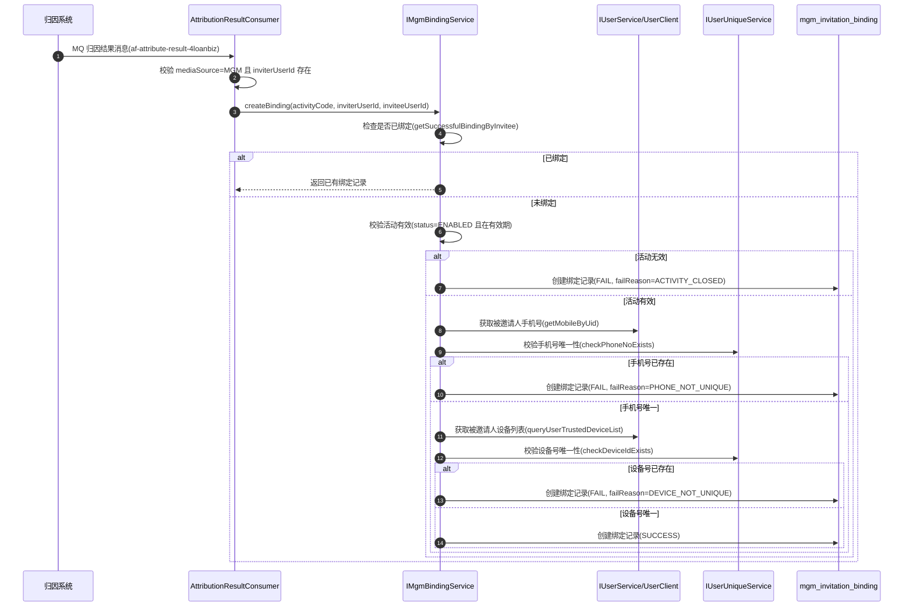
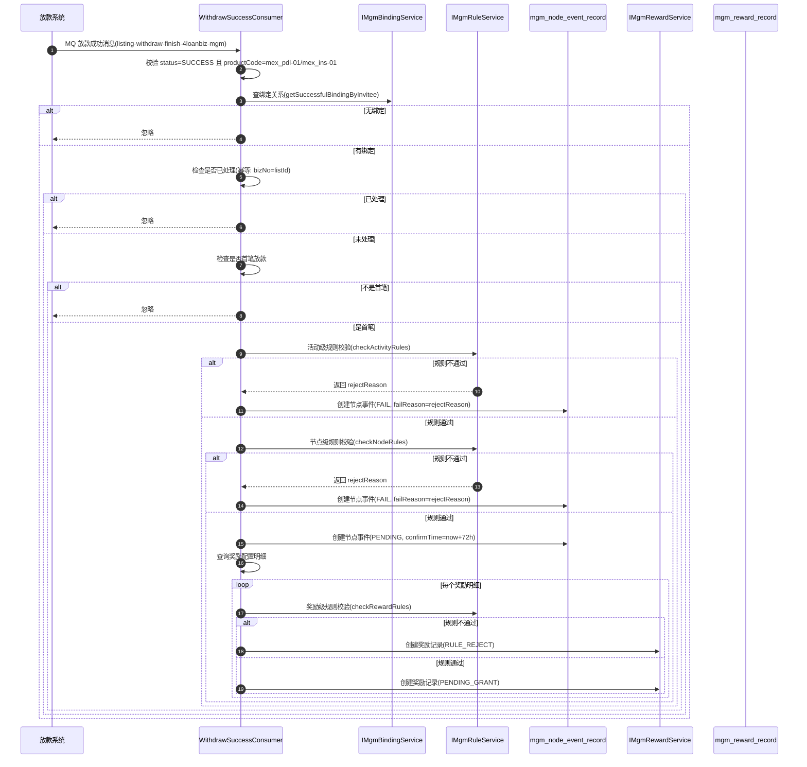
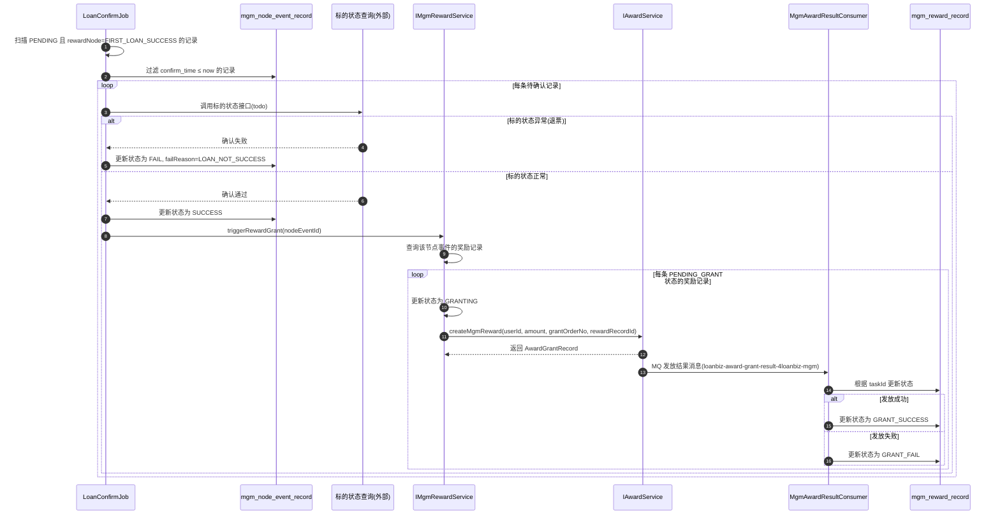
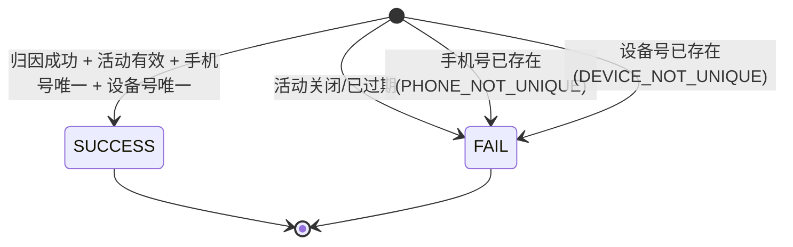
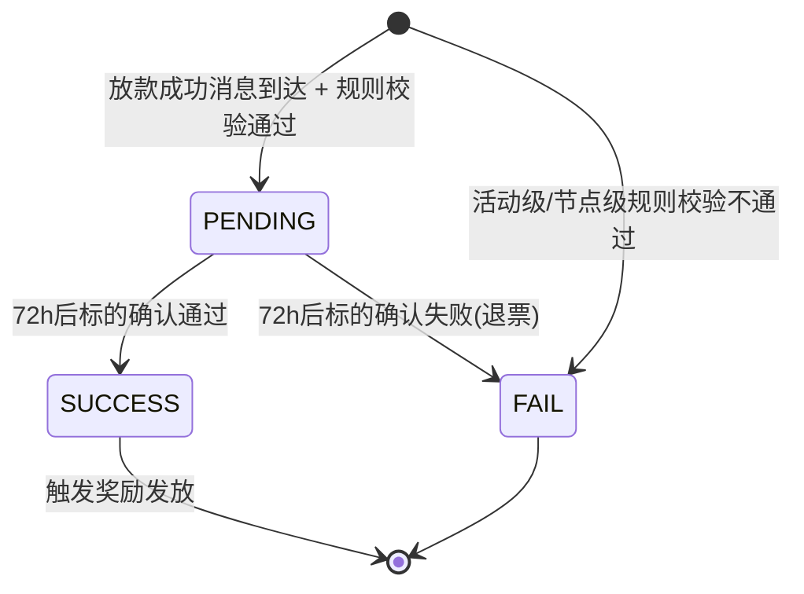
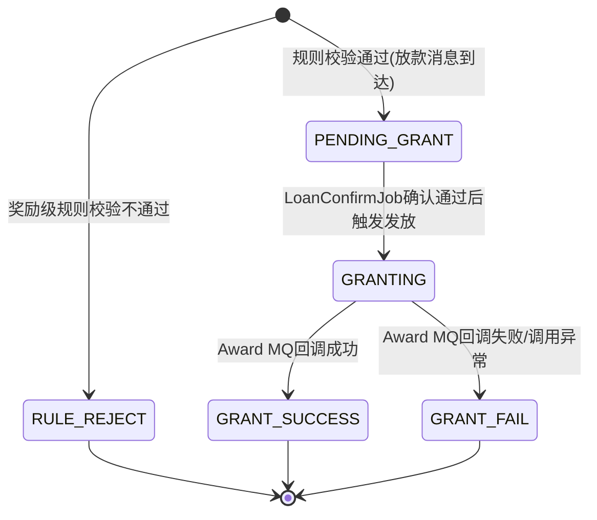

## 背景

loan-biz-service 是拍拍贷海外贷款业务服务平台，包含 award（返现奖励）和 mgm（Member Get Member 邀请拉新）等子模块。

## 领域模型

MGM 模块新增 8 个实体，award 模块新增 MGM 场景支持。MGM 通过 `task_id` 关联 `AwardGrantRecord`。

```mermaid
erDiagram
    MGM_ACTIVITY {
        Long id PK
        String activityName
        String activityCode UK
        Date startTime
        Date endTime
        String status
        String description
        Date inserttime
        Date updatetime
        Boolean isactive
    }
    
    MGM_REWARD_CONFIG {
        Long id PK
        Long activityId FK
        String rewardNode
        Date startTime
        Date endTime
        String status
        String description
        Date inserttime
        Date updatetime
        Boolean isactive
    }
    
    MGM_REWARD_CONFIG_DETAIL {
        Long id PK
        Long rewardConfigId FK
        String rewardTarget
        String rewardType
        String cashbackMode
        BigDecimal rewardAmount
        Date startTime
        Date endTime
        String status
        Date inserttime
        Date updatetime
        Boolean isactive
    }
    
    MGM_RULE_CONFIG {
        Long id PK
        String refType
        Long refId
        String ruleCode
        String ruleName
        String ruleValue
        String status
        Date inserttime
        Date updatetime
        Boolean isactive
    }
    
    MGM_INVITATION_BINDING {
        Long id PK
        Long activityId FK
        Long inviterUserId
        Long inviteeUserId
        String bindingStatus
        String failReason
        Date bindingTime
        String extensionField
        Date inserttime
        Date updatetime
        Boolean isactive
    }
    
    MGM_NODE_EVENT_RECORD {
        Long id PK
        String rewardNode
        Long bindingId FK
        Long activityId FK
        Long inviterUserId
        Long inviteeUserId
        Long rewardConfigId FK
        String bizNo UK
        Date eventTime
        String eventData
        String status
        String failReason
        Date confirmTime
        String extensionField
        Date inserttime
        Date updatetime
        Boolean isactive
    }
    
    MGM_REWARD_RECORD {
        Long id PK
        Long activityId FK
        Long bindingId FK
        Long rewardConfigDetailId FK
        String rewardNode
        String rewardTarget
        String rewardType
        Long targetUserId
        BigDecimal rewardAmount
        String rewardInfo
        String status
        String rejectReason
        String grantOrderNo UK
        Long nodeEventId FK
        String extensionField
        Date inserttime
        Date updatetime
        Boolean isactive
    }
    
    MGM_BLACKLIST {
        Long id PK
        Long userId
        String reason
        Date inserttime
        Date updatetime
        Boolean isactive
    }
    
    AWARD_GRANT_RECORD {
        Long id PK
        Long user_id FK
        Long task_id FK
        String award_scene
        BigDecimal award_amount
        String grant_status
        String grant_order_no UK
        Date expire_time
        Date inserttime
        Date updatetime
        Boolean isactive
    }
    
    INTEGRATE_INVOKE_RECORD {
        Long id PK
        Long event_id FK
        String business_no UK
        String event_type
        Date inserttime
        Date updatetime
        Boolean isactive
    }
    
    MGM_ACTIVITY ||--o{ MGM_REWARD_CONFIG : "has"
    MGM_REWARD_CONFIG ||--o{ MGM_REWARD_CONFIG_DETAIL : "has"
    MGM_ACTIVITY ||--o{ MGM_RULE_CONFIG : "has"
    MGM_REWARD_CONFIG ||--o{ MGM_RULE_CONFIG : "has"
    MGM_REWARD_CONFIG_DETAIL ||--o{ MGM_RULE_CONFIG : "has"
    MGM_ACTIVITY ||--o{ MGM_INVITATION_BINDING : "has"
    MGM_INVITATION_BINDING ||--o{ MGM_NODE_EVENT_RECORD : "triggers"
    MGM_INVITATION_BINDING ||--o{ MGM_REWARD_RECORD : "has"
    MGM_REWARD_CONFIG_DETAIL ||--o{ MGM_REWARD_RECORD : "defines"
    MGM_NODE_EVENT_RECORD ||--o{ MGM_REWARD_RECORD : "triggers"
    MGM_ACTIVITY ||--o{ MGM_BLACKLIST : "references"

    MGM_REWARD_RECORD ||--o| AWARD_GRANT_RECORD : "creates via createMgmReward"
    AWARD_GRANT_RECORD ||--o{ INTEGRATE_INVOKE_RECORD : "logs"
```



### 实体详细字段

#### MgmActivity - MGM活动表

说明：活动主表。

| 字段名          | 类型      | 必填 | 说明                     |
| ------------ | ------- | -- | ---------------------- |
| id           | Long    | 是  | 主键ID，自增                |
| activityName | String  | 是  | 活动名称                   |
| activityCode | String  | 是  | 活动编码（唯一标识）             |
| startTime    | Date    | 是  | 活动开始时间                 |
| endTime      | Date    | 是  | 活动结束时间                 |
| status       | String  | 是  | 活动状态（ENABLED/DISABLED） |
| description  | String  | 否  | 活动描述                   |
| inserttime   | Date    | 是  | 创建时间                   |
| updatetime   | Date    | 是  | 更新时间                   |
| isactive     | Boolean | 是  | 逻辑删除标记（true=有效）        |

#### MgmRewardConfig - MGM奖励配置表

说明：一个活动下按奖励节点配置的奖励项。同一活动可有多个节点的奖励配置，每个配置有独立的生效时间和状态。

| 字段名         | 类型      | 必填 | 说明                               |
| ----------- | ------- | -- | -------------------------------- |
| id          | Long    | 是  | 主键ID，自增                          |
| activityId  | Long    | 是  | 关联活动ID                           |
| rewardNode  | String  | 是  | 奖励节点（当前仅支持 FIRST\_LOAN\_SUCCESS） |
| startTime   | Date    | 是  | 配置开始时间                           |
| endTime     | Date    | 是  | 配置结束时间                           |
| status      | String  | 是  | 配置状态（ENABLED/DISABLED）           |
| description | String  | 否  | 配置描述                             |
| inserttime  | Date    | 是  | 创建时间                             |
| updatetime  | Date    | 是  | 更新时间                             |
| isactive    | Boolean | 是  | 逻辑删除标记                           |

**奖励节点(RewardNode)枚举**：

| 节点                   | 说明     | 触发时机               |
| -------------------- | ------ | ------------------ |
| FIRST\_LOAN\_SUCCESS | 首笔放款成功 | 被邀请人首笔放款成功后，需72h确认 |

> 注：设计文档中预留了其他节点（如 CREDIT\_SUCCESS 戳额成功），但当前实现仅支持 FIRST\_LOAN\_SUCCESS。

#### MgmRewardConfigDetail - MGM奖励配置明细表

说明：一个奖励配置下的具体奖励项，定义给谁、什么类型、什么金额/券信息。支持任意组合（如同时给邀请人返现 100 + 发 A 券，给被邀请人返现放款金额 10% + 发 B 券）；每条明细可配置独立的生效时间窗口。

| 字段名            | 类型         | 必填 | 说明                     |
| -------------- | ---------- | -- | ---------------------- |
| id             | Long       | 是  | 主键ID，自增                |
| rewardConfigId | Long       | 是  | 关联奖励配置ID               |
| rewardTarget   | String     | 是  | 奖励对象（INVITER/INVITEE）  |
| rewardType     | String     | 是  | 奖励类型（CASHBACK/COUPON）  |
| cashbackMode   | String     | 否  | 返现模式（FIXED/PERCENTAGE） |
| rewardAmount   | BigDecimal | 是  | 奖励金额                   |
| startTime      | Date       | 是  | 明细开始时间                 |
| endTime        | Date       | 是  | 明细结束时间                 |
| status         | String     | 是  | 明细状态（ENABLED/DISABLED） |
| inserttime     | Date       | 是  | 创建时间                   |
| updatetime     | Date       | 是  | 更新时间                   |
| isactive       | Boolean    | 是  | 逻辑删除标记                 |

#### MgmRuleConfig - MGM规则配置表

说明：多层级规则配置。通过 `ref_type` + `ref_id` 关联到不同层级的实体，实现活动有活动的规则、节点有节点的规则、奖励有奖励的规则。

| 字段名        | 类型      | 必填 | 说明                                             |
| ---------- | ------- | -- | ---------------------------------------------- |
| id         | Long    | 是  | 主键ID，自增                                        |
| refType    | String  | 是  | 规则引用类型（ACTIVITY/REWARD\_CONFIG/REWARD\_DETAIL） |
| refId      | Long    | 是  | 规则引用对象ID                                       |
| ruleCode   | String  | 是  | 规则编码                                           |
| ruleName   | String  | 是  | 规则名称                                           |
| ruleValue  | String  | 是  | 规则值（JSON或配置值）                                  |
| status     | String  | 是  | 规则状态（ENABLED/DISABLED）                         |
| inserttime | Date    | 是  | 创建时间                                           |
| updatetime | Date    | 是  | 更新时间                                           |
| isactive   | Boolean | 是  | 逻辑删除标记                                         |

**规则层级示例**：

| 层级  | ref\_type       | 典型规则      | 举例                                                                        |
| --- | --------------- | --------- | ------------------------------------------------------------------------- |
| 所有活动硬性 | - | 所有活动硬性规则 | 未逾期、不在黑名单、唯一性校验（手机号唯一、设备号唯一、CURP唯一、银行卡唯一）             |
| 活动级 | `ACTIVITY`      | 活动整体的通用规则 | 活动A全局每日邀请上限：当日≤10人、累计≤100人                                                |
| 节点级 | `REWARD_CONFIG` | 某节点下的规则   | 活动A戳额节点：绑定到戳额≤7天、当日≤2人、累计≤50人；放款节点：绑定到放款≤7天 |
| 奖励级 | `REWARD_DETAIL` | 某条具体奖励的规则 | 活动A放款节点返现：当日≤5人、累计≤50人                                                    |

**规则体系详解**：

> **说明**：人数上限规则为活动级规则时，统计依据为 `mgm_node_event_record` 表中邀请人当前活动activityId下 `status IN ('SUCCESS', 'PENDING')` 的记录数；人数上限规则为节点级规则时，统计依据为 `mgm_node_event_record` 表中邀请人当前活动activityId、当前节点rewardNode下 `status IN ('SUCCESS', 'PENDING')` 的记录数；人数上限规则为奖励级规则时，统计依据为 `mgm_reward_record` 表中邀请人当前活动activityId、当前奖励rewardDetailId下 `status IN ('GRANTING', 'GRANT_SUCCESS')` 的记录数；当天上限inserttime >= 当天开始时间

**规则配置示例**：

假设活动 ID=1，该活动下有首笔放款节点奖励配置（ID=10）：

```
-- 活动级规则：邀请人当日人数上限 10 人
ref_type=ACTIVITY, ref_id=1, rule_code=DAILY_PERSON_LIMIT, rule_value={"limit":10}
-- 活动级规则：邀请人累计人数上限 100 人
ref_type=ACTIVITY, ref_id=1, rule_code=TOTAL_PERSON_LIMIT, rule_value={"limit":100}

-- 节点级规则：首笔放款节点绑定到放款 ≤ 7 天
ref_type=REWARD_CONFIG, ref_id=10, rule_code=BINDING_TO_NODE_DAYS, rule_value={"days":7}
-- 节点级规则：首笔放款节点手机号唯一校验
ref_type=REWARD_CONFIG, ref_id=10, rule_code=PHONE_NOT_UNIQUE
-- 节点级规则：首笔放款节点设备号唯一校验
ref_type=REWARD_CONFIG, ref_id=10, rule_code=DEVICE_NOT_UNIQUE
-- 节点级规则：首笔放款节点 CURP 唯一校验
ref_type=REWARD_CONFIG, ref_id=10, rule_code=CURP_UNIQUE
-- 节点级规则：首笔放款节点银行卡唯一校验
ref_type=REWARD_CONFIG, ref_id=10, rule_code=BANKCARD_UNIQUE

-- 奖励级规则：首笔放款节点返现每日上限 5 人
ref_type=REWARD_DETAIL, ref_id=xxx, rule_code=DAILY_PERSON_LIMIT, rule_value={"limit":5}
-- 奖励级规则：首笔放款节点返现累计上限 50 人
ref_type=REWARD_DETAIL, ref_id=xxx, rule_code=TOTAL_PERSON_LIMIT, rule_value={"limit":50}    
```

**此次实际规则配置**：

假设活动 ID=1，该活动下有首笔放款节点奖励配置（ID=1）：

```
-- 活动级规则：邀请人当日人数上限 10 人
ref_type=ACTIVITY, ref_id=1, rule_code=DAILY_PERSON_LIMIT, rule_value={"limit":10}
-- 活动级规则：邀请人累计人数上限 100 人
ref_type=ACTIVITY, ref_id=1, rule_code=TOTAL_PERSON_LIMIT, rule_value={"limit":100}  
```

**规则校验顺序**：

当前实现中，规则校验按以下顺序执行：

1. **所有活动硬性规则校验**：逾期、黑名单、手机号、设备号、CURP、银行卡唯一
1. **活动级规则校验**（checkActivityRules）：活动有效性、活动级上限等
2. **节点级规则校验**（checkNodeRules）：节点有效性、节点级规则（节点发生时间、节点级上限）等
3. **奖励级规则校验**（checkRewardRules）：奖励有效性、奖励级规则（奖励级上限）等

**规则拒绝原因(RuleRejectReason)枚举**：

| 原因                     | 说明          | 校验层级        |
| ---------------------- | ----------- | ----------- |
| INVITER\_BLACKLIST     | 邀请人在黑名单中    | 所有活动        |
| INVITER\_OVERDUE       | 邀请人逾期       | 所有活动       |
| PHONE\_NOT\_UNIQUE     | 手机号不唯一      | 所有活动        |
| DEVICE\_NOT\_UNIQUE    | 设备号不唯一      | 所有活动         |
| CURP\_NOT\_UNIQUE      | CURP不唯一     |  所有活动(存在才校验)         |
| BANKCARD\_NOT\_UNIQUE  | 银行卡不唯一      | 所有活动(存在才校验)         |
| ACTIVITY\_CLOSED       | 活动已关闭或不在有效期 | 活动级         |
| REWARD\_CONFIG\_CLOSED | 奖励配置已关闭     | 节点级         |
| DAILY\_PERSON\_LIMIT   | 当日人数超限      | 活动级/节点级/奖励级 |
| TOTAL\_PERSON\_LIMIT   | 累计人数超限      | 活动级/节点级/奖励级 |

#### MgmInvitationBinding - MGM邀请绑定关系表

说明：记录邀请人与被邀请人的绑定关系。归因结果消息触发绑定，通过外部接口校验唯一性条件（手机号、设备号）。

| 字段名            | 类型      | 必填 | 说明                        |
| -------------- | ------- | -- | ------------------------- |
| id             | Long    | 是  | 主键ID，自增                   |
| activityId     | Long    | 是  | 关联活动ID                    |
| inviterUserId  | Long    | 是  | 邀请人用户ID                   |
| inviteeUserId  | Long    | 是  | 受邀人用户ID                   |
| bindingStatus  | String  | 是  | 绑定状态（SUCCESS/FAIL）        |
| failReason     | String  | 否  | 失败原因（PHONE\_NOT\_UNIQUE等） |
| bindingTime    | Date    | 是  | 绑定时间                      |
| extensionField | String  | 否  | 扩展字段（JSON）                |
| inserttime     | Date    | 是  | 创建时间                      |
| updatetime     | Date    | 是  | 更新时间                      |
| isactive       | Boolean | 是  | 逻辑删除标记                    |

#### MgmNodeEventRecord - MGM节点事件记录表

说明：记录触发奖励流程的奖励节点事件，用于防止重复发放奖励。

| 字段名            | 类型      | 必填 | 说明                             |
| -------------- | ------- | -- | ------------------------------ |
| id             | Long    | 是  | 主键ID，自增                        |
| rewardNode     | String  | 是  | 奖励节点（当前仅 FIRST\_LOAN\_SUCCESS） |
| bindingId      | Long    | 是  | 关联绑定关系ID                       |
| activityId     | Long    | 是  | 关联活动ID                         |
| inviterUserId  | Long    | 是  | 邀请人用户ID                        |
| inviteeUserId  | Long    | 是  | 受邀人用户ID                        |
| rewardConfigId | Long    | 否  | 关联奖励配置ID                       |
| bizNo          | String  | 是  | 业务单号（放款单号=listId，幂等键）          |
| eventTime      | Date    | 是  | 事件发生时间                         |
| eventData      | String  | 否  | 事件原始数据（JSON）                   |
| status         | String  | 是  | 事件状态（PENDING/SUCCESS/FAIL）     |
| failReason     | String  | 否  | 失败原因（RuleRejectReason枚举）       |
| confirmTime    | Date    | 否  | 确认时间（放款确认任务：now+72h，可配置）       |
| extensionField | String  | 否  | 扩展字段（JSON）                     |
| inserttime     | Date    | 是  | 创建时间                           |
| updatetime     | Date    | 是  | 更新时间                           |
| isactive       | Boolean | 是  | 逻辑删除标记                         |

**产品过滤**：

放款消息仅处理以下产品类型（ProductEnum）：

- `mex_pdl-01`：墨西哥短期贷款
- `mex_ins-01`：墨西哥分期贷款

#### MgmRewardRecord - MGM奖励发放记录表

说明：每一笔奖励的发放流水，记录完整的发放上下文和状态流转。

| 字段名                  | 类型         | 必填 | 说明                                                                              |
| -------------------- | ---------- | -- | ------------------------------------------------------------------------------- |
| id                   | Long       | 是  | 主键ID，自增，作为award的task\_id                                                        |
| activityId           | Long       | 是  | 关联活动ID                                                                          |
| bindingId            | Long       | 是  | 关联绑定关系ID                                                                        |
| rewardConfigDetailId | Long       | 是  | 关联奖励配置明细ID                                                                      |
| rewardNode           | String     | 是  | 奖励节点                                                                            |
| rewardTarget         | String     | 是  | 奖励对象（INVITER/INVITEE）                                                           |
| rewardType           | String     | 是  | 奖励类型（CASHBACK/COUPON）                                                           |
| targetUserId         | Long       | 是  | 领奖用户ID                                                                          |
| rewardAmount         | BigDecimal | 是  | 奖励金额                                                                            |
| rewardInfo           | String     | 否  | 奖励详情（JSON）                                                                      |
| status               | String     | 是  | 奖励状态（PENDING\_GRANT/GRANTING/GRANT\_SUCCESS/GRANT\_FAIL/RULE\_REJECT/CANCELLED） |
| rejectReason         | String     | 否  | 拒绝原因（规则校验不通过时记录）                                                                |
| grantOrderNo         | String     | 是  | 发放单号（幂等键）                                                                       |
| nodeEventId          | Long       | 是  | 关联节点事件ID                                                                        |
| extensionField       | String     | 否  | 扩展字段（JSON）                                                                      |
| inserttime           | Date       | 是  | 创建时间                                                                            |
| updatetime           | Date       | 是  | 更新时间                                                                            |
| isactive             | Boolean    | 是  | 逻辑删除标记                                                                          |

#### MgmBlacklist - MGM黑名单表

说明：MGM 场景独立的黑名单。

| 字段名        | 类型      | 必填 | 说明                     |
| ---------- | ------- | -- | ---------------------- |
| id         | Long    | 是  | 主键ID，自增                |
| userId     | Long    | 是  | 黑名单用户ID                |
| reason     | String  | 是  | 黑名单原因  |
| inserttime | Date    | 是  | 创建时间                   |
| updatetime | Date    | 是  | 更新时间                   |
| isactive   | Boolean | 是  | 逻辑删除标记                 |

#### AwardGrantRecord - award模块返现记录，MGM场景扩展

| 字段名              | 类型     | 必填 | 说明（MGM场景新增）                    |
| ---------------- | ------ | -- | ------------------------------ |
| task\_id         | Long   | 是  | MGM场景下存储mgm\_reward\_record.id |
| award\_scene     | String | 是  | MGM场景值为"mgm"                   |
| source           | String | 新增 | 来源标识（MGM）                      |
| grant\_order\_no | String | 新增 | MGM生成的幂等单号                     |

## 时序图与流程图

### 归因绑定流程



### 放款奖励触发流程



### 放款确认与奖励发放流程



## 状态机

### mgm\_invitation\_binding 绑定状态



| 状态      | 说明   | 允许的下一状态 | 创建场景            |
| ------- | ---- | ------- | --------------- |
| SUCCESS | 绑定成功 | 终态      | 活动有效且唯一性校验均通过   |
| FAIL    | 绑定失败 | 终态      | 活动关闭、手机号或设备号不唯一 |

**失败原因枚举(BindingFailReason)**：

| 原因                  | 说明              |
| ------------------- | --------------- |
| PHONE\_NOT\_UNIQUE  | 被邀请人手机号已存在于其他用户 |
| DEVICE\_NOT\_UNIQUE | 被邀请人设备号已存在于其他用户 |
| ACTIVITY\_CLOSED    | 活动未找到、已关闭或不在有效期 |
| INVITER\_NOT\_FOUND | 邀请人不存在          |

### mgm\_node\_event\_record 节点事件状态



| 状态      | 说明           | 允许的下一状态      | 创建场景                    |
| ------- | ------------ | ------------ | ----------------------- |
| PENDING | 待处理(等待72h确认) | SUCCESS、FAIL | 放款成功且规则校验通过             |
| SUCCESS | 事件处理成功       | 终态           | LoanConfirmJob确认通过后触发奖励 |
| FAIL    | 事件处理失败       | 终态           | 规则校验失败或放款确认失败           |

### mgm\_reward\_record 奖励记录状态



| 状态             | 说明   | 允许的下一状态                    | 创建场景                     |
| -------------- | ---- | -------------------------- | ------------------------ |
| PENDING\_GRANT | 待发放  | GRANTING                   | 放款成功且奖励级规则校验通过           |
| GRANTING       | 发放中  | GRANT\_SUCCESS、GRANT\_FAIL | LoanConfirmJob触发后调用award |
| GRANT\_SUCCESS | 发放成功 | 终态                         | Award发放成功回调              |
| GRANT\_FAIL    | 发放失败 | 终态                         | Award发放失败回调或调用异常         |
| RULE\_REJECT   | 规则拒绝 | 终态                         | 奖励级规则校验不通过               |

**注意**：当前实现中，放款确认失败时不会创建奖励记录（节点事件直接标记为FAIL），因此没有 CANCELLED 状态流转。

## 数据库设计

### 新增表

MGM 模块需要新建 8 张表，DDL 已在 `loan-biz-mgm/doc/sql/schema.sql` 中定义，直接执行即可。具体表结构详见该文件，此处列出表名和用途：

| 表名                         | 中文名        | 用途                |
| -------------------------- | ---------- | ----------------- |
| `mgm_activity`             | MGM活动表     | 活动主表，管理活动生命周期     |
| `mgm_reward_config`        | MGM奖励配置表   | 活动下的奖励节点配置        |
| `mgm_reward_config_detail` | MGM奖励配置明细表 | 奖励配置下的具体奖励项       |
| `mgm_rule_config`          | MGM规则配置表   | 活动/节点/奖励级规则配置     |
| `mgm_invitation_binding`   | MGM邀请绑定关系表 | 邀请人与被邀请人的绑定关系     |
| `mgm_reward_record`        | MGM奖励发放记录表 | 奖励发放记录及状态跟踪       |
| `mgm_node_event_record`    | MGM节点事件记录表 | 奖励节点事件记录（含放款确认任务） |
| `mgm_blacklist`            | MGM黑名单表    | 黑名单用户管理           |

**执行方式**：在 mex\_loan\_biz 数据库中执行 `loan-biz-mgm/doc/sql/schema.sql`，所有表与 award 模块共库。

## 接口设计

### award 模块新增接口：`createMgmReward()`

**方法签名**：

```java
/**
 * MGM 场景直接创建返现奖励
 * @param request MGM 返现请求（userId, amount, grantOrderNo 等）
 * @return AwardGrantRecord 创建的返现记录
 */
AwardGrantRecord createMgmReward(CreateMgmRewardRequest request);
```

**请求参数**：

| 参数名            | 类型         | 必填 | 说明                                 |
| -------------- | ---------- | -- | ---------------------------------- |
| userId         | Long       | 是  | 领奖用户ID                             |
| amount         | BigDecimal | 是  | 返现金额                               |
| grantOrderNo   | String     | 是  | 幂等单号（MGM 生成）                       |
| rewardRecordId | Long       | 是  | mgm\_reward\_record.id，作为 task\_id |
| bizLine        | String     | 否  | 业务线                                |

**返回语义**：成功时返回新创建的 `AwardGrantRecord`，失败时抛异常。

**幂等设计**：按 `grantOrderNo` 去重，已存在则直接返回已有记录。

### award 模块新增接口：`mgmWithdraw()`

**方法签名**：

```java
/**
 * MGM 批量提现接口
 * 基于 award_grant_record 中 award_scene=mgm 的记录，
 * 校验待提现金额并发起批量提现
 * @param request MGM 提现请求（userId, amount, bankInfo）
 * @return withdraw_record.id
 */
Long mgmWithdraw(MgmWithdrawRequest request);
```

**请求参数**：

| 参数名      | 类型                       | 必填 | 说明              |
| -------- | ------------------------ | -- | --------------- |
| userId   | Long                     | 是  | 领奖用户ID          |
| amount   | BigDecimal               | 是  | 提现金额（必须等于待提现总额） |
| bankInfo | LastRepaymentAccountInfo | 是  | 银行卡信息           |

**LastRepaymentAccountInfo 字段**：

| 参数名          | 类型     | 必填 | 说明               |
| ------------ | ------ | -- | ---------------- |
| userId       | Long   | 是  | 用户ID（可选，接口入参已包含） |
| bankAcctName | String | 否  | 账户名称（持卡人姓名）      |
| bankAcctNo   | String | 是  | 银行账号             |
| bankCode     | String | 是  | 银行代码             |
| phone        | String | 否  | 手机号（银行预留手机号）     |

**返回语义**：成功时返回 `withdraw_record.id`，失败时抛异常。

**处理流程**：

1. 查询用户所有 MGM `GRANT_SUCCESS` 状态的 `award_grant_record`：
   - `award_scene = 'mgm'`
   - `grant_status = 'GRANT_SUCCESS'`
   - `expire_time > now`
   - 未被提现过（不存在关联的 `award_withdraw_record`）
2. 校验金额：`sum(award_amount) == inputAmount`，不相等则抛异常
3. 调用内部 `batchWithdraw()` 发起批量提现
4. 返回 `withdraw_record.id`

#### POST `/loan-biz/award/mgm/withdraw` - MGM 批量提现

**说明**：基于 `AwardGrantRecord` 中 `award_scene=mgm` 的记录，一次性提现用户所有 MGM 待提现金额。

**请求参数（Request）**：

| 参数名      | 类型                       | 必填 | 说明              |
| -------- | ------------------------ | -- | --------------- |
| userId   | Long                     | 是  | 领奖用户ID          |
| amount   | BigDecimal               | 是  | 提现金额（必须等于待提现总额） |
| bankInfo | LastRepaymentAccountInfo | 是  | 银行卡信息           |

**返回参数（Response）**：

| 参数名     | 类型      | 说明                          |
| ------- | ------- | --------------------------- |
| code    | Integer | 状态码，0 表示成功                  |
| message | String  | 响应消息                        |
| data    | Long    | 提现记录ID（withdraw\_record.id） |

**响应示例**：

```json
{
  "code": 0,
  "message": "success",
  "data": 10001
}
```

### MGM App 查询接口

#### POST `/loan-biz/mgm/validActivity/list` - 查询当前有效活动

**说明**：供 App 查询当前有效的 MGM 活动，返回 status=ENABLED 且在有效期内的活动列表。

**请求参数（Request）**：

无请求参数。

**返回参数（Response）**：

| 参数名     | 类型                 | 说明         |
| ------- | ------------------ | ---------- |
| code    | Integer            | 状态码，0 表示成功 |
| message | String             | 响应消息       |
| data    | List\<ActivityDTO> | 活动列表       |

**ActivityDTO**：

| 参数名          | 类型     | 说明     |
| ------------ | ------ | ------ |
| id           | Long   | 活动ID   |
| activityName | String | 活动名称   |
| activityCode | String | 活动编码   |
| startTime    | Date   | 活动开始时间 |
| endTime      | Date   | 活动结束时间 |
| description  | String | 活动描述   |

**响应示例**：

```json
{
  "code": 0,
  "message": "success",
  "data": [
    {
      "id": 1,
      "activityName": "邀请好友返现活动",
      "activityCode": "INVITE_CASHBACK_2026",
      "startTime": "2026-04-01T00:00:00",
      "endTime": "2026-12-31T23:59:59",
      "description": "邀请好友成功放款后可获得返现奖励"
    }
  ]
}
```

#### POST `/loan-biz/mgm/binding/list` - 查询绑定关系列表

**说明**：供 App 展示邀请人与被邀请人的绑定关系列表。

**请求参数**：

| 参数名           | 类型      | 必填 | 说明                              |
| ------------- | ------- | -- | ------------------------------- |
| inviterUserId | Long    | 是  | 邀请人用户ID                         |
| activityId    | Long    | 否  | 活动ID，为空则查询所有活动                  |
| bindingStatus | String  | 否  | 绑定状态筛选：SUCCESS / FAIL，为空则查询所有状态 |
| pageNo        | Integer | 否  | 页码，默认 1                         |
| pageSize      | Integer | 否  | 页大小，默认 10                       |

**返回参数**：

| 参数名     | 类型                    | 说明         |
| ------- | --------------------- | ---------- |
| code    | Integer               | 状态码，0 表示成功 |
| message | String                | 响应消息       |
| data    | Page\<BindingListDTO> | 分页数据       |

**BindingListDTO**：

| 参数名           | 类型     | 说明                  |
| ------------- | ------ | ------------------- |
| id            | Long   | 绑定记录ID              |
| activityId    | Long   | 活动ID                |
| activityName  | String | 活动名称                |
| inviterUserId | Long   | 邀请人用户ID             |
| inviteeUserId | Long   | 被邀请人用户ID            |
| bindingStatus | String | 绑定状态：SUCCESS / FAIL |
| bindingTime   | Date   | 绑定时间                |

**响应示例**：

```json
{
  "code": 0,
  "message": "success",
  "data": {
    "pageNo": 1,
    "pageSize": 10,
    "total": 10,
    "elements": [
      {
        "id": 1001,
        "activityId": 1,
        "activityName": "邀请好友返现活动",
        "inviterUserId": 20001,
        "inviteeUserId": 30001,
        "bindingStatus": "SUCCESS",
        "bindingTime": "2026-04-08T10:00:00"
      }
    ]
  }
}
```

#### POST `/loan-biz/mgm/node-event/list` - 查询奖励节点事件列表

**说明**：供 App 展示邀请人的奖励节点事件列表（被邀请人触发的奖励节点事件）。

**请求参数**：

| 参数名           | 类型            | 必填 | 说明                        |
| ------------- | ------------- | -- | ------------------------- |
| inviterUserId | Long          | 是  | 邀请人用户ID                   |
| activityId    | Long          | 否  | 活动ID，为空则查询所有活动            |
| statusList    | List\<String> | 否  | 状态筛选：PENDING/SUCCESS/FAIL |
| pageNo        | Integer       | 否  | 页码，默认 1                   |
| pageSize      | Integer       | 否  | 页大小，默认 10                 |

**返回参数**：

| 参数名     | 类型                  | 说明         |
| ------- | ------------------- | ---------- |
| code    | Integer             | 状态码，0 表示成功 |
| message | String              | 响应消息       |
| data    | Page\<NodeEventDTO> | 分页数据       |

**NodeEventDTO**：

| 参数名           | 类型     | 说明                      |
| ------------- | ------ | ----------------------- |
| id            | Long   | 节点事件记录ID                |
| activityId    | Long   | 活动ID                    |
| activityName  | String | 活动名称                    |
| inviterUserId | Long   | 邀请人用户ID                 |
| inviteeUserId | Long   | 被邀请人用户ID                |
| rewardNode    | String | 奖励节点                    |
| eventTime     | Date   | 事件发生时间                  |
| status        | String | 状态：PENDING/SUCCESS/FAIL |
| failReason    | String | 失败原因（仅 FAIL 时有值）        |
| confirmTime   | Date   | 计划确认时间（仅放款场景）           |

#### POST `/loan-biz/mgm/reward-record/list` - 查询奖励记录列表

**说明**：供 App 展示邀请人奖励发放记录列表。

**请求参数**：

| 参数名          | 类型            | 必填 | 说明                                                                             |
| ------------ | ------------- | -- | ------------------------------------------------------------------------------ |
| targetUserId | Long          | 是  | 领奖用户ID                                                                         |
| activityId   | Long          | 否  | 活动ID，为空则查询所有活动                                                                 |
| statusList   | List\<String> | 否  | 状态筛选：GRANT\_SUCCESS/GRANT\_FAIL/GRANTING/PENDING\_GRANT/RULE\_REJECT/CANCELLED |
| pageNo       | Integer       | 否  | 页码，默认 1                                                                        |
| pageSize     | Integer       | 否  | 页大小，默认 10                                                                      |

**返回参数**：

| 参数名     | 类型                     | 说明         |
| ------- | ---------------------- | ---------- |
| code    | Integer                | 状态码，0 表示成功 |
| message | String                 | 响应消息       |
| data    | Page\<RewardRecordDTO> | 分页数据       |

**RewardRecordDTO**：

| 参数名          | 类型         | 说明                              |
| ------------ | ---------- | ------------------------------- |
| id           | Long       | 奖励记录ID                          |
| activityId   | Long       | 活动ID                            |
| activityName | String     | 活动名称                            |
| rewardNode   | String     | 奖励节点                            |
| rewardTarget | String     | 奖励对象：INVITER/INVITEE            |
| rewardType   | String     | 奖励类型：CASHBACK                   |
| rewardAmount | BigDecimal | 奖励金额                            |
| status       | String     | 奖励状态                            |
| grantTime    | Date       | 发放时间（status=GRANT\_SUCCESS 时有值） |

### MGM 后台配置接口

**路径前缀**：`/loan-biz/mgm/admin/`

**设计决策**：

- 操作粒度：级联批量创建（一步到位创建活动+奖励配置+明细+规则）
- 状态切换：复用 update 接口修改 status 字段
- 软删除与状态关闭：两者都支持
- 规则配置：统一规则配置接口
- 黑名单：只支持手动管理

#### 活动配置管理

##### POST `/loan-biz/mgm/admin/activity/create` - 创建活动

**请求参数**：

| 参数名          | 类型     | 必填 | 说明            |
| ------------ | ------ | -- | ------------- |
| activityName | String | 是  | 活动名称          |
| activityCode | String | 是  | 活动编码（唯一标识）    |
| startTime    | Date   | 是  | 活动开始时间        |
| endTime      | Date   | 是  | 活动结束时间        |
| status       | String | 否  | 状态，默认 ENABLED |
| description  | String | 否  | 活动描述          |

**返回参数**：

| 参数名     | 类型      | 说明         |
| ------- | ------- | ---------- |
| code    | Integer | 状态码，0 表示成功 |
| message | String  | 响应消息       |
| data    | Long    | 活动ID       |

##### POST `/loan-biz/mgm/admin/activity/create-full` - 级联创建活动+奖励配置+明细+规则

**请求参数**：

| 参数名           | 类型     | 必填 | 说明     |
| ------------- | ------ | -- | ------ |
| activityName  | String | 是  | 活动名称   |
| activityCode  | String | 是  | 活动编码   |
| startTime     | Date   | 是  | 活动开始时间 |
| endTime       | Date   | 是  | 活动结束时间 |
| description   | String | 否  | 活动描述   |
| rewardConfigs | List   | 否  | 奖励配置列表 |

**RewardConfigItem**：

| 参数名         | 类型     | 必填 | 说明                                         |
| ----------- | ------ | -- | ------------------------------------------ |
| rewardNode  | String | 是  | 奖励节点（FIRST\_LOAN\_SUCCESS/CREDIT\_SUCCESS） |
| startTime   | Date   | 否  | 配置开始时间（为空则继承活动时间）                          |
| endTime     | Date   | 否  | 配置结束时间（为空则继承活动时间）                          |
| description | String | 否  | 配置描述                                       |
| details     | List   | 是  | 奖励明细列表                                     |
| rules       | List   | 否  | 规则配置列表                                     |

**RewardDetailItem**：

| 参数名          | 类型         | 必填 | 说明                    |
| ------------ | ---------- | -- | --------------------- |
| rewardTarget | String     | 是  | 奖励对象（INVITER/INVITEE） |
| rewardType   | String     | 是  | 奖励类型（CASHBACK）        |
| cashbackMode | String     | 否  | 返现模式，默认 FIXED         |
| rewardAmount | BigDecimal | 是  | 奖励金额                  |
| startTime    | Date       | 否  | 明细开始时间                |
| endTime      | Date       | 否  | 明细结束时间                |

**RuleConfigItem**：

| 参数名       | 类型     | 必填 | 说明        |
| --------- | ------ | -- | --------- |
| ruleCode  | String | 是  | 规则编码      |
| ruleName  | String | 是  | 规则名称      |
| ruleValue | String | 是  | 规则值（JSON） |

**请求示例**：

```json
{
  "activityName": "春季邀请活动",
  "activityCode": "SPRING_2026",
  "startTime": "2026-03-01T00:00:00",
  "endTime": "2026-05-31T23:59:59",
  "description": "邀请好友返现",
  "rewardConfigs": [
    {
      "rewardNode": "FIRST_LOAN_SUCCESS",
      "details": [
        {"rewardTarget": "INVITER", "rewardType": "CASHBACK", "rewardAmount": 100.00},
        {"rewardTarget": "INVITEE", "rewardType": "CASHBACK", "rewardAmount": 50.00}
      ],
      "rules": [
        {"ruleCode": "DAILY_PERSON_LIMIT", "ruleName": "每日邀请上限", "ruleValue": "{\"limit\":10}"}
      ]
    }
  ]
}
```

**返回参数**：

| 参数名     | 类型              | 说明         |
| ------- | --------------- | ---------- |
| code    | Integer         | 状态码，0 表示成功 |
| message | String          | 响应消息       |
| data    | ActivityFullDTO | 创建的活动详情    |

**ActivityFullDTO**：

| 参数名             | 类型          | 说明       |
| --------------- | ----------- | -------- |
| activityId      | Long        | 活动ID     |
| rewardConfigIds | List\<Long> | 奖励配置ID列表 |
| rewardDetailIds | List\<Long> | 奖励明细ID列表 |
| ruleConfigIds   | List\<Long> | 规则配置ID列表 |

##### POST `/loan-biz/mgm/admin/activity/update` - 修改活动

**请求参数**：

| 参数名          | 类型     | 必填 | 说明                   |
| ------------ | ------ | -- | -------------------- |
| id           | Long   | 是  | 活动ID                 |
| activityName | String | 否  | 活动名称                 |
| startTime    | Date   | 否  | 活动开始时间               |
| endTime      | Date   | 否  | 活动结束时间               |
| status       | String | 否  | 状态（ENABLED/DISABLED） |
| description  | String | 否  | 活动描述                 |

**返回参数**：

| 参数名     | 类型      | 说明         |
| ------- | ------- | ---------- |
| code    | Integer | 状态码，0 表示成功 |
| message | String  | 响应消息       |

##### POST `/loan-biz/mgm/admin/activity/query/list` - 查询活动列表

**请求参数**：

| 参数名          | 类型      | 必填 | 说明         |
| ------------ | ------- | -- | ---------- |
| activityCode | String  | 否  | 活动编码       |
| activityName | String  | 否  | 活动名称（模糊匹配） |
| status       | String  | 否  | 状态筛选       |
| pageNo       | Integer | 否  | 页码，默认 1    |
| pageSize     | Integer | 否  | 页大小，默认 10  |

**返回参数**：

| 参数名     | 类型                     | 说明         |
| ------- | ---------------------- | ---------- |
| code    | Integer                | 状态码，0 表示成功 |
| message | String                 | 响应消息       |
| data    | Page\<ActivityListDTO> | 分页数据       |

**ActivityListDTO**：

| 参数名          | 类型     | 说明   |
| ------------ | ------ | ---- |
| id           | Long   | 活动ID |
| activityName | String | 活动名称 |
| activityCode | String | 活动编码 |
| startTime    | Date   | 开始时间 |
| endTime      | Date   | 结束时间 |
| status       | String | 状态   |
| description  | String | 描述   |
| createTime   | Date   | 创建时间 |

##### POST `/loan-biz/mgm/admin/activity/query/detail` - 查询活动详情

**请求参数**：

| 参数名 | 类型   | 必填 | 说明   |
| --- | ---- | -- | ---- |
| id  | Long | 是  | 活动ID |

**返回参数**：

| 参数名     | 类型                | 说明         |
| ------- | ----------------- | ---------- |
| code    | Integer           | 状态码，0 表示成功 |
| message | String            | 响应消息       |
| data    | ActivityDetailDTO | 活动详情       |

**ActivityDetailDTO**：

| 参数名           | 类型                           | 说明             |
| ------------- | ---------------------------- | -------------- |
| id            | Long                         | 活动ID           |
| activityName  | String                       | 活动名称           |
| activityCode  | String                       | 活动编码           |
| startTime     | Date                         | 开始时间           |
| endTime       | Date                         | 结束时间           |
| status        | String                       | 状态             |
| description   | String                       | 描述             |
| createTime    | Date                         | 创建时间           |
| updateTime    | Date                         | 更新时间           |
| rewardConfigs | List\<RewardConfigDetailDTO> | 奖励配置列表（含明细和规则） |

##### POST `/loan-biz/mgm/admin/activity/delete` - 删除活动（软删除）

**请求参数**：

| 参数名 | 类型   | 必填 | 说明   |
| --- | ---- | -- | ---- |
| id  | Long | 是  | 活动ID |

**返回参数**：

| 参数名     | 类型      | 说明         |
| ------- | ------- | ---------- |
| code    | Integer | 状态码，0 表示成功 |
| message | String  | 响应消息       |

#### 黑名单管理

##### POST `/loan-biz/mgm/admin/blacklist/create` - 添加黑名单

**请求参数**：

| 参数名        | 类型     | 必填 | 说明             |
| ---------- | ------ | -- | -------------- |
| userId     | Long   | 是  | 用户ID           |
| reason     | String | 是  | 加入原因           |

**返回参数**：

| 参数名     | 类型      | 说明         |
| ------- | ------- | ---------- |
| code    | Integer | 状态码，0 表示成功 |
| message | String  | 响应消息       |
| data    | Long    | 黑名单记录ID    |

##### POST `/loan-biz/mgm/admin/blacklist/query/list` - 查询黑名单列表

**请求参数**：

| 参数名      | 类型      | 必填 | 说明                    |
| -------- | ------- | -- | --------------------- |
| userId   | Long    | 否  | 用户ID                  |
| status   | String  | 否  | 状态筛选（ACTIVE/INACTIVE） |
| pageNo   | Integer | 否  | 页码，默认 1               |
| pageSize | Integer | 否  | 页大小，默认 10             |

**返回参数**：

| 参数名     | 类型                  | 说明         |
| ------- | ------------------- | ---------- |
| code    | Integer             | 状态码，0 表示成功 |
| message | String              | 响应消息       |
| data    | Page\<BlacklistDTO> | 分页数据       |

**BlacklistDTO**：

| 参数名        | 类型     | 说明      |
| ---------- | ------ | ------- |
| id         | Long   | 黑名单记录ID |
| userId     | Long   | 用户ID    |
| reason     | String | 加入原因    |
| createTime | Date   | 创建时间    |

##### POST `/loan-biz/mgm/admin/blacklist/delete` - 删除黑名单记录

**请求参数**：

| 参数名 | 类型   | 必填 | 说明      |
| --- | ---- | -- | ------- |
| id  | Long | 是  | 黑名单记录ID |

**返回参数**：

| 参数名     | 类型      | 说明         |
| ------- | ------- | ---------- |
| code    | Integer | 状态码，0 表示成功 |
| message | String  | 响应消息       |

**说明**：此接口为软删除，设置 isactive = 0。

## 消息队列

### 消费topic: af-attribute-result-4loanbiz - 归因结果消息

**绑定exchange**：af-attribute-result-exchange

**幂等设计**：

- 通过 `mgm_invitation_binding` 表查询 `inviteeUserId`保证同一被邀请人不会重复绑定

**消息格式(AttributionResultMsg)**：

| 字段名           | 类型              | 必填 | 说明              |
| ------------- | --------------- | -- | --------------- |
| userId        | Long            | 是  | 被邀请人用户ID        |
| inviterUserId | Long            | 是  | 邀请人用户ID（为空则不处理） |
| activityCode  | String          | 是  | 活动编码            |
| mediaSource   | MediaSourceEnum | 是  | 归因来源（仅处理 MGM）   |

```json
{
"userId": 52037,
"inviterUserId": 52036,
"activityCode": "MGM",
"mediaSource": "MGM"
}
 ```

**处理逻辑**：

1. 校验 `mediaSource=MGM` 且 `inviterUserId` 不为空
2. 调用 `bindingService.createBinding(activityCode, inviterUserId, userId)`
3. 创建绑定记录（SUCCESS 或 FAIL）

### 消费topic: listing-withdraw-finish-4loanbiz-mgm - 放款结果消息

**绑定exchange**：listing-withdraw-finish-exchange

**幂等设计**：

- 通过 `mgm_node_event_record` 表查询 `rewardNode=FIRST_LOAN_SUCCESS + inviteeUserId + bizNo=listId` 保证同一笔放款不会重复处理
- 查询该被邀请人的首笔放款事件，保证只处理首笔放款

**消息格式(WithdrawResultMessage)**：

| 字段名            | 类型     | 必填 | 说明                                |
| -------------- | ------ | -- | --------------------------------- |
| listId         | Long   | 是  | 借款Id（作为 bizNo）                    |
| borrowerId     | Long   | 是  | 用户ID（被邀请人）                        |
| listAmount     | String | 否  | 标的金额                              |
| withdrawAmount | String | 否  | 提现金额                              |
| eventTime      | Date   | 是  | 放款时间                              |
| productCode    | String | 是  | 产品编码（仅处理 mex\_pdl-01、mex\_ins-01） |
| status         | String | 是  | 提现结果（仅处理 SUCCESS）                 |

**处理逻辑**：

1. 校验 `status=SUCCESS` 且 `productCode` 为 mex\_pdl-01 或 mex\_ins-01
2. 查询被邀请人的绑定关系（bindingStatus=SUCCESS）
3. 幂等检查：是否已处理过该 listId
4. 首笔检查：是否已存在该被邀请人的放款事件
5. 活动级规则校验 -> 节点级规则校验
6. 规则通过：创建 PENDING 状态节点事件，设置 confirmTime=now+72h
7. 查询奖励配置明细，逐条创建奖励记录（规则通过->PENDING\_GRANT，规则不通过->RULE\_REJECT）

### 消费topic: loanbiz-award-grant-result-4loanbiz-mgm - 返现发放结果消息

**绑定exchange**：loanbiz-award-grant-result-exchange

**幂等设计**：

- 通过 `taskId` 查询 `mgm_reward_record`，更新状态

**消息格式(AwardGrantResultMsg)**：

| 字段名          | 类型      | 必填 | 说明                                |
| ------------ | ------- | -- | --------------------------------- |
| taskId       | Long    | 是  | MGM奖励记录ID（mgm\_reward\_record.id） |
| grantOrderNo | String  | 是  | 发放业务单号                            |
| success      | Boolean | 是  | 发放结果（true=成功，false=失败）            |
| failReason   | String  | 否  | 失败原因                              |

**处理逻辑**：

1. 根据 `taskId` 查询奖励记录
2. 根据 `success` 更新状态为 `GRANT_SUCCESS` 或 `GRANT_FAIL`

## 定时任务

| Job名称          | CRON表达式       | 执行说明               | 参数                                                                     |
| -------------- | ---------------- | ------------------ | ---------------------------------------------------------------------- |
| LoanConfirmJob | `0 0/5 * * * ?`   | 扫描待确认放款事件，执行72h后确认 | status=PENDING 且 rewardNode=FIRST\_LOAN\_SUCCESS 且 confirm\_time ≤ now |

**处理流程**：

1. 扫描所有 `PENDING` 状态的放款节点事件
2. 过滤 `rewardNode=FIRST_LOAN_SUCCESS` 且 `confirm_time ≤ now` 的记录
3. 调用标的状态查询接口（todo）校验放款状态
4. 若放款成功：更新状态为 `SUCCESS`，触发奖励发放
5. 若放款失败（退票）：更新状态为 `FAIL`

## 配置

| 配置Key                     | 配置Value（示例） | 发布时机 | 说明           |
| ------------------------- | ----------- | ---- | ------------ |
| `mgm.confirm.delay.hours` | `72`        | 发布前  | 放款确认延迟时间（小时） |
| `mybatis.mapperLocations` | `mybatis/*Mapper.xml, classpath:mybatis-common/*Mapper.xml, classpath:mybatis-mex/*Mapper.xml, classpath:mybatis-award/*Mapper.xml, classpath:mybatis-mgm/*Mapper.xml` | 发布前  |  |

## 外部依赖

### 依赖接口

#### 用户唯一性判断接口

**接口地址**：`user-sign-on.creocreditapi.mx/userInfo/judgeUserExists`

**用途**：校验被邀请人的手机号、CURP、设备号是否已存在于其他用户，用于唯一性校验规则。

**请求参数**：

| 参数名      | 类型     | 必填 | 说明                  |
| -------- | ------ | -- | ------------------- |
| cardNo   | String | 否  | CURP（不可同时为空）        |
| phoneNo  | String | 否  | 手机号（取末10位匹配，不可同时为空） |
| deviceId | String | 否  | 设备ID（不可同时为空）        |

> 注：cardNo、phoneNo、deviceId 不可同时为空，至少传入一个参数。

**响应参数**：

| 参数名     | 类型      | 必填 | 说明                       |
| ------- | ------- | -- | ------------------------ |
| code    | Integer | 是  | 0 表示成功                   |
| message | String  | 否  | "success" 表示成功           |
| data    | Boolean | 是  | 是否存在（true=已存在，false=不存在） |

**调用场景**：

1. 绑定流程：校验被邀请人手机号、设备号是否已存在于其他邀请人的绑定中
2. 奖励规则校验：校验被邀请人 CURP、人脸、银行卡是否已存在（配置开关控制）

**响应示例**：

```json
{
  "code": 0,
  "message": "success",
  "data": true
}
```

#### 依赖exchange

| 系统     | 接口 | 用途     | 备注     |
| ------ | -- | ------ | ------ |
| 归因系统   | MQ | 归因结果消息 | <br /> |
| 外部放款系统 | MQ | 放款成功消息 | <br /> |

## 影响范围

- **影响的服务/模块**：
  - `loan-biz-mgm`（新建）：作为子模块无独立启动类
  - `loan-biz-award`：新增 MGM 返现接口 `createMgmReward()`
- **数据迁移**：新建8张表，无存量数据迁移
- **兼容性**：新建模块不影响现有功能
- **回滚方案**：删除 MGM 模块代码，回滚 Award 模块改动

## 监控项

| 监控指标    | 监控方式    | 告警阈值   | 告警接收人 |
| ------- | ------- | ------ | ----- |
| 奖励发放失败数 | 日志关键词统计 | 超过阈值告警 | MGM运维 |

