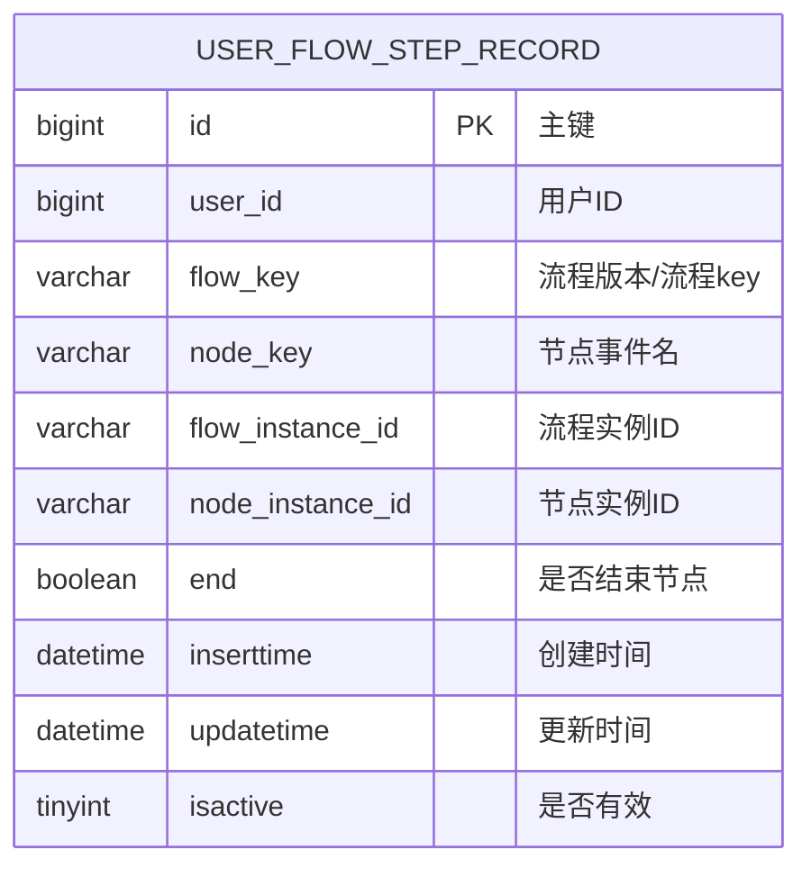
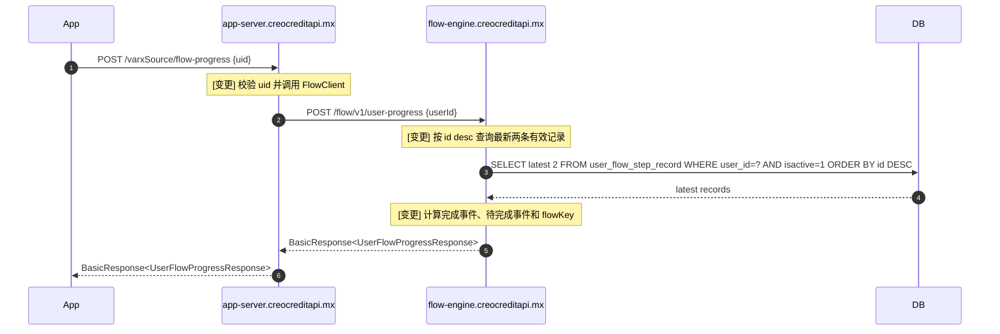
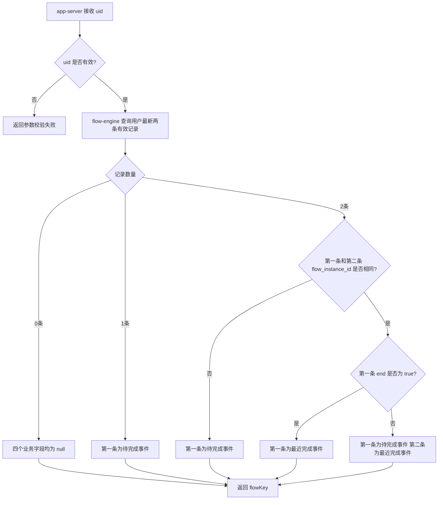

# User Flow Progress API 技术方案

## 背景及目标

当前 `flow-engine.creocreditapi.mx` 已通过 `user_flow_step_record` 记录用户流程节点推进历史，`app-server.creocreditapi.mx` 已通过 `FlowClient` 调用 flow-engine 的 `/flow/v1/*` 接口。现需新增一个只读查询能力：根据 `uid` 返回用户最近一次完成事件、完成时间、待完成事件和流程版本，用于上游根据“未访问第一个页面”和“已访问但未完成/已完成”等状态区分话术。

目标：

- 在 flow-engine 新增只读接口，按 `user_flow_step_record.id` 倒序查询用户最新两条有效记录并计算流程进度。
- 在 app-server 新增对外接口，封装调用 flow-engine 并返回统一 app-server 响应。
- 不自动启动流程、不推进节点、不修改历史数据；无记录时四个业务字段均返回 `null`。

## 关键决策

- 流程版本取 `flow_key` → 同一个 `flow_instance_id` 下 `flow_key` 相同，可用最新有效记录确定；无记录时不从默认配置补齐，返回 `null`。
- 最近完成/待完成事件直接返回 `node_key` → 用户需求描述为“事件名/下一步节点事件名”，当前记录表中可稳定提供 `node_key`，不引入额外展示名映射。
- 完成时间取完成事件记录的 `updatetime`（毫秒时间戳）→ 现有 `FlowStepResponse` 已使用 `updatetime` 作为节点返回时间，保持同一口径；没有完成事件时返回 `null`。
- flow-engine 查询不要求传入 `flow_key` → 用户入参只有 `uid`，按用户所有有效流程记录最新两条判断；返回版本由命中的记录 `flow_key` 决定。
- 只新增业务扩展查询，不变更表结构 → 复用现有 `UserFlowStepRecord` 实体和 `user_flow_step_record` 表，Mapper 增加按用户查询最新两条有效记录的方法。

## 修改到的站点

| 站点/应用                    | 改动说明                                                     | 影响范围                                   |
| ---------------------------- | ------------------------------------------------------------ | ------------------------------------------ |
| flow-engine.creocreditapi.mx | 新增用户流程进度查询接口、Service 计算逻辑和最新两条记录查询 | 只读查询接口，读取 `user_flow_step_record` |
| app-server.creocreditapi.mx  | 新增对外查询接口、FlowClient 方法和服务层封装                | App 对外接口入口，调用 flow-engine         |

## 领域模型

### 查询结果模型：`UserFlowProgressResponse` - 用户流程进度

| 字段名            | 类型   | 允许为空 | 说明                                                      |
| ----------------- | ------ | -------- | --------------------------------------------------------- |
| completedStepCode | String | YES      | 最近一次完成事件名，取完成记录的 `node_key`               |
| completedTime     | Long   | YES      | 最近一次完成时间（毫秒时间戳），取完成记录的 `updatetime` |
| curStepCode       | String | YES      | 当前待完成事件名，取待完成记录的 `node_key`               |
| flowKey           | String | YES      | 流程版本，取返回记录对应的 `flow_key`；无记录时为 `null`  |

计算中间模型：

| 名称            | 来源                                 | 说明                           |
| --------------- | ------------------------------------ | ------------------------------ |
| firstRecord     | `user_flow_step_record` 最新有效记录 | `id desc` 排序第一条           |
| secondRecord    | `user_flow_step_record` 次新有效记录 | `id desc` 排序第二条，可能为空 |
| completedRecord | 规则计算出的完成事件记录             | 可能为空                       |
| pendingRecord   | 规则计算出的待完成事件记录           | 可能为空                       |

## 时序图与流程图

### 时序图

与旧流程相比：

- 旧逻辑：app-server 只能调用 flow-engine 获取/推进当前步骤，缺少只读查询“最近完成/下一步待完成”语义的接口。
- 新逻辑：新增只读链路，不自动启动流程、不提交/回退节点，只读取 `user_flow_step_record`。
- 影响：可区分未访问第一个页面的用户；无记录时四个字段均为空。

### 流程图

## 接口设计

### 所属服务：flow-engine.creocreditapi.mx

#### POST /flow/v1/user-progress - 查询用户流程进度

**改动类型**：新增

**请求参数**：

| 参数名 | 类型 | 必填 | 说明    |
| ------ | ---- | ---- | ------- |
| userId | Long | 是   | 用户 ID |

**返回参数**：

| 参数名                 | 类型    | 说明                                        |
| ---------------------- | ------- | ------------------------------------------- |
| code                   | Integer | 沿用 flow-engine `BaseResponse` 成功/失败码 |
| message                | String  | 沿用 flow-engine `BaseResponse` 提示信息    |
| data                   | Object  | 用户流程进度                                |
| data.completedStepCode | String  | 最近一次完成事件名，可能为 `null`           |
| data.completedTime     | Long    | 完成时间（毫秒时间戳），可能为 `null`       |
| data.curStepCode       | String  | 当前待完成事件名，可能为 `null`             |
| data.flowKey           | String  | 流程版本，无记录时为 `null`                 |

**处理规则**：

| 场景                                   | 完成事件          | 完成时间            | 待完成事件        | 流程版本          |
| -------------------------------------- | ----------------- | ------------------- | ----------------- | ----------------- |
| 查不到记录                             | `null`            | `null`              | `null`            | `null`            |
| 仅一条记录                             | `null`            | `null`              | 第一条 `node_key` | 第一条 `flow_key` |
| 两条记录且实例不同                     | `null`            | `null`              | 第一条 `node_key` | 第一条 `flow_key` |
| 两条记录且实例相同，第一条 `end=true`  | 第一条 `node_key` | 第一条 `updatetime` | `null`            | 第一条 `flow_key` |
| 两条记录且实例相同，第一条 `end=false` | 第二条 `node_key` | 第二条 `updatetime` | 第一条 `node_key` | 第一条 `flow_key` |

**错误码**：沿用 flow-engine 现有 `BaseResponse` / `ResponseEnum`。`userId` 为空时由参数校验失败返回；查询无记录不是错误，返回成功且 `data` 内字段为 `null`。

### 所属服务：app-server.creocreditapi.mx

#### POST /varxSource/flow-progress - 查询用户流程进度

**改动类型**：新增

**请求参数**：

| 参数名 | 类型 | 必填 | 说明    |
| ------ | ---- | ---- | ------- |
| uid    | Long | 是   | 用户 ID |

**返回参数**：

| 参数名                 | 类型    | 说明                                                  |
| ---------------------- | ------- | ----------------------------------------------------- |
| code                   | Integer | 沿用 `BasicResponse` 状态码                           |
| message                | String  | 沿用 `BasicResponse` 提示信息                         |
| data                   | Object  | 用户流程进度                                          |
| data.completedStepCode | String  | 最近一次完成事件名，可能为 `null`                     |
| data.completedTime     | Long    | 完成时间（毫秒时间戳），可能为 `null`                 |
| data.curStepCode       | String  | 当前待完成事件名，可能为 `null`                       |
| data.flowKey           | String  | 流程版本，取 flow-engine 返回的 `flowKey`，可能为null |

**调用链路**：

- `VarxSourceController` 新增接口并只做入参接收、调用 Service、响应包装；返回类型使用 `BasicResponse<UserFlowProgressResponse>`。
- `IFlowService` / `FlowServiceImpl` 新增 `queryUserProgress(Long uid)`，复用 `FlowClient` 调用 flow-engine。
- `FlowClient` 新增 `@PostExchange("/flow/v1/user-progress")` 方法，client request/response 模型放在 `client.flowengine.request/response` 包内。

**错误码**：

| 错误码                    | 说明                                      |
| ------------------------- | ----------------------------------------- |
| app-server 现有成功码     | 查询成功，包括无记录但四个字段均为 `null` |
| app-server 参数校验失败码 | `uid` 为空或格式非法                      |
| app-server 系统错误码     | flow-engine 调用失败或返回失败            |

## 监控项

| 监控指标                                             | 监控方式                                             | 告警阈值               | 告警接收人              |
| ---------------------------------------------------- | ---------------------------------------------------- | ---------------------- | ----------------------- |
| app-server 调用 flow-engine 用户流程进度接口失败日志 | 应用日志关键字 `flowClient queryUserProgress failed` | 按现有日志告警策略接入 | 现有 app-server 值班人  |
| flow-engine 查询用户流程进度异常日志                 | 应用日志关键字 `queryUserProgress failed`            | 按现有日志告警策略接入 | 现有 flow-engine 值班人 |
