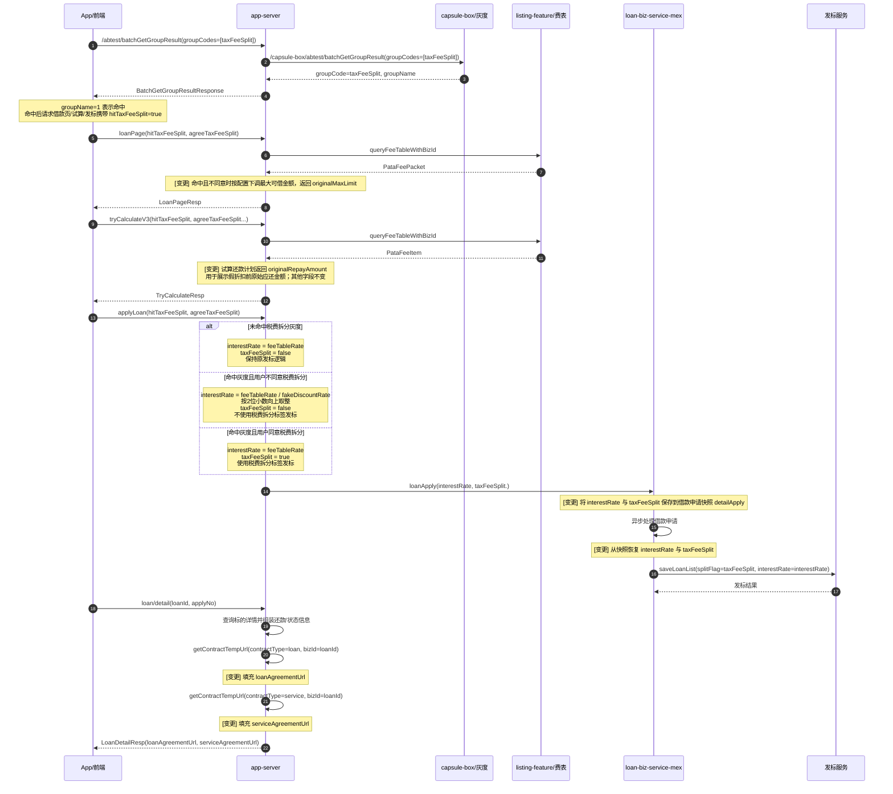

# VAT税费拆分技术方案

## 背景及目标

本次变更需要支持 VAT 税费拆分灰度：通过灰度控制用户是否进入税费拆分实验；未命中灰度时保持原有链路不变；命中灰度后根据用户是否同意税费拆分进入不同发标路径。

目标：

- 未命中税费拆分灰度：保持原有假折扣、试算、发标行为不变。
- 命中税费拆分灰度且用户不同意：不提供假折扣，通过提费后的利率发标，且不携带税费拆分标签。
- 命中税费拆分灰度且用户同意：保持税费拆分路径，发标时携带税费拆分标签。
- 借款页与试算结果补充原始金额、日利率等字段，支持前端展示提费、原始金额和拆分相关信息。。

## 关键决策

- 灰度查询复用现有 `batchGetGroupResult` 接口 → 前端通过 `/abtest/batchGetGroupResult` 查询灰度 code `taxFeeSplit`，命中结果转换为借款页、试算、发标请求中的 `hitTaxFeeSplit`；服务端按 `hitTaxFeeSplit`、`agreeTaxFeeSplit` 两个布尔标记进行业务分流，避免影响非灰度用户。
- 税费拆分标记只在“命中灰度且用户同意”时置为 `true` → 保证只有明确同意拆分的用户使用税费拆分标签发标。
- “命中灰度且用户不同意”使用提费利率发标 → 通过 `interestRate / fakeDiscountRate` 还原到提费后的利率，不设置 `taxFeeSplit`，满足“不提供假折扣（提费）”要求。
- 借款页额度在用户不同意拆分时按配置折扣下调 → 使用 `notAgreeTaxFeeSplit.maxLoanLimit.discount` 控制最大可借金额折扣，默认值 `0.8`，同时返回 `originalMaxLimit` 便于前端展示原始最大额度。
- 税费拆分标记保存到借款申请快照并最终映射为发标 `splitFlag` → 保证异步发标阶段仍能从快照恢复用户选择，不依赖内存或请求上下文。
- 保留原有费率、VAT 类型、VAT 税率透传 → 本次只扩展拆分标签和不同意拆分时的利率处理，不改变原有产品、费表、VAT 字段来源。

## 时序图与流程图

### 时序图

## 接口设计

### POST `loanPage` - 借款页

**改动类型**：修改

**所属服务**：app-server

**请求参数**：

| 参数名 | 类型 | 必填 | 改动类型 | 说明 |
| --- | --- | --- | --- | --- |
| hitTaxFeeSplit | boolean | 否 | 新增 | 是否命中税费拆分灰度，默认 `false` |
| agreeTaxFeeSplit | boolean | 否 | 新增 | 用户是否同意税费拆分，默认 `false` |

**返回参数变更**：

| 参数名 | 类型 | 改动类型 | 说明 |
| --- | --- | --- | --- |
| loanTermAmtList[].loanPeriodAmtList[].originalMaxLimit | String | 新增 | 原始最大可借金额 |
| loanTermAmtList[].loanPeriodAmtList[].maxLimit | String | 修改 | 命中灰度且不同意税费拆分时，可能按 `notAgreeTaxFeeSplit.maxLoanLimit.discount` 下调 |

**前端展示说明**：
- 选择或取消服务费勾选协议重新调用此接口，按最大可借金额试算
- 二次确认左边灰块可借金额写maxLimit，右边红块可借金额写originalMaxLimit

### POST `tryCalculateV3` - 试算

**改动类型**：修改

**所属服务**：app-server

**请求参数**：

| 参数名 | 类型 | 必填 | 改动类型 | 说明 |
| --- | --- | --- | --- | --- |
| hitTaxFeeSplit | boolean | 否 | 新增 | 是否命中税费拆分灰度，默认 `false`；由 `taxFeeSplit` 灰度结果转换得到 |
| agreeTaxFeeSplit | boolean | 否 | 新增 | 用户是否同意税费拆分，默认 `false` |

**返回参数变更**：

| 参数名 | 类型 | 改动类型 | 说明 |
| --- | --- | --- | --- |
| repaymentAmount | String | 原有 | 优惠后应还总金额 |
| originalRepayAmount| String | 原有 | 原始应还金额 |
| discountAmount | String | 原有 | 总优惠金额 |
| repaymentItems[].repaymentAmount | String | 原有 | 分期优惠后应还金额 |
| repaymentItems[].originalRepayAmount | String | 新增 | 分期原始应还金额 |
| repaymentItems[].loanFee | String | 新增 | 应还费用（利息+VAT） |
| repaymentItems[].originalLoanFee | String | 新增 | 原始应还费用（利息+VAT） |

**前端展示说明**：
- 选择或取消服务费勾选协议重新调用此接口，按最大可借金额试算，有优惠券时服务端会返回优惠最大的
- 不命中灰度/命中灰度且同意税费拆分，前端展示逻辑不变（优惠金额、原始金额划线）
- 命中灰度且不同意税费拆分，前端优惠模块置灰展示假折扣优惠和优惠券优惠，还款计划展示用原始金额（originalRepayAmount、repaymentItems[].originalRepayAmount、repaymentItems[].originalLoanFee）；二次确认左边灰块优惠金额为0，右边红块优惠金额为总优惠金额discountAmount

### POST `applyLoan` - 发标申请

**改动类型**：修改

**所属服务**：app-server

**请求参数**：

| 参数名 | 类型 | 必填 | 改动类型 | 说明 |
| --- | --- | --- | --- | --- |
| hitTaxFeeSplit | boolean | 否 | 新增 | 是否命中税费拆分灰度，默认 `false` |
| agreeTaxFeeSplit | boolean | 否 | 新增 | 用户是否同意税费拆分，默认 `false` |

**内部请求变更**：`app-server` 调用 `loan-biz-service-mex` 的 `LoanApplyApplyReq` 新增 `taxFeeSplit`。

### POST `loan/detail` - 借款详情

**改动类型**：修改

**所属服务**：app-server

**用途**：查询标的详情，返回借款状态、还款计划、优惠券、合同地址等信息。本次在原借款合同地址基础上补充服务合同地址。

**返回参数变更**：

| 参数名 | 类型 | 改动类型 | 说明 |
| --- | --- | --- | --- |
| loanAgreementUrl | String | 原有 | 借款合同预览地址，合同类型 `loan` |
| serviceAgreementUrl | String | 新增 | 服务合同预览地址，合同类型 `service` |

**合同地址填充逻辑**：

| 合同字段 | contractType | bizId | 说明 |
| --- | --- | --- | --- |
| loanAgreementUrl | `loan` | `loanId` | 通过 `contractService.getContractTempUrl` 获取借款合同预览地址 |
| serviceAgreementUrl | `service` | `loanId` | 通过 `contractService.getContractTempUrl` 获取服务合同预览地址 |

**注意事项**：

- `serviceAgreementUrl` 只作为借款详情响应新增字段，不影响原有借款合同字段。
- 服务合同地址获取失败时，不应影响借款详情主流程返回；前端可按字段是否为空决定是否展示服务合同入口。

## 配置

| 配置Key | 配置Value（示例） | 改动类型 | 发布时机 | 说明 |
| --- | --- | --- | --- | --- |
| `taxFeeSplit` | capsule-box 分组：`1` 命中，`0` 未命中 | 新增 | 发布前 | 税费拆分灰度 code，通过 `/abtest/batchGetGroupResult` 查询 |
| `notAgreeTaxFeeSplit.maxLoanLimit.discount` | `0.8` | 新增 | 发布前 | 命中税费拆分灰度但用户不同意时，借款页最大可借金额折扣；未配置默认 `0.8` |
| `fake.discount.rate` | 以线上现有配置为准 | 复用 | 发布前确认 | 用于假折扣和不同意税费拆分时的提费利率反推，`interestRate / fakeDiscountRate` |
