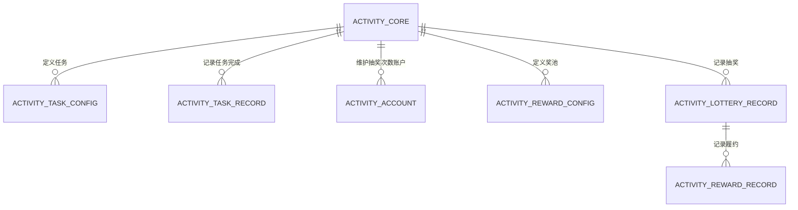
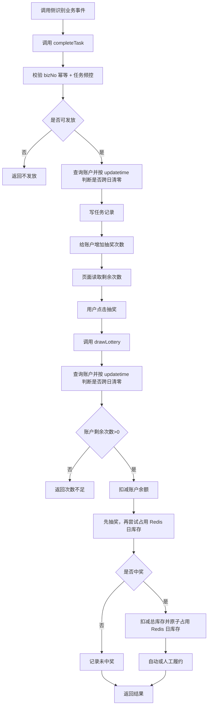
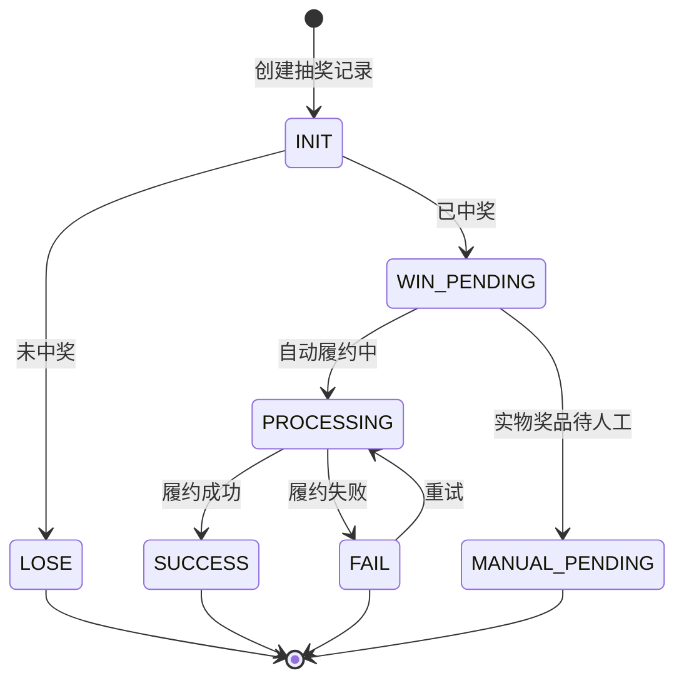

# 墨西哥世界杯活动 技术方案

## 背景及目标

当前 `loan-biz` 已具备首页资源位、营销弹窗、券/提额履约等外围能力，但缺少一套可复用于世界杯、MGM 及后续活动的轻量抽奖活动核心。结合当前已确认的数据库结构和产品规则，本次方案不建设世界杯专属重领域模型，而是在参考 `D:\marketing-center` 活动中心分层思路的基础上，收敛为一套更轻量的活动核心能力。

重点参考来源：

* 活动定义：`D:\marketing-center\marketing-center-activity\src\main\resources\activity-mybatis\TbActivityDefMapper.xml`
* 任务定义与任务记录：`D:\marketing-center\marketing-center-task\src\main\resources\task-mybatis\TbActivityTaskDefMapper.xml`、`D:\marketing-center\marketing-center-task\src\main\resources\task-mybatis\TbActivityTaskUserRecordMapper.xml`
* 抽奖配置与抽奖记录：`D:\marketing-center\marketing-center-lottery\src\main\resources\lottery-mybatis\TbRewardLotteryConfigMapper.xml`、`D:\marketing-center\marketing-center-lottery\src\main\resources\lottery-mybatis\TbUserLotteryRecordMapper.xml`
* 任务频控与奖励调度：`D:\marketing-center\marketing-center-reward\src\main\java\com\ppdai\intl\marketing\center\reward\service\impl\TaskRewardDispatcherServiceImpl.java`
* 抽奖次数账户：`D:\marketing-center\marketing-center-account\src\main\java\com\ppdai\intl\marketing\center\account\service\impl\UserAccountServiceImpl.java`

本次方案目标：

* 将 `loan-biz` 的职责收敛为活动核心引擎：活动配置、任务定义、任务完成频控、抽奖次数维护、奖池库存、抽奖记录、奖励履约
* 明确“比赛日”“VS 样式”“页面文案”“国旗和国家名”等业务表达由调用侧维护，`loan-biz` 不承担表达层含义
* 在抽奖次数维护上保留 `marketing-center` 的账户主表思路，但去掉批次库存和过期 Job，改为基于 `activity_account.updatetime` 的自然日重置
* 保持方案轻量：不新增过多世界杯专用表，不引入复杂账户批次、过期流水与 FIFO 扣减逻辑

## 关键决策

* 参考 `marketing-center` 的能力分层，而不是世界杯专属建模 → 活动主定义、任务定义、任务记录、抽奖配置、抽奖记录、奖励履约分开建模
* 抽奖次数维护保留 `activity_account` 主账户，但不再引入 `activity_account_inventory` 批次表 → 当前剩余抽奖次数只维护在 `activity_account.available_value`
* 每日清零采用“查询/更新阶段按 `updatetime` 判断是否跨自然日，若跨日则将 `available_value` 置 0” → 不再使用 `expire_time + Job`
* 任务频控采用 `marketing-center` 的“任务定义 restrict_config + 任务记录按时间窗统计”模式 → 世界杯三个任务均限制为自然日内最多发放 1 次
* 奖池库存采用“总库存 + Redis 每日限流”双层控制 → 总库存落 DB，每日库存阈值放在 `activity_reward_config.reward_config` 中，运行时用 Redis 做按天限流
* 履约采用“抽奖记录 + 奖励履约记录”两层模型 → 保留对虚拟奖品自动发放、实物奖品人工处理的跟踪能力
* `loan-biz` 不负责比赛日判定、活动可见人群校验与分享成功判定 → 调用侧只传统一 `taskCode`，`loan-biz` 再根据比赛日标识和任务奖励配置中的 `matchDayAwardValue` / `awardValue` 计算实际发放次数

## 领域模型



### 实体：`activity_core` - 通用活动主表

参考 `marketing-center` 的 `tb_activity_def`，但收窄为活动核心最小字段。

| 字段名 (Field) | 类型 (Type) | 长度 (Length) | 允许为空 (Nullable) | 默认值 (Default) | 说明 (Description) |
| --- | --- | --- | --- | --- | --- |
| id | bigint | 20 | NO | - | 主键 |
| activity_code | varchar | 64 | NO | - | 活动编码，唯一 |
| activity_name | varchar | 128 | NO | - | 活动名称 |
| start_time | datetime | - | NO | - | 活动开始时间 |
| end_time | datetime | - | NO | - | 活动结束时间 |
| status | varchar | 32 | NO | `INIT` | 状态：INIT/ENABLED/DISABLED/ENDED |
| inserttime | datetime | - | NO | CURRENT_TIMESTAMP | 创建时间 |
| updatetime | datetime | - | NO | CURRENT_TIMESTAMP | 更新时间 |
| isactive | tinyint | 1 | NO | 1 | 逻辑删除 |

### 实体：`activity_task_config` - 任务定义表

参考 `marketing-center` 的 `tb_activity_task_def`，核心沿用 `restrict_config` 与 `award_config` 两类 JSON 配置。

| 字段名 (Field) | 类型 (Type) | 长度 (Length) | 允许为空 (Nullable) | 默认值 (Default) | 说明 (Description) |
| --- | --- | --- | --- | --- | --- |
| id | bigint | 20 | NO | - | 主键 |
| activity_id | bigint | 20 | NO | - | 活动 ID |
| task_code | varchar | 64 | NO | - | 任务编码 |
| task_name | varchar | 128 | NO | - | 任务名称 |
| restrict_config | varchar | 1024 | NO | - | 任务频控配置 JSON；参考 `ActivityTaskRestrictConfigDto` |
| award_config | varchar | 1024 | NO | - | 任务奖励配置 JSON；世界杯场景固定表达“发放抽奖次数” |
| enable_flag | tinyint | 1 | NO | 1 | 是否启用 |
| inserttime | datetime | - | NO | CURRENT_TIMESTAMP | 创建时间 |
| updatetime | datetime | - | NO | CURRENT_TIMESTAMP | 更新时间 |
| isactive | tinyint | 1 | NO | 1 | 逻辑删除 |

#### `restrict_config` JSON 结构

参考 `D:\marketing-center\marketing-center-server\src\main\java\com\ppdai\intl\marketing\center\dto\ActivityTaskRestrictConfigDto.java`：

```json
{
  "duration": 1440,
  "limitCount": 1,
  "minAmount": null
}
```

字段含义：

* `duration`：频控时间窗，单位分钟；世界杯按 1 天配置 `1440`
* `limitCount`：时间窗内最多奖励次数；世界杯三个任务均为 `1`
* `minAmount`：金额门槛；仅还款类任务按需启用

#### `award_config` JSON 结构

世界杯场景固定为“发放抽奖次数”的轻量配置：

```json
{
  "awardType": "LOTTERY_COUNT",
  "awardValue": 1,
  "matchDayAwardValue": 2
}
```

字段含义：

* `awardType`：固定为 `LOTTERY_COUNT`
* `awardValue`：默认发放的抽奖次数
* `matchDayAwardValue`：比赛日发放的抽奖次数；若为空，则默认沿用 `awardValue`

补充口径：

* 调用侧始终传统一 `taskCode`
* `loan-biz` 在处理任务完成时，根据当前是否比赛日，优先取 `matchDayAwardValue`
* 若不是比赛日，或 `matchDayAwardValue` 未配置，则取 `awardValue`

### 实体：`activity_task_record` - 任务完成记录表

参考 `marketing-center` 的 `tb_activity_task_user_record`，用于任务完成幂等、频控和审计。

| 字段名 (Field) | 类型 (Type) | 长度 (Length) | 允许为空 (Nullable) | 默认值 (Default) | 说明 (Description) |
| --- | --- | --- | --- | --- | --- |
| id | bigint | 20 | NO | - | 主键 |
| activity_id | bigint | 20 | NO | - | 活动 ID |
| task_code | varchar | 64 | NO | - | 任务编码 |
| user_id | bigint | 20 | NO | - | 用户 ID |
| biz_no | varchar | 64 | NO | - | 任务完成幂等键 |
| award_flag | tinyint | 1 | NO | 0 | 本次是否实际发放抽奖次数 |
| inserttime | datetime | - | NO | CURRENT_TIMESTAMP | 完成时间 |
| updatetime | datetime | - | NO | CURRENT_TIMESTAMP | 更新时间 |
| isactive | tinyint | 1 | NO | 1 | 逻辑删除 |

### 实体：`activity_account` - 用户活动抽奖次数账户表

参考 `marketing-center` 的 `tb_activity_user_account`，但收敛为世界杯活动只需要的两个核心字段：累计发放总次数和当前剩余抽奖次数。

| 字段名 (Field) | 类型 (Type) | 长度 (Length) | 允许为空 (Nullable) | 默认值 (Default) | 说明 (Description) |
| --- | --- | --- | --- | --- | --- |
| id | bigint | 20 | NO | - | 主键 |
| activity_id | bigint | 20 | NO | - | 活动 ID |
| user_id | bigint | 20 | NO | - | 用户 ID |
| account_type | varchar | 32 | NO | - | 活动账户类型；本次固定为 `WORLD_CUP_LOTTERY_COUNT` |
| total_value | decimal | 18,2 | NO | 0 | 累计发放总次数；可用于后续统计或入口持续展示判定 |
| available_value | decimal | 18,2 | NO | 0 | 当前剩余抽奖次数 |
| inserttime | datetime | - | NO | CURRENT_TIMESTAMP | 创建时间 |
| updatetime | datetime | - | NO | CURRENT_TIMESTAMP | 更新时间；用于判断是否跨自然日 |
| isactive | tinyint | 1 | NO | 1 | 逻辑删除 |

### 实体：`activity_reward_config` - 奖池配置表

参考 `marketing-center` 的 `tb_reward_lottery_config`，但保留世界杯必须的库存字段。

| 字段名 (Field) | 类型 (Type) | 长度 (Length) | 允许为空 (Nullable) | 默认值 (Default) | 说明 (Description) |
| --- | --- | --- | --- | --- | --- |
| id | bigint | 20 | NO | - | 主键 |
| activity_id | bigint | 20 | NO | - | 活动 ID |
| reward_code | varchar | 64 | NO | - | 奖励编码 |
| reward_name | varchar | 128 | NO | - | 奖励名称 |
| reward_type | varchar | 32 | NO | - | 奖励类型：COUPON/LIMIT_UP/PHYSICAL/NO_PRIZE |
| weight | int | 11 | NO | 0 | 抽奖权重 |
| probability | decimal | 10,4 | YES | NULL | 备用概率字段，便于兼容营销中心配置习惯 |
| total_stock | int | 11 | NO | 0 | 总库存 |
| granted_total | int | 11 | NO | 0 | 已发放总量 |
| stock_version | int | 11 | NO | 0 | 乐观锁版本号 |
| delivery_type | varchar | 32 | NO | - | 履约类型：AUTO/MANUAL/NONE |
| reward_config | varchar | 2048 | YES | NULL | 券批次、提额模板、实物说明、每日库存阈值等配置 |
| status | varchar | 32 | NO | `ENABLED` | 状态 |
| sort_order | int | 11 | NO | 0 | 排序 |
| inserttime | datetime | - | NO | CURRENT_TIMESTAMP | 创建时间 |
| updatetime | datetime | - | NO | CURRENT_TIMESTAMP | 更新时间 |
| isactive | tinyint | 1 | NO | 1 | 逻辑删除 |

#### `reward_config` JSON 结构

世界杯场景建议将每日库存阈值放在 `reward_config` 中，示例：

```json
{
  "dailyStockLimit": 100,
  "couponBatchNo": "CPN_2026_WORLD_CUP_01",
  "limitTemplateCode": "LIMIT_UP_WORLD_CUP_A",
  "physicalRemark": "manual_dispatch"
}
```

字段说明：

* `dailyStockLimit`：每日库存阈值；抽奖时读取该值，并结合 Redis key 做当日限流
* `couponBatchNo`：优惠券奖品对应的券批次号
* `limitTemplateCode`：提额券对应的模板编码或策略编码
* `physicalRemark`：实物奖品履约说明，供人工处理使用

### 实体：`activity_lottery_record` - 抽奖记录表

参考 `marketing-center` 的 `tb_user_lottery_record`，补齐库存和履约状态。

| 字段名 (Field) | 类型 (Type) | 长度 (Length) | 允许为空 (Nullable) | 默认值 (Default) | 说明 (Description) |
| --- | --- | --- | --- | --- | --- |
| id | bigint | 20 | NO | - | 主键 |
| activity_id | bigint | 20 | NO | - | 活动 ID |
| user_id | bigint | 20 | NO | - | 用户 ID |
| flow_no | varchar | 64 | NO | - | 抽奖流水号 |
| award_flag | tinyint | 1 | NO | 0 | 是否中奖 |
| award_result | varchar | 2048 | YES | NULL | 抽奖结果 JSON |
| reward_config_id | bigint | 20 | YES | NULL | 奖励配置 ID |
| inventory_frozen | tinyint | 1 | NO | 0 | 是否已扣库存 |
| fulfillment_status | varchar | 32 | NO | `INIT` | 履约状态 |
| inserttime | datetime | - | NO | CURRENT_TIMESTAMP | 抽奖时间 |
| updatetime | datetime | - | NO | CURRENT_TIMESTAMP | 更新时间 |
| isactive | tinyint | 1 | NO | 1 | 逻辑删除 |

### 实体：`activity_reward_record` - 奖励履约记录表

参考 `marketing-center` 的 `tb_reward_exchange_record`。

| 字段名 (Field) | 类型 (Type) | 长度 (Length) | 允许为空 (Nullable) | 默认值 (Default) | 说明 (Description) |
| --- | --- | --- | --- | --- | --- |
| id | bigint | 20 | NO | - | 主键 |
| activity_id | bigint | 20 | NO | - | 活动 ID |
| lottery_record_id | bigint | 20 | NO | - | 抽奖记录 ID |
| user_id | bigint | 20 | NO | - | 用户 ID |
| reward_config_id | bigint | 20 | NO | - | 奖励配置 ID |
| status | varchar | 32 | NO | `INIT` | 履约状态：INIT/PROCESSING/SUCCESS/FAIL/MANUAL_PENDING |
| origin_biz_no | varchar | 64 | YES | NULL | 外部履约业务号 |
| exchange_result | varchar | 2048 | YES | NULL | 外部履约结果 |
| fail_reason | varchar | 256 | YES | NULL | 失败原因 |
| inserttime | datetime | - | NO | CURRENT_TIMESTAMP | 创建时间 |
| updatetime | datetime | - | NO | CURRENT_TIMESTAMP | 更新时间 |
| isactive | tinyint | 1 | NO | 1 | 逻辑删除 |

## 时序图与流程图

### 时序图

```mermaid
sequenceDiagram
  autonumber
  participant Caller as 调用侧
  participant Core as ActivityCoreService
  participant DB as MySQL
  participant Redis as Redis
  participant Ext as Coupon/Limit/客服

  Caller->>Core: completeTask(activityCode, userId, taskCode, bizNo)
  Core->>DB: 查询 activity_task_config
  Core->>DB: 按 bizNo 查询 activity_task_record 做幂等校验
  Core->>DB: 按 restrict_config 统计时间窗内 task_record
  Core->>DB: 查询 activity_account
  Core->>Core: 若 updatetime 跨自然日，将 available_value 置 0
  alt 命中幂等或频控
    Core-->>Caller: 返回不发放
  else 可发放
    Core->>DB: 写入 activity_task_record(awardFlag=true, bizNo)
    Core->>DB: activity_account.total_value + awardValue; available_value + awardValue
    Core-->>Caller: 返回最新剩余次数
  end

  Caller->>Core: drawLottery(activityCode, userId)
  Core->>DB: 查询 activity_account
  Core->>Core: 若 updatetime 跨自然日，将 available_value 置 0
  Core->>DB: 校验 activity_account.available_value > 0
  Core->>DB: 扣减 activity_account.available_value
  Core->>DB: 过滤总库存不可用奖品
  Core->>DB: 先完成抽奖结果计算
  Core->>DB: 写入 activity_lottery_record
  alt 中奖
    Core->>Redis: 尝试占用 Redis 日库存配额（Lua/原子脚本）
    Note over Core,Redis: 若占用失败，需按超发保护降级为空奖或重新抽取
    Core->>DB: 扣减总库存
    Core->>DB: 写入 activity_reward_record
    Core->>Ext: 自动履约或标记人工处理
  end
  Core-->>Caller: 返回抽奖结果
```

### 流程图



## 状态机

### 状态图



| 状态 | 说明 | 允许的下一状态 |
| --- | --- | --- |
| INIT | 抽奖记录已创建 | LOSE、WIN_PENDING |
| LOSE | 未中奖 | 终态 |
| WIN_PENDING | 已中奖待履约 | PROCESSING、MANUAL_PENDING |
| PROCESSING | 自动履约中 | SUCCESS、FAIL |
| MANUAL_PENDING | 实物奖品待人工联系 | 终态 |
| SUCCESS | 履约成功 | 终态 |
| FAIL | 履约失败 | PROCESSING、终态 |

## 数据库设计

### 新增表

#### `activity_core` - 通用活动主表

**建表 SQL（Required）**：

```sql
CREATE TABLE `activity_core` (
  `id` bigint(20) NOT NULL AUTO_INCREMENT COMMENT '主键',
  `activity_code` varchar(64) NOT NULL COMMENT '活动编码',
  `activity_name` varchar(128) NOT NULL COMMENT '活动名称',
  `start_time` datetime NOT NULL COMMENT '开始时间',
  `end_time` datetime NOT NULL COMMENT '结束时间',
  `status` varchar(32) NOT NULL COMMENT '状态',
  `inserttime` datetime NOT NULL DEFAULT CURRENT_TIMESTAMP COMMENT '创建时间',
  `updatetime` datetime NOT NULL DEFAULT CURRENT_TIMESTAMP ON UPDATE CURRENT_TIMESTAMP COMMENT '更新时间',
  `isactive` tinyint(1) NOT NULL DEFAULT '1' COMMENT '逻辑删除',
  PRIMARY KEY (`id`),
  UNIQUE KEY `uk_activity_code` (`activity_code`),
  KEY `idx_activity_status_time` (`status`, `start_time`, `end_time`)
) ENGINE=InnoDB DEFAULT CHARSET=utf8mb4 COMMENT='通用活动主表';
```

#### `activity_task_config` - 任务定义表

**建表 SQL（Required）**：

```sql
CREATE TABLE `activity_task_config` (
  `id` bigint(20) NOT NULL AUTO_INCREMENT COMMENT '主键',
  `activity_id` bigint(20) NOT NULL COMMENT '活动ID',
  `task_code` varchar(64) NOT NULL COMMENT '任务编码',
  `task_name` varchar(128) NOT NULL COMMENT '任务名称',
  `restrict_config` varchar(1024) NOT NULL COMMENT '频控配置',
  `award_config` varchar(1024) NOT NULL COMMENT '奖励配置',
  `enable_flag` tinyint(1) NOT NULL DEFAULT '1' COMMENT '启用标记',
  `inserttime` datetime NOT NULL DEFAULT CURRENT_TIMESTAMP COMMENT '创建时间',
  `updatetime` datetime NOT NULL DEFAULT CURRENT_TIMESTAMP ON UPDATE CURRENT_TIMESTAMP COMMENT '更新时间',
  `isactive` tinyint(1) NOT NULL DEFAULT '1' COMMENT '逻辑删除',
  PRIMARY KEY (`id`),
  UNIQUE KEY `uk_activity_task_code` (`activity_id`, `task_code`),
  KEY `idx_activity_enable` (`activity_id`, `enable_flag`)
) ENGINE=InnoDB DEFAULT CHARSET=utf8mb4 COMMENT='任务定义表';
```

#### `activity_task_record` - 任务完成记录表

**建表 SQL（Required）**：

```sql
CREATE TABLE `activity_task_record` (
  `id` bigint(20) NOT NULL AUTO_INCREMENT COMMENT '主键',
  `activity_id` bigint(20) NOT NULL COMMENT '活动ID',
  `task_code` varchar(64) NOT NULL COMMENT '任务编码',
  `user_id` bigint(20) NOT NULL COMMENT '用户ID',
  `biz_no` varchar(64) NOT NULL COMMENT '任务完成幂等键',
  `award_flag` tinyint(1) NOT NULL DEFAULT '0' COMMENT '是否发放次数',
  `inserttime` datetime NOT NULL DEFAULT CURRENT_TIMESTAMP COMMENT '创建时间',
  `updatetime` datetime NOT NULL DEFAULT CURRENT_TIMESTAMP ON UPDATE CURRENT_TIMESTAMP COMMENT '更新时间',
  `isactive` tinyint(1) NOT NULL DEFAULT '1' COMMENT '逻辑删除',
  PRIMARY KEY (`id`),
  UNIQUE KEY `uk_activity_task_biz_no` (`activity_id`, `task_code`, `biz_no`),
  KEY `idx_activity_task_user_time` (`activity_id`, `task_code`, `user_id`, `inserttime`)
) ENGINE=InnoDB DEFAULT CHARSET=utf8mb4 COMMENT='任务完成记录表';
```

#### `activity_account` - 用户抽奖次数账户表

**建表 SQL（Required）**：

```sql
CREATE TABLE `activity_account` (
  `id` bigint(20) NOT NULL AUTO_INCREMENT COMMENT '主键',
  `activity_id` bigint(20) NOT NULL COMMENT '活动ID',
  `user_id` bigint(20) NOT NULL COMMENT '用户ID',
  `account_type` varchar(32) NOT NULL COMMENT '账户类型，本次固定 WORLD_CUP_LOTTERY_COUNT',
  `total_value` decimal(18,2) NOT NULL DEFAULT 0 COMMENT '累计发放总值',
  `available_value` decimal(18,2) NOT NULL DEFAULT 0 COMMENT '当前可用值',
  `inserttime` datetime NOT NULL DEFAULT CURRENT_TIMESTAMP COMMENT '创建时间',
  `updatetime` datetime NOT NULL DEFAULT CURRENT_TIMESTAMP ON UPDATE CURRENT_TIMESTAMP COMMENT '更新时间',
  `isactive` tinyint(1) NOT NULL DEFAULT '1' COMMENT '逻辑删除',
  PRIMARY KEY (`id`),
  UNIQUE KEY `uk_activity_user_account` (`activity_id`, `user_id`, `account_type`)
) ENGINE=InnoDB DEFAULT CHARSET=utf8mb4 COMMENT='用户抽奖次数账户表';
```

#### `activity_reward_config` - 奖池配置表

**建表 SQL（Required）**：

```sql
CREATE TABLE `activity_reward_config` (
  `id` bigint(20) NOT NULL AUTO_INCREMENT COMMENT '主键',
  `activity_id` bigint(20) NOT NULL COMMENT '活动ID',
  `reward_code` varchar(64) NOT NULL COMMENT '奖励编码',
  `reward_name` varchar(128) NOT NULL COMMENT '奖励名称',
  `reward_type` varchar(32) NOT NULL COMMENT '奖励类型',
  `weight` int(11) NOT NULL DEFAULT 0 COMMENT '抽奖权重',
  `probability` decimal(10,4) DEFAULT NULL COMMENT '概率',
  `total_stock` int(11) NOT NULL DEFAULT 0 COMMENT '总库存',
  `granted_total` int(11) NOT NULL DEFAULT 0 COMMENT '已发放总量',
  `stock_version` int(11) NOT NULL DEFAULT 0 COMMENT '库存版本号',
  `delivery_type` varchar(32) NOT NULL COMMENT '履约类型',
  `reward_config` varchar(2048) DEFAULT NULL COMMENT '奖励配置',
  `status` varchar(32) NOT NULL DEFAULT 'ENABLED' COMMENT '状态',
  `sort_order` int(11) NOT NULL DEFAULT 0 COMMENT '排序',
  `inserttime` datetime NOT NULL DEFAULT CURRENT_TIMESTAMP COMMENT '创建时间',
  `updatetime` datetime NOT NULL DEFAULT CURRENT_TIMESTAMP ON UPDATE CURRENT_TIMESTAMP COMMENT '更新时间',
  `isactive` tinyint(1) NOT NULL DEFAULT '1' COMMENT '逻辑删除',
  PRIMARY KEY (`id`),
  UNIQUE KEY `uk_activity_reward_code` (`activity_id`, `reward_code`)
) ENGINE=InnoDB DEFAULT CHARSET=utf8mb4 COMMENT='奖池配置表';
```

#### `activity_lottery_record` - 抽奖记录表

**建表 SQL（Required）**：

```sql
CREATE TABLE `activity_lottery_record` (
  `id` bigint(20) NOT NULL AUTO_INCREMENT COMMENT '主键',
  `activity_id` bigint(20) NOT NULL COMMENT '活动ID',
  `user_id` bigint(20) NOT NULL COMMENT '用户ID',
  `flow_no` varchar(64) NOT NULL COMMENT '抽奖流水号',
  `award_flag` tinyint(1) NOT NULL DEFAULT '0' COMMENT '是否中奖',
  `award_result` varchar(2048) DEFAULT NULL COMMENT '抽奖结果',
  `reward_config_id` bigint(20) DEFAULT NULL COMMENT '奖励配置ID',
  `inventory_frozen` tinyint(1) NOT NULL DEFAULT '0' COMMENT '是否已扣库存',
  `fulfillment_status` varchar(32) NOT NULL DEFAULT 'INIT' COMMENT '履约状态',
  `inserttime` datetime NOT NULL DEFAULT CURRENT_TIMESTAMP COMMENT '创建时间',
  `updatetime` datetime NOT NULL DEFAULT CURRENT_TIMESTAMP ON UPDATE CURRENT_TIMESTAMP COMMENT '更新时间',
  `isactive` tinyint(1) NOT NULL DEFAULT '1' COMMENT '逻辑删除',
  PRIMARY KEY (`id`),
  UNIQUE KEY `uk_flow_no` (`flow_no`),
  KEY `idx_activity_user_time` (`activity_id`, `user_id`, `inserttime`)
) ENGINE=InnoDB DEFAULT CHARSET=utf8mb4 COMMENT='抽奖记录表';
```

#### `activity_reward_record` - 奖励履约记录表

**建表 SQL（Required）**：

```sql
CREATE TABLE `activity_reward_record` (
  `id` bigint(20) NOT NULL AUTO_INCREMENT COMMENT '主键',
  `activity_id` bigint(20) NOT NULL COMMENT '活动ID',
  `lottery_record_id` bigint(20) NOT NULL COMMENT '抽奖记录ID',
  `user_id` bigint(20) NOT NULL COMMENT '用户ID',
  `reward_config_id` bigint(20) NOT NULL COMMENT '奖励配置ID',
  `status` varchar(32) NOT NULL DEFAULT 'INIT' COMMENT '履约状态',
  `origin_biz_no` varchar(64) DEFAULT NULL COMMENT '外部业务号',
  `exchange_result` varchar(2048) DEFAULT NULL COMMENT '履约结果',
  `fail_reason` varchar(256) DEFAULT NULL COMMENT '失败原因',
  `inserttime` datetime NOT NULL DEFAULT CURRENT_TIMESTAMP COMMENT '创建时间',
  `updatetime` datetime NOT NULL DEFAULT CURRENT_TIMESTAMP ON UPDATE CURRENT_TIMESTAMP COMMENT '更新时间',
  `isactive` tinyint(1) NOT NULL DEFAULT '1' COMMENT '逻辑删除',
  PRIMARY KEY (`id`),
  UNIQUE KEY `uk_lottery_record_id` (`lottery_record_id`)
) ENGINE=InnoDB DEFAULT CHARSET=utf8mb4 COMMENT='奖励履约记录表';
```

### 数据变更

**变更说明**：世界杯活动初始化一条活动、3 条任务定义、若干奖池配置。比赛日和普通日不再拆成不同 `task_code`，而是在任务奖励配置 `award_config` 中通过 `awardValue` / `matchDayAwardValue` 区分。每日库存不落 DB，由 `reward_config.dailyStockLimit` 配置每日限流阈值，运行时通过 Redis 计数控制。当前确认规则为：访问活动主页比赛日 `+2`、普通日 `+1`；还款和分享无论普通日/比赛日均为 `+1`。

**数据变更 SQL（Required）**：

```sql
INSERT INTO `activity_core`
(`activity_code`, `activity_name`, `start_time`, `end_time`, `status`)
VALUES
('mex_worldcup_2026', '墨西哥世界杯活动', '2026-06-11 00:00:00', '2026-07-20 23:59:59', 'ENABLED');

INSERT INTO `activity_task_config`
(`activity_id`, `task_code`, `task_name`, `restrict_config`, `award_config`, `enable_flag`)
SELECT id, 'HOME_VISIT', '访问活动主页', '{"duration":1440,"limitCount":1}', '{"awardType":"LOTTERY_COUNT","awardValue":1,"matchDayAwardValue":2}', 1 FROM `activity_core` WHERE `activity_code`='mex_worldcup_2026'
UNION ALL
SELECT id, 'REPAY', '还款', '{"duration":1440,"limitCount":1}', '{"awardType":"LOTTERY_COUNT","awardValue":1}', 1 FROM `activity_core` WHERE `activity_code`='mex_worldcup_2026'
UNION ALL
SELECT id, 'SHARE', '分享', '{"duration":1440,"limitCount":1}', '{"awardType":"LOTTERY_COUNT","awardValue":1}', 1 FROM `activity_core` WHERE `activity_code`='mex_worldcup_2026';
```

## 接口设计

### POST `/api/v1/activity/task/complete` - 完成任务并发放抽奖次数

**改动类型**：新增

**所属服务**：活动核心

**请求参数**：

| 参数名 | 类型 | 必填 | 说明 |
| --- | --- | --- | --- |
| activityCode | String | 是 | 活动编码 |
| userId | Long | 是 | 用户 ID |
| taskCode | String | 是 | 任务编码 |
| bizNo | String | 是 | 任务完成幂等键 |

**返回参数**：

| 参数名 | 类型 | 说明 |
| --- | --- | --- |
| code | Integer | 状态码 |
| message | String | 提示信息 |
| data.awardFlag | Boolean | 是否实际发放次数 |
| data.awardValue | Integer | 本次发放次数 |
| data.availableLotteryCount | Integer | 当前剩余抽奖次数 |

说明：

* 频控校验参考 `marketing-center` 的 `verifyAccess` 逻辑：根据 `restrict_config.duration + limitCount`，统计 `activity_task_record` 指定时间窗内成功记录数量
* 世界杯三个任务默认都是每日最多发放一次
* 分享任务成功口径由调用侧按 PRD 固定执行：成功拉起外部 App 即调用该接口，不等待真正分享回调
* 更新或查询账户时，若 `activity_account.updatetime` 不属于当前墨西哥自然日，则先将 `available_value` 重置为 0，再继续发放或返回

### POST `/api/v1/activity/lottery/count` - 查询剩余抽奖次数

**改动类型**：新增

**所属服务**：活动核心

**请求参数**：

| 参数名 | 类型 | 必填 | 说明 |
| --- | --- | --- | --- |
| activityCode | String | 是 | 活动编码 |
| userId | Long | 是 | 用户 ID |

**返回参数**：

| 参数名 | 类型 | 说明 |
| --- | --- | --- |
| code | Integer | 状态码 |
| message | String | 提示信息 |
| data.availableLotteryCount | Integer | 剩余抽奖次数，对应 `activity_account.available_value` |

说明：

* 查询前若发现 `activity_account.updatetime` 已跨自然日，则先将 `available_value` 重置为 0，再返回结果

### POST `/api/v1/activity/lottery/draw` - 抽奖

**改动类型**：新增

**所属服务**：活动核心

**请求参数**：

| 参数名 | 类型 | 必填 | 说明 |
| --- | --- | --- | --- |
| activityCode | String | 是 | 活动编码 |
| userId | Long | 是 | 用户 ID |

**返回参数**：

| 参数名 | 类型 | 说明 |
| --- | --- | --- |
| code | Integer | 状态码 |
| message | String | 提示信息 |
| data.awardFlag | Boolean | 是否中奖 |
| data.awardResult | Object | 抽奖结果 |
| data.availableLotteryCount | Integer | 抽奖后剩余次数 |

说明：

* 抽奖前若发现 `activity_account.updatetime` 已跨自然日，则先将 `available_value` 重置为 0，再校验是否可抽
* 跑马灯最近 `10` 条真实中奖记录，基于 `activity_reward_record` 中状态为 `PROCESSING` / `SUCCESS` 的记录倒序查询组装，不展示未中奖记录

## 定时任务

当前方案不设计额外定时任务。奖励履约异常通过线上监控、告警和人工介入处理。

## 配置

| 配置Key | 配置Value（示例） | 改动类型 | 发布时机 | 说明 |
| --- | --- | --- | --- | --- |
| `user.slot.config` | 新增世界杯首页入口 slot 配置 | 新增 | 发布前 | 首页 banner |
| `config.user.collect.config` | 新增世界杯首页弹窗频控配置 | 新增 | 发布前 | 首页营销弹窗 |
| `activity.lottery.timezone` | `America/Mexico_City` | 新增 | 发布前 | 账户日切、每日库存限流的自然日时区 |
| `activity.reward.daily.stock.prefix` | `activity:reward:daily:stock` | 新增 | 发布前 | Redis 每日库存限流 key 前缀 |

## 缓存设计

| Key | 类型 | 过期时间 | 改动类型 | 说明 |
| --- | --- | --- | --- | --- |
| `activity:core:{activityCode}` | String | 10m | 新增 | 活动配置缓存 |
| `activity:task:list:{activityCode}` | String | 10m | 新增 | 任务定义缓存 |
| `activity:lottery:count:{activityCode}:{userId}` | String | 5m | 新增 | 用户剩余抽奖次数缓存 |
| `activity:reward:list:{activityCode}` | String | 5m | 新增 | 奖池配置缓存 |
| `activity:reward:daily:stock:{activityCode}:{rewardCode}:{date}` | String | 1d | 新增 | 奖励每日库存已发放计数 |

**缓存策略**：

* 剩余次数以 DB 为准，任务发放、抽奖成功或跨日重置后删除对应用户缓存
* 活动和任务定义走短期缓存，减少频繁查库
* 每日库存计数采用 Redis `INCR` + 过期时间控制，key 在墨西哥自然日结束后自动过期
* Redis 日库存占用需通过 Lua 或等价原子脚本完成“校验阈值 + 占用计数”，避免先中奖后递增导致的超发

## 外部依赖

### 依赖接口

| 系统 | 接口 | 用途 | 备注 |
| --- | --- | --- | --- |
| 券中台 | `CouponActionClient#lockBind` 或最终确认的发券接口 | 优惠券履约 | 需进一步确认最终直接发券能力 |
| 资产/风险 | 提额奖励履约接口 | 提额券履约 | 需进一步确认接口契约 |
| 调用侧业务系统 | 调用任务完成接口 | 负责比赛日判定、还款完成判定、分享成功判定、活动可见人群校验 | `loan-biz` 不维护这些表达逻辑 |

## 监控项

| 监控指标 | 监控方式 | 告警阈值 | 告警接收人 |
| --- | --- | --- | --- |
| 任务完成接口失败率 | 接口成功率监控 | 5 分钟失败率 > 5% | 活动研发负责人 |
| 抽奖接口失败率 | 接口成功率监控 | 5 分钟失败率 > 3% | 活动研发负责人 |
| Redis 日库存计数异常 | Redis key 巡检 + 错误日志 | 出现超卖或 key 丢失立即告警 | 活动研发负责人 |
| 奖励履约失败次数 | DB 失败记录统计 | 10 分钟内失败 > 20 次 | 活动研发负责人、运营 |
