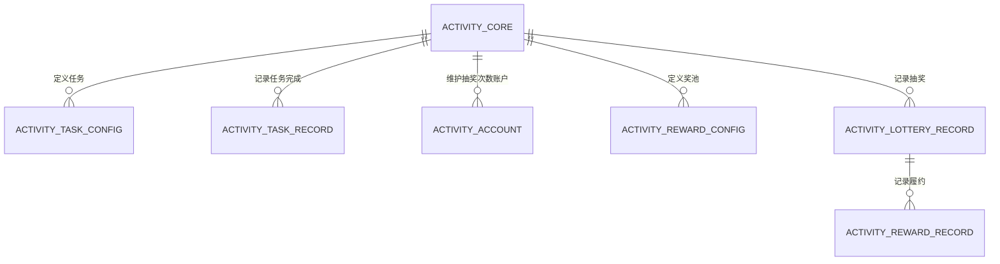
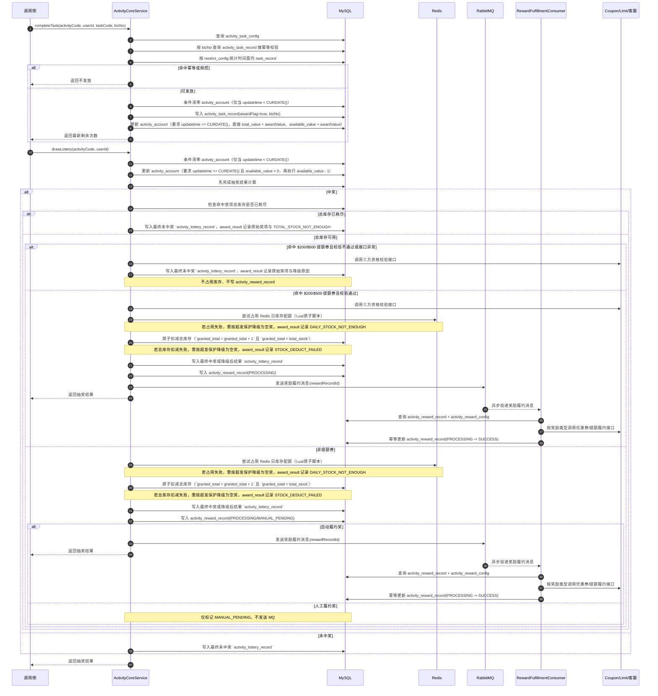
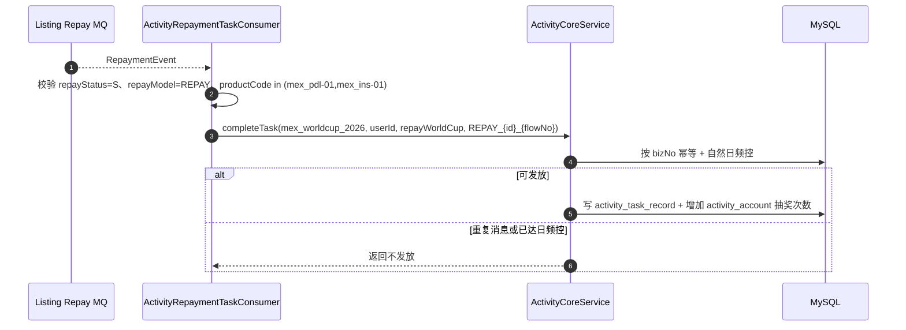
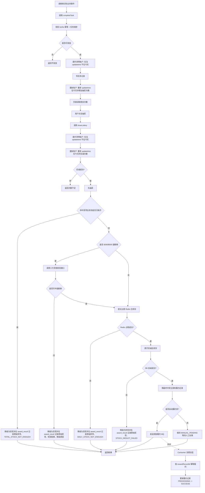
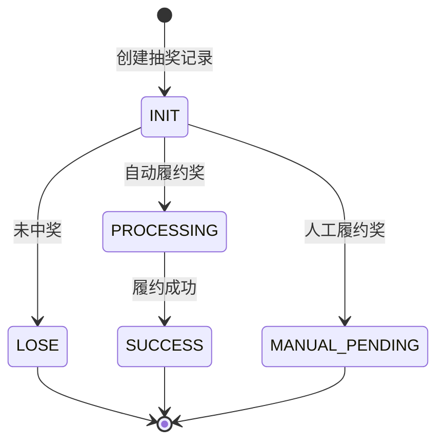

# 墨西哥世界杯活动 技术方案

## 背景及目标

当前 `loan-biz` 已具备首页资源位、营销弹窗、券/提额履约等外围能力，但缺少一套可复用于世界杯、MGM 及后续活动的轻量抽奖活动核心。结合当前已确认的数据库结构和产品规则，本次方案不建设世界杯专属重领域模型，而是在参考 `D:\marketing-center` 活动中心分层思路的基础上，收敛为一套更轻量的活动核心能力。

重点参考来源：

* 活动定义：`D:\marketing-center\marketing-center-activity\src\main\resources\activity-mybatis\TbActivityDefMapper.xml`
* 任务定义与任务记录：`D:\marketing-center\marketing-center-task\src\main\resources\task-mybatis\TbActivityTaskDefMapper.xml`、`D:\marketing-center\marketing-center-task\src\main\resources\task-mybatis\TbActivityTaskUserRecordMapper.xml`
* 抽奖配置与抽奖记录：`D:\marketing-center\marketing-center-lottery\src\main\resources\lottery-mybatis\TbRewardLotteryConfigMapper.xml`、`D:\marketing-center\marketing-center-lottery\src\main\resources\lottery-mybatis\TbUserLotteryRecordMapper.xml`
* 任务频控与奖励调度：`D:\marketing-center\marketing-center-reward\src\main\java\com\ppdai\intl\marketing\center\reward\service\impl\TaskRewardDispatcherServiceImpl.java`
* 抽奖次数账户：`D:\marketing-center\marketing-center-account\src\main\java\com\ppdai\intl\marketing\center\account\service\impl\UserAccountServiceImpl.java`

本次方案目标：

* 将 `loan-biz` 的职责收敛为活动核心引擎：活动配置、任务定义、任务完成频控、抽奖次数维护、奖池库存、抽奖记录、奖励履约
* 明确“比赛日”“VS 样式”“页面文案”“国旗和国家名”等业务表达由调用侧维护，`loan-biz` 不承担表达层含义
* 在抽奖次数维护上保留 `marketing-center` 的账户主表思路，但去掉批次库存和过期 Job，改为基于 `activity_account.updatetime` 的自然日重置
* 保持方案轻量：不新增过多世界杯专用表，不引入复杂账户批次、过期流水与 FIFO 扣减逻辑

## 关键决策

* 参考 `marketing-center` 的能力分层，而不是世界杯专属建模 → 活动主定义、任务定义、任务记录、抽奖配置、抽奖记录、奖励履约分开建模
* 抽奖次数维护保留 `activity_account` 主账户，但不再引入 `activity_account_inventory` 批次表 → 当前剩余抽奖次数只维护在 `activity_account.available_value`
* 每日清零采用“两步 SQL”方案：发放前/扣减前先执行条件清零，再执行基于数据库当前日期函数判断的发放/扣减 SQL → 不再使用 `expire_time + Job`
* 任务频控采用 `marketing-center` 的“任务定义 restrict_config + 任务记录按时间窗统计”模式 → 世界杯三个任务均限制为自然日内最多发放 1 次
* 奖池库存采用“总库存 + Redis 每日限流”双层控制 → 总库存落 DB，每日库存阈值放在 `activity_reward_config.reward_config` 中，运行时用 Redis 做按天限流
* 履约采用“抽奖记录 + 奖励履约记录 + MQ 异步履约”模型 → 抽奖链路只负责写入履约记录并发送履约消息，虚拟奖品由 Consumer 异步履约，实物奖品保留人工处理
* `loan-biz` 不负责比赛日判定、活动可见人群校验与分享成功判定 → 调用侧只传统一 `taskCode`，`loan-biz` 再根据比赛日标识和任务奖励配置中的 `matchDayAwardValue` / `awardValue` 计算实际发放次数
* 还款任务由 `loan-biz-market` 直接消费还款成功 MQ 自动完成 → 新增世界杯还款队列，Consumer 校验商户、还款状态和还款模式后调用 `completeTask(mex_worldcup_2026, userId, repayWorldCup, bizNo)` 发放抽奖次数

## 领域模型



### 实体：`activity_core` - 通用活动主表

参考 `marketing-center` 的 `tb_activity_def`，但收窄为活动核心最小字段。

| 字段名 (Field) | 类型 (Type) | 长度 (Length) | 允许为空 (Nullable) | 默认值 (Default) | 说明 (Description) |
| --- | --- | --- | --- | --- | --- |
| id | bigint | 20 | NO | - | 主键 |
| activity_code | varchar | 64 | NO | - | 活动编码，唯一 |
| activity_name | varchar | 128 | NO | - | 活动名称 |
| start_time | datetime | - | NO | - | 活动开始时间 |
| end_time | datetime | - | NO | - | 活动结束时间 |
| status | varchar | 32 | NO | `INIT` | 状态：INIT/ENABLED/DISABLED/ENDED |
| inserttime | datetime | - | NO | CURRENT_TIMESTAMP | 创建时间 |
| updatetime | datetime | - | NO | CURRENT_TIMESTAMP | 更新时间 |
| isactive | tinyint | 1 | NO | 1 | 逻辑删除 |

### 实体：`activity_task_config` - 任务定义表

参考 `marketing-center` 的 `tb_activity_task_def`，核心沿用 `restrict_config` 与 `award_config` 两类 JSON 配置。

| 字段名 (Field) | 类型 (Type) | 长度 (Length) | 允许为空 (Nullable) | 默认值 (Default) | 说明 (Description) |
| --- | --- | --- | --- | --- | --- |
| id | bigint | 20 | NO | - | 主键 |
| activity_id | bigint | 20 | NO | - | 活动 ID |
| task_code | varchar | 64 | NO | - | 任务编码 |
| task_name | varchar | 128 | NO | - | 任务名称 |
| restrict_config | varchar | 1024 | NO | - | 任务频控配置 JSON；参考 `ActivityTaskRestrictConfigDto` |
| award_config | varchar | 1024 | NO | - | 任务奖励配置 JSON；世界杯场景固定表达“发放抽奖次数” |
| enable_flag | tinyint | 1 | NO | 1 | 是否启用 |
| inserttime | datetime | - | NO | CURRENT_TIMESTAMP | 创建时间 |
| updatetime | datetime | - | NO | CURRENT_TIMESTAMP | 更新时间 |
| isactive | tinyint | 1 | NO | 1 | 逻辑删除 |

#### `restrict_config` JSON 结构

参考 `D:\marketing-center\marketing-center-server\src\main\java\com\ppdai\intl\marketing\center\dto\ActivityTaskRestrictConfigDto.java`，但世界杯场景按自然日做了进一步收敛：

```json
{
  "cycleType": "NATURAL_DAY",
  "limitCount": 1
}
```

字段含义：

* `cycleType`：固定为 `NATURAL_DAY`，表示按自然日控制频次
* `limitCount`：时间窗内最多奖励次数；世界杯三个任务均为 `1`

#### `award_config` JSON 结构

世界杯场景固定为“发放抽奖次数”的轻量配置：

```json
{
  "awardType": "LOTTERY_COUNT",
  "awardValue": 1,
  "matchDayAwardValue": 2
}
```

字段含义：

* `awardType`：固定为 `LOTTERY_COUNT`
* `awardValue`：默认发放的抽奖次数
* `matchDayAwardValue`：比赛日发放的抽奖次数；若为空，则默认沿用 `awardValue`

补充口径：

* 调用侧始终传统一 `taskCode`
* `loan-biz` 在处理任务完成时，根据当前是否比赛日，优先取 `matchDayAwardValue`
* 若不是比赛日，或 `matchDayAwardValue` 未配置，则取 `awardValue`

### 实体：`activity_task_record` - 任务完成记录表

参考 `marketing-center` 的 `tb_activity_task_user_record`，用于任务完成幂等、频控和审计。

| 字段名 (Field) | 类型 (Type) | 长度 (Length) | 允许为空 (Nullable) | 默认值 (Default) | 说明 (Description) |
| --- | --- | --- | --- | --- | --- |
| id | bigint | 20 | NO | - | 主键 |
| activity_id | bigint | 20 | NO | - | 活动 ID |
| task_code | varchar | 64 | NO | - | 任务编码 |
| user_id | bigint | 20 | NO | - | 用户 ID |
| biz_no | varchar | 64 | NO | - | 任务完成幂等键 |
| award_flag | tinyint | 1 | NO | 0 | 本次是否实际发放抽奖次数 |
| inserttime | datetime | - | NO | CURRENT_TIMESTAMP | 完成时间 |
| updatetime | datetime | - | NO | CURRENT_TIMESTAMP | 更新时间 |
| isactive | tinyint | 1 | NO | 1 | 逻辑删除 |

### 实体：`activity_account` - 用户活动抽奖次数账户表

参考 `marketing-center` 的 `tb_activity_user_account`，但收敛为世界杯活动只需要的两个核心字段：累计发放总次数和当前剩余抽奖次数。

| 字段名 (Field) | 类型 (Type) | 长度 (Length) | 允许为空 (Nullable) | 默认值 (Default) | 说明 (Description) |
| --- | --- | --- | --- | --- | --- |
| id | bigint | 20 | NO | - | 主键 |
| activity_id | bigint | 20 | NO | - | 活动 ID |
| user_id | bigint | 20 | NO | - | 用户 ID |
| account_type | varchar | 32 | NO | - | 活动账户类型；本次固定为 `WORLD_CUP_LOTTERY_COUNT` |
| total_value | decimal | 18,2 | NO | 0 | 累计发放总次数；可用于后续统计或入口持续展示判定 |
| available_value | decimal | 18,2 | NO | 0 | 当前剩余抽奖次数 |
| inserttime | datetime | - | NO | CURRENT_TIMESTAMP | 创建时间 |
| updatetime | datetime | - | NO | CURRENT_TIMESTAMP | 更新时间；用于判断是否跨自然日 |
| isactive | tinyint | 1 | NO | 1 | 逻辑删除 |

### 实体：`activity_reward_config` - 奖池配置表

参考 `marketing-center` 的 `tb_reward_lottery_config`，但保留世界杯必须的库存字段。

| 字段名 (Field) | 类型 (Type) | 长度 (Length) | 允许为空 (Nullable) | 默认值 (Default) | 说明 (Description) |
| --- | --- | --- | --- | --- | --- |
| id | bigint | 20 | NO | - | 主键 |
| activity_id | bigint | 20 | NO | - | 活动 ID |
| reward_code | varchar | 64 | NO | - | 奖励编码 |
| reward_name | varchar | 128 | NO | - | 奖励名称 |
| reward_type | varchar | 32 | NO | - | 奖励类型：COUPON/LIMIT_UP/PHYSICAL/NO_PRIZE |
| weight | int | 11 | NO | 0 | 抽奖权重，按百分制整数配置 |
| total_stock | int | 11 | YES | NULL | 总库存；`NULL` 表示该奖项无库存概念 |
| granted_total | int | 11 | YES | NULL | 已发放总量；无库存概念奖项可不记录 |
| delivery_type | varchar | 32 | NO | - | 履约类型：AUTO/MANUAL/NONE |
| reward_config | varchar | 2048 | YES | NULL | 券批次、提额模板、实物说明、每日库存阈值等配置 |
| reward_status | varchar | 32 | NO | `ENABLED` | 状态：ENABLED/DISABLED |
| sort_order | int | 11 | NO | 0 | 排序 |
| inserttime | datetime | - | NO | CURRENT_TIMESTAMP | 创建时间 |
| updatetime | datetime | - | NO | CURRENT_TIMESTAMP | 更新时间 |
| isactive | tinyint | 1 | NO | 1 | 逻辑删除 |

#### `reward_config` JSON 结构

世界杯场景建议将每日库存阈值放在 `reward_config` 中，示例：

```json
{
  "dailyStockLimit": 100,
  "couponBatchNo": "CPN_2026_WORLD_CUP_01",
  "limitBizType": "304",
  "subBizScene": "world_cup",
  "reqIncreaseLimit": 200,
  "qualificationCheckRequired": true,
  "physicalRemark": "manual_dispatch"
}
```

字段说明：

* `dailyStockLimit`：每日库存阈值；抽奖时读取该值，并结合 Redis key 做当日限流
* `couponBatchNo`：优惠券奖品对应的券批次号
* `limitBizType`：提额业务类型；世界杯固定为 `304`
* `subBizScene`：提额子业务场景；世界杯固定为 `world_cup`
* `reqIncreaseLimit`：期望提额额度，世界杯场景用于区分 `$200` / `$500` 提额券三方资格校验和履约参数
* `qualificationCheckRequired`：是否需要命中后先调用三方资格校验；世界杯 `$200` / `$500` 提额券固定为 `true`
* `physicalRemark`：实物奖品履约说明，供人工处理使用

#### `weight` 配置规则

* `weight` 采用百分制整数权重。
* 同一 `activity_id` 下，所有启用中的奖励项 `weight` 总和必须等于 `100`。
* 若总和不等于 `100`，则奖池配置应视为非法配置，不允许进入抽奖计算。
* `NO_REWARD` 作为逻辑结果项参与权重计算，但不适用库存控制；该奖项可配置 `total_stock = NULL`、`granted_total = NULL`。

**当前配置验证**（权重总和 = 30 + 20 + 24 + 5 + 1 + 20 = 100 ✓）：

| 奖项 | 权重 | 总库存 | 每日库存 | 中奖概率 |
| --- | --- | --- | --- | --- |
| $200提额券 | 30% | 10,000 | 500 | 30% |
| $500提额券 | 20% | 10,000 | 500 | 20% |
| 10%借款优惠券 | 24% | 5,000 | 200 | 24% |
| 世界杯吉祥物 | 5% | 5 | 1 | 5% |
| 签名球衣 | 1% | 1 | 1 | 1% |
| 未中奖 | 20% | 无限 | 无限 | 20% |

### 实体：`activity_lottery_record` - 抽奖记录表

参考 `marketing-center` 的 `tb_user_lottery_record`，作为抽奖结果账本；中奖后的履约状态统一由 `activity_reward_record` 维护。

| 字段名 (Field) | 类型 (Type) | 长度 (Length) | 允许为空 (Nullable) | 默认值 (Default) | 说明 (Description) |
| --- | --- | --- | --- | --- | --- |
| id | bigint | 20 | NO | - | 主键 |
| activity_id | bigint | 20 | NO | - | 活动 ID |
| user_id | bigint | 20 | NO | - | 用户 ID |
| award_flag | tinyint | 1 | NO | 0 | 是否中奖 |
| award_result | varchar | 2048 | YES | NULL | 抽奖结果 JSON |
| reward_config_id | bigint | 20 | YES | NULL | 奖励配置 ID |
| inserttime | datetime | - | NO | CURRENT_TIMESTAMP | 抽奖时间 |
| updatetime | datetime | - | NO | CURRENT_TIMESTAMP | 更新时间 |
| isactive | tinyint | 1 | NO | 1 | 逻辑删除 |

#### `award_result` JSON 结构

抽奖记录保存最终对用户展示的结果，同时在发生降级时保留原始命中奖项和降级原因。提额券三方资格校验未通过、总库存不足、Redis 每日库存不足、DB 库存扣减失败时，最终结果必须按 `NO_REWARD` 保存，并记录降级明细。

普通中奖示例：

```json
{
  "awardFlag": true,
  "rewardCode": "LIMIT_COUPON_200",
  "rewardName": "$200提额券",
  "rewardType": "LIMIT_UP",
  "degraded": false
}
```

提额券资格校验降级示例：

```json
{
  "awardFlag": false,
  "rewardCode": "NO_REWARD",
  "rewardName": "未中奖",
  "rewardType": "NO_PRIZE",
  "degraded": true,
  "originRewardCode": "LIMIT_COUPON_200",
  "originRewardName": "$200提额券",
  "originRewardType": "LIMIT_UP",
  "degradeReason": "LIMIT_QUALIFICATION_REJECTED",
  "degradeScene": "LIMIT_UP_QUALIFICATION_CHECK",
  "qualificationCheckResult": {
    "success": true,
    "eligible": false,
    "thirdCode": "REJECTED",
    "thirdMessage": "user is not eligible"
  }
}
```

库存不足降级示例：

```json
{
  "awardFlag": false,
  "rewardCode": "NO_REWARD",
  "rewardName": "未中奖",
  "rewardType": "NO_PRIZE",
  "degraded": true,
  "originRewardCode": "DISCOUNT_COUPON_10P",
  "originRewardName": "10%借款优惠券",
  "originRewardType": "COUPON",
  "degradeReason": "DAILY_STOCK_NOT_ENOUGH",
  "degradeScene": "REWARD_STOCK_CHECK"
}
```

字段含义：

* `awardFlag` / `rewardCode` / `rewardName` / `rewardType`：最终对用户展示和后续统计使用的抽奖结果
* `degraded`：是否发生降级；库存不足、每日库存占用失败、提额资格校验不通过等场景均可置为 `true`
* `originRewardCode` / `originRewardName` / `originRewardType`：发生降级时的原始命中奖项
* `degradeReason`：降级原因；提额券资格校验不通过使用 `LIMIT_QUALIFICATION_REJECTED`，接口异常使用 `LIMIT_QUALIFICATION_CHECK_FAILED`，总库存不足使用 `TOTAL_STOCK_NOT_ENOUGH`，Redis 每日库存不足使用 `DAILY_STOCK_NOT_ENOUGH`，DB 库存扣减失败使用 `STOCK_DEDUCT_FAILED`
* `degradeScene`：降级场景；提额券三方校验固定为 `LIMIT_UP_QUALIFICATION_CHECK`，库存相关降级固定为 `REWARD_STOCK_CHECK`
* `qualificationCheckResult`：三方资格校验摘要，需避免保存敏感字段和过长报文

### 实体：`activity_reward_record` - 奖励履约记录表

参考 `marketing-center` 的 `tb_reward_exchange_record`。

| 字段名 (Field) | 类型 (Type) | 长度 (Length) | 允许为空 (Nullable) | 默认值 (Default) | 说明 (Description) |
| --- | --- | --- | --- | --- | --- |
| id | bigint | 20 | NO | - | 主键 |
| activity_id | bigint | 20 | NO | - | 活动 ID |
| lottery_record_id | bigint | 20 | NO | - | 抽奖记录 ID |
| user_id | bigint | 20 | NO | - | 用户 ID |
| reward_config_id | bigint | 20 | NO | - | 奖励配置 ID |
| reward_status | varchar | 32 | NO | `INIT` | 履约状态：INIT/LOSE/PROCESSING/MANUAL_PENDING/SUCCESS |
| origin_biz_no | varchar | 64 | YES | NULL | 外部履约业务号 |
| exchange_result | varchar | 2048 | YES | NULL | 外部履约结果 |
| fail_reason | varchar | 256 | YES | NULL | 失败原因 |
| inserttime | datetime | - | NO | CURRENT_TIMESTAMP | 创建时间 |
| updatetime | datetime | - | NO | CURRENT_TIMESTAMP | 更新时间 |
| isactive | tinyint | 1 | NO | 1 | 逻辑删除 |

## 时序图与流程图

### 时序图



#### 还款任务自动完成



### 流程图



### 奖励履约 MQ

自动履约奖品不在抽奖接口内同步调用外部系统。抽奖链路命中奖项并完成库存扣减后，先写入 `activity_reward_record`，再按履约类型决定是否发送 MQ：

* `delivery_type=AUTO`：履约记录初始化为 `PROCESSING`，发送奖励履约 MQ，消息体只携带 `rewardRecordId`
* `delivery_type=MANUAL`：履约记录初始化为 `MANUAL_PENDING`，不发送 MQ，由运营/客服人工处理
* `delivery_type=NONE`：通常仅用于 `NO_REWARD`，不写入中奖履约记录，也不发送 MQ

消息体：

```json
{
  "rewardRecordId": 123456
}
```

Consumer 处理规则：

* 消费端根据 `rewardRecordId` 查询 `activity_reward_record` 和 `activity_reward_config`
* 仅当履约记录状态为 `PROCESSING` 时执行外部履约；若已是 `SUCCESS`、`MANUAL_PENDING` 或记录不存在，直接 ACK，保证重复消息幂等
* 优惠券奖品根据 `reward_config.couponBatchNo` 调用券中台履约接口，提额券奖品根据 `reward_config.limitBizType` / `subBizScene` / `reqIncreaseLimit` 调用提额履约接口
* 外部履约成功后，使用条件更新将 `activity_reward_record.reward_status` 从 `PROCESSING` 更新为 `SUCCESS`，同时写入 `origin_biz_no` 和 `exchange_result`
* 外部履约失败或异常时不 ACK 成功，消息重回队列重试；若需要人工介入，可保留 `PROCESSING` 并写入 `fail_reason` / `exchange_result` 供监控识别
* 非法消息或无法解析消息直接 ACK，避免毒消息阻塞队列

## 状态机

### 状态图



| 状态 | 说明 | 允许的下一状态 |
| --- | --- | --- |
| INIT | 抽奖记录已创建 | LOSE、PROCESSING、MANUAL_PENDING |
| LOSE | 未中奖 | 终态 |
| PROCESSING | 自动履约中；由 MQ Consumer 幂等执行外部履约，异常时保持该状态等待重试或人工介入 | SUCCESS |
| MANUAL_PENDING | 实物奖品待人工联系 | 终态 |
| SUCCESS | 履约成功 | 终态 |

## 数据库设计

### 新增表

#### `activity_core` - 通用活动主表

**建表 SQL（Required）**：

```sql
CREATE TABLE `activity_core` (
  `id` bigint(20) unsigned NOT NULL AUTO_INCREMENT COMMENT '主键',
  `activity_code` varchar(64) NOT NULL COMMENT '活动编码',
  `activity_name` varchar(128) NOT NULL COMMENT '活动名称',
  `start_time` datetime DEFAULT NULL COMMENT '开始时间',
  `end_time` datetime DEFAULT NULL COMMENT '结束时间',
  `activity_status` varchar(32) NOT NULL COMMENT '活动状态：ENABLED/DISABLED',
  `inserttime` datetime NOT NULL DEFAULT CURRENT_TIMESTAMP COMMENT '创建时间',
  `updatetime` datetime NOT NULL DEFAULT CURRENT_TIMESTAMP ON UPDATE CURRENT_TIMESTAMP COMMENT '更新时间',
  `isactive` tinyint(1) NOT NULL DEFAULT '1' COMMENT '逻辑删除',
  PRIMARY KEY (`id`),
  KEY `idx_activity_inserttime` (`inserttime`),
  KEY `idx_activity_updatetime` (`updatetime`)
) ENGINE=InnoDB DEFAULT CHARSET=utf8mb4 COMMENT='通用活动主表';
```

#### `activity_task_config` - 任务定义表

**建表 SQL（Required）**：

```sql
CREATE TABLE `activity_task_config` (
  `id` bigint(20) unsigned NOT NULL AUTO_INCREMENT COMMENT '主键',
  `activity_id` bigint(20) NOT NULL COMMENT '活动ID',
  `task_code` varchar(64) NOT NULL COMMENT '任务编码',
  `task_name` varchar(128) NOT NULL COMMENT '任务名称',
  `restrict_config` varchar(1024) NULL DEFAULT NULL COMMENT '频控配置',
  `award_config` varchar(1024) NULL DEFAULT NULL COMMENT '奖励配置',
  `enable_flag` tinyint(1) NOT NULL DEFAULT '1' COMMENT '启用标记',
  `inserttime` datetime NOT NULL DEFAULT CURRENT_TIMESTAMP COMMENT '创建时间',
  `updatetime` datetime NOT NULL DEFAULT CURRENT_TIMESTAMP ON UPDATE CURRENT_TIMESTAMP COMMENT '更新时间',
  `isactive` tinyint(1) NOT NULL DEFAULT '1' COMMENT '逻辑删除',
  PRIMARY KEY (`id`),
  KEY `idx_activity_task_code` (`activity_id`, `task_code`),
  KEY `idx_task_config_inserttime` (`inserttime`),
  KEY `idx_task_config_updatetime` (`updatetime`)
) ENGINE=InnoDB DEFAULT CHARSET=utf8mb4 COMMENT='任务定义表';
```

#### `activity_task_record` - 任务完成记录表

**建表 SQL（Required）**：

```sql
CREATE TABLE `activity_task_record` (
  `id` bigint(20) unsigned NOT NULL AUTO_INCREMENT COMMENT '主键',
  `activity_id` bigint(20) NOT NULL COMMENT '活动ID',
  `task_code` varchar(64) NOT NULL COMMENT '任务编码',
  `user_id` bigint(20) NOT NULL COMMENT '用户ID',
  `biz_no` varchar(64) NOT NULL DEFAULT '' COMMENT '任务完成幂等键',
  `award_flag` tinyint(1) NOT NULL DEFAULT '0' COMMENT '是否发放',
  `inserttime` datetime NOT NULL DEFAULT CURRENT_TIMESTAMP COMMENT '创建时间',
  `updatetime` datetime NOT NULL DEFAULT CURRENT_TIMESTAMP ON UPDATE CURRENT_TIMESTAMP COMMENT '更新时间',
  `isactive` tinyint(1) NOT NULL DEFAULT '1' COMMENT '逻辑删除',
  PRIMARY KEY (`id`),
  KEY `idx_activity_task_biz_no` (`activity_id`, `task_code`, `biz_no`),
  KEY `idx_task_user_time` (`user_id`, `inserttime`),
  KEY `idx_task_record_inserttime` (`inserttime`),
  KEY `idx_task_record_updatetime` (`updatetime`)
) ENGINE=InnoDB DEFAULT CHARSET=utf8mb4 COMMENT='任务完成记录表';
```

#### `activity_account` - 用户抽奖次数账户表

**建表 SQL（Required）**：

```sql
CREATE TABLE `activity_account` (
  `id` bigint(20) unsigned NOT NULL AUTO_INCREMENT COMMENT '主键',
  `activity_id` bigint(20) NOT NULL COMMENT '活动ID',
  `user_id` bigint(20) NOT NULL COMMENT '用户ID',
  `account_type` varchar(32) NOT NULL COMMENT '账户类型，本次固定 WORLD_CUP_LOTTERY_COUNT',
  `total_value` decimal(18,2) NOT NULL DEFAULT 0 COMMENT '累计发放总值',
  `available_value` decimal(18,2) NOT NULL DEFAULT 0 COMMENT '当前可用值',
  `inserttime` datetime NOT NULL DEFAULT CURRENT_TIMESTAMP COMMENT '创建时间',
  `updatetime` datetime NOT NULL DEFAULT CURRENT_TIMESTAMP ON UPDATE CURRENT_TIMESTAMP COMMENT '更新时间',
  `isactive` tinyint(1) NOT NULL DEFAULT '1' COMMENT '逻辑删除',
  PRIMARY KEY (`id`),
  UNIQUE KEY `uniq_user_activity_account` (`user_id`, `activity_id`, `account_type`),
  KEY `idx_account_inserttime` (`inserttime`),
  KEY `idx_account_updatetime` (`updatetime`)
) ENGINE=InnoDB DEFAULT CHARSET=utf8mb4 COMMENT='用户抽奖次数账户表';
```

#### `activity_reward_config` - 奖池配置表

**建表 SQL（Required）**：

```sql
CREATE TABLE `activity_reward_config` (
  `id` bigint(20) unsigned NOT NULL AUTO_INCREMENT COMMENT '主键',
  `activity_id` bigint(20) NOT NULL COMMENT '活动ID',
  `reward_code` varchar(64) NOT NULL COMMENT '奖励编码',
  `reward_name` varchar(128) NOT NULL COMMENT '奖励名称',
  `reward_type` varchar(32) NOT NULL COMMENT '奖励类型',
  `weight` int(11) NOT NULL DEFAULT 0 COMMENT '抽奖权重',
  `total_stock` int(11) DEFAULT NULL COMMENT '总库存，NULL表示无库存概念',
  `granted_total` int(11) DEFAULT NULL COMMENT '已发放总量，NULL表示无需记录',
  `delivery_type` varchar(32) NOT NULL COMMENT '履约类型',
  `reward_config` varchar(2048) DEFAULT NULL COMMENT '奖励配置',
  `reward_status` varchar(32) NOT NULL COMMENT '状态',
  `sort_order` int(11) NOT NULL DEFAULT 0 COMMENT '排序',
  `inserttime` datetime NOT NULL DEFAULT CURRENT_TIMESTAMP COMMENT '创建时间',
  `updatetime` datetime NOT NULL DEFAULT CURRENT_TIMESTAMP ON UPDATE CURRENT_TIMESTAMP COMMENT '更新时间',
  `isactive` tinyint(1) NOT NULL DEFAULT '1' COMMENT '逻辑删除',
  PRIMARY KEY (`id`),
  KEY `idx_activity_reward_code` (`activity_id`, `reward_code`),
  KEY `idx_reward_config_inserttime` (`inserttime`),
  KEY `idx_reward_config_updatetime` (`updatetime`)
) ENGINE=InnoDB DEFAULT CHARSET=utf8mb4 COMMENT='奖池配置表';
```

#### `activity_lottery_record` - 抽奖记录表

**建表 SQL（Required）**：

```sql
CREATE TABLE `activity_lottery_record` (
  `id` bigint(20) unsigned NOT NULL AUTO_INCREMENT COMMENT '主键',
  `activity_id` bigint(20) NOT NULL COMMENT '活动ID',
  `user_id` bigint(20) NOT NULL COMMENT '用户ID',
  `award_flag` tinyint(1) NOT NULL COMMENT '是否中奖',
  `award_result` varchar(1024) DEFAULT NULL COMMENT '抽奖结果',
  `reward_config_id` bigint(20) DEFAULT NULL COMMENT '奖励配置ID',
  `inserttime` datetime NOT NULL DEFAULT CURRENT_TIMESTAMP COMMENT '创建时间',
  `updatetime` datetime NOT NULL DEFAULT CURRENT_TIMESTAMP ON UPDATE CURRENT_TIMESTAMP COMMENT '更新时间',
  `isactive` tinyint(1) NOT NULL DEFAULT '1' COMMENT '逻辑删除',
  PRIMARY KEY (`id`),
  KEY `idx_user_activity_time` (`user_id`, `activity_id`, `inserttime`),
  KEY `idx_lottery_record_inserttime` (`inserttime`),
  KEY `idx_lottery_record_updatetime` (`updatetime`)
) ENGINE=InnoDB DEFAULT CHARSET=utf8mb4 COMMENT='抽奖记录表';
```

#### `activity_reward_record` - 奖励履约记录表

**建表 SQL（Required）**：

```sql
CREATE TABLE `activity_reward_record` (
  `id` bigint(20) unsigned NOT NULL AUTO_INCREMENT COMMENT '主键',
  `activity_id` bigint(20) NOT NULL COMMENT '活动ID',
  `lottery_record_id` bigint(20) NOT NULL COMMENT '抽奖记录ID',
  `user_id` bigint(20) NOT NULL COMMENT '用户ID',
  `reward_config_id` bigint(20) NOT NULL COMMENT '奖励配置ID',
  `reward_status` varchar(32) NOT NULL COMMENT '履约状态',
  `origin_biz_no` varchar(64) DEFAULT NULL COMMENT '外部业务号',
  `exchange_result` varchar(2048) DEFAULT NULL COMMENT '履约结果',
  `fail_reason` varchar(256) DEFAULT NULL COMMENT '失败原因',
  `inserttime` datetime NOT NULL DEFAULT CURRENT_TIMESTAMP COMMENT '创建时间',
  `updatetime` datetime NOT NULL DEFAULT CURRENT_TIMESTAMP ON UPDATE CURRENT_TIMESTAMP COMMENT '更新时间',
  `isactive` tinyint(1) NOT NULL DEFAULT '1' COMMENT '逻辑删除',
  PRIMARY KEY (`id`),
  KEY `idx_lottery_record_id` (`lottery_record_id`),
  KEY `idx_reward_record_inserttime` (`inserttime`),
  KEY `idx_reward_record_updatetime` (`updatetime`)
) ENGINE=InnoDB DEFAULT CHARSET=utf8mb4 COMMENT='奖励履约记录表';
```

### 数据变更

**变更说明**：世界杯活动初始化一条活动、3 条任务定义、若干奖池配置。活动开始时间为 `2026-06-09`。比赛日和普通日不再拆成不同 `task_code`，而是在任务奖励配置 `award_config` 中通过 `awardValue` / `matchDayAwardValue` 区分。`openWorldCupHomePage`、`repayWorldCup`、`shareWorldCup` 三个任务均按自然日控制频次，并直接对齐 app-server 对前端暴露的任务 code，不再由调用侧做 code 映射。每日库存不落 DB，由 `reward_config.dailyStockLimit` 配置每日限流阈值，运行时通过 Redis 计数控制。当前确认规则为：访问活动主页比赛日 `+2`、普通日 `+1`；还款和分享无论普通日/比赛日均为 `+1`。

**数据变更 SQL（Required）**：

```sql
INSERT INTO `activity_core`
(`activity_code`, `activity_name`, `start_time`, `end_time`, `activity_status`)
VALUES
('mex_worldcup_2026', '墨西哥世界杯活动', '2026-06-09 00:00:00', '2026-07-20 23:59:59', 'ENABLED');

INSERT INTO `activity_task_config`
(`activity_id`, `task_code`, `task_name`, `restrict_config`, `award_config`, `enable_flag`)
SELECT id, 'openWorldCupHomePage', '访问活动主页', '{"cycleType":"NATURAL_DAY","limitCount":1}', '{"awardType":"LOTTERY_COUNT","awardValue":1,"matchDayAwardValue":2}', 1 FROM `activity_core` WHERE `activity_code`='mex_worldcup_2026'
UNION ALL
SELECT id, 'repayWorldCup', '还款', '{"cycleType":"NATURAL_DAY","limitCount":1}', '{"awardType":"LOTTERY_COUNT","awardValue":1}', 1 FROM `activity_core` WHERE `activity_code`='mex_worldcup_2026'
UNION ALL
SELECT id, 'shareWorldCup', '分享', '{"cycleType":"NATURAL_DAY","limitCount":1}', '{"awardType":"LOTTERY_COUNT","awardValue":1}', 1 FROM `activity_core` WHERE `activity_code`='mex_worldcup_2026';

INSERT INTO `activity_reward_config`
(`activity_id`, `reward_code`, `reward_name`, `reward_type`, `weight`, `total_stock`, `granted_total`, `delivery_type`, `reward_config`, `reward_status`, `sort_order`)
SELECT id, 'LIMIT_COUPON_200', '$200提额券', 'LIMIT_UP', 30, 10000, 0, 'AUTO', '{"dailyStockLimit":500,"limitBizType":"304","subBizScene":"world_cup","reqIncreaseLimit":200,"qualificationCheckRequired":true,"physicalRemark":null}', 'ENABLED', 10 FROM `activity_core` WHERE `activity_code`='mex_worldcup_2026'
UNION ALL
SELECT id, 'LIMIT_COUPON_500', '$500提额券', 'LIMIT_UP', 20, 10000, 0, 'AUTO', '{"dailyStockLimit":500,"limitBizType":"304","subBizScene":"world_cup","reqIncreaseLimit":500,"qualificationCheckRequired":true,"physicalRemark":null}', 'ENABLED', 20 FROM `activity_core` WHERE `activity_code`='mex_worldcup_2026'
UNION ALL
SELECT id, 'DISCOUNT_COUPON_10P', '10%借款优惠券', 'COUPON', 24, 5000, 0, 'AUTO', '{"dailyStockLimit":200,"couponBatchNo":"DISCOUNT_COUPON_10P","physicalRemark":null}', 'ENABLED', 30 FROM `activity_core` WHERE `activity_code`='mex_worldcup_2026'
UNION ALL
SELECT id, 'WORLD_CUP_MASCOT', '世界杯吉祥物', 'PHYSICAL', 5, 5, 0, 'MANUAL', '{"dailyStockLimit":1,"physicalRemark":"manual_dispatch"}', 'ENABLED', 40 FROM `activity_core` WHERE `activity_code`='mex_worldcup_2026'
UNION ALL
SELECT id, 'SIGNED_JERSEY', '签名球衣', 'PHYSICAL', 1, 1, 0, 'MANUAL', '{"dailyStockLimit":1,"physicalRemark":"manual_dispatch"}', 'ENABLED', 50 FROM `activity_core` WHERE `activity_code`='mex_worldcup_2026'
UNION ALL
SELECT id, 'NO_REWARD', '未中奖', 'NO_PRIZE', 20, NULL, NULL, 'NONE', '{"dailyStockLimit":null,"physicalRemark":null}', 'ENABLED', 60 FROM `activity_core` WHERE `activity_code`='mex_worldcup_2026';
```

## 接口设计

### POST `/api/v1/activity/task/complete` - 完成任务并发放抽奖次数

**改动类型**：新增

**所属服务**：活动核心

**请求参数**：

| 参数名 | 类型 | 必填 | 说明 |
| --- | --- | --- | --- |
| activityCode | String | 是 | 活动编码 |
| userId | Long | 是 | 用户 ID |
| taskCode | String | 是 | 任务编码 |
| bizNo | String | 是 | 任务完成幂等键 |

**返回参数**：

| 参数名 | 类型 | 说明 |
| --- | --- | --- |
| code | Integer | 状态码 |
| message | String | 提示信息 |
| data.awardFlag | Boolean | 是否实际发放次数 |
| data.awardValue | Integer | 本次发放次数 |
| data.availableLotteryCount | Integer | 当前剩余抽奖次数 |

说明：

* 频控校验参考 `marketing-center` 的 `verifyAccess` 思路，但世界杯场景按 `restrict_config.cycleType=NATURAL_DAY` + `limitCount` 统计当前自然日内成功记录数量
* 世界杯三个任务默认都是每日最多发放一次
* 分享任务成功口径由调用侧按 PRD 固定执行：成功拉起外部 App 即调用该接口，不等待真正分享回调
* 发放前先执行一次条件清零 SQL：仅当 `activity_account.updatetime` 不属于当前自然日时，将 `available_value` 置 0 并更新时间
* 发放 SQL 直接基于数据库当前日期函数判断是否仍属于当前自然日，并基于数据库当前值完成 `+awardValue`

建议 SQL 模式：

```sql
UPDATE activity_account
SET available_value = 0,
    updatetime = NOW()
WHERE activity_id = :activityId
  AND user_id = :userId
  AND account_type = 'WORLD_CUP_LOTTERY_COUNT'
  AND updatetime < CURDATE();

UPDATE activity_account
SET available_value = available_value + :awardValue,
    total_value = total_value + :awardValue,
    updatetime = NOW()
WHERE activity_id = :activityId
  AND user_id = :userId
  AND account_type = 'WORLD_CUP_LOTTERY_COUNT'
  AND updatetime >= CURDATE();
```

### POST `/api/v1/activity/lottery/count` - 查询剩余抽奖次数

**改动类型**：新增

**所属服务**：活动核心

**请求参数**：

| 参数名 | 类型 | 必填 | 说明 |
| --- | --- | --- | --- |
| activityCode | String | 是 | 活动编码 |
| userId | Long | 是 | 用户 ID |

**返回参数**：

| 参数名 | 类型 | 说明 |
| --- | --- | --- |
| code | Integer | 状态码 |
| message | String | 提示信息 |
| data.availableLotteryCount | Integer | 剩余抽奖次数，对应 `activity_account.available_value` |

说明：

* 查询前若发现 `activity_account.updatetime` 已跨自然日，则先执行一次条件清零，再返回结果；自然日判断统一使用数据库日期函数

### POST `/api/v1/activity/lottery/draw` - 抽奖

**改动类型**：新增

**所属服务**：活动核心

**请求参数**：

| 参数名 | 类型 | 必填 | 说明 |
| --- | --- | --- | --- |
| activityCode | String | 是 | 活动编码 |
| userId | Long | 是 | 用户 ID |

**返回参数**：

| 参数名 | 类型 | 说明 |
| --- | --- | --- |
| code | Integer | 状态码 |
| message | String | 提示信息 |
| data.awardFlag | Boolean | 是否中奖 |
| data.awardResult | Object | 抽奖结果 |
| data.availableLotteryCount | Integer | 抽奖后剩余次数 |

说明：

* 抽奖前先执行一次条件清零 SQL；随后扣减 SQL 仅在 `activity_account.updatetime` 已属于当前自然日且 `available_value > 0` 时执行，判断统一使用数据库日期函数
* 若扣减 SQL 更新影响行数为 0，则视为剩余次数不足
* 先按权重抽出命中奖项，再检查该奖项总库存是否已耗尽；若已耗尽，则将本次结果降级为空奖，`award_result` 中记录原始命中奖项和 `TOTAL_STOCK_NOT_ENOUGH`
* 若命中奖项为 `$200` / `$500` 提额券，则在占用 Redis 日库存和扣减 DB 总库存前，先调用三方资格校验接口；仅当返回可中奖时才继续占用库存与履约
* 若三方资格校验返回不可中奖、接口超时或接口异常，则将本次结果降级为 `未中奖`，`activity_lottery_record.award_flag=0`、`reward_config_id` 保存最终 `NO_REWARD` 奖项配置 ID，`award_result` 中记录原始提额券、三方校验摘要和降级原因
* 若 Redis 每日库存占用失败，则将本次结果降级为 `未中奖`，`award_result` 中记录原始命中奖项和 `DAILY_STOCK_NOT_ENOUGH`
* 若 DB 总库存原子扣减失败，则将本次结果降级为 `未中奖`，`award_result` 中记录原始命中奖项和 `STOCK_DEDUCT_FAILED`
* 提额券资格校验降级不写入 `activity_reward_record`，不占用每日库存，不扣减总库存；对用户返回结果按未中奖处理
* 跑马灯最近 `10` 条真实中奖记录，基于 `activity_reward_record` 中状态为 `PROCESSING` / `SUCCESS` 的记录倒序查询组装，不展示未中奖记录
* 自动履约奖品抽中奖后不在抽奖接口同步调用外部履约接口，只写入 `activity_reward_record(PROCESSING)` 并发送奖励履约 MQ；Consumer 异步完成履约并更新为 `SUCCESS`

建议 SQL 模式：

```sql
UPDATE activity_account
SET available_value = 0,
    updatetime = NOW()
WHERE activity_id = :activityId
  AND user_id = :userId
  AND account_type = 'WORLD_CUP_LOTTERY_COUNT'
  AND updatetime < CURDATE();

UPDATE activity_account
SET available_value = available_value - 1,
    updatetime = NOW()
WHERE activity_id = :activityId
  AND user_id = :userId
  AND account_type = 'WORLD_CUP_LOTTERY_COUNT'
  AND updatetime >= CURDATE()
  AND available_value > 0;
```

## 定时任务

当前方案不设计额外定时任务。奖励履约异常通过线上监控、告警和人工介入处理。

## MQ 设计

### `market-activity-reward-fulfillment` - 奖励异步履约消息

**改动类型**：新增

**生产者**：`ActivityCoreService` 在中奖奖励记录创建后发送

**消费者**：`ActivityRewardFulfillmentConsumer`

**触发条件**：`activity_reward_record.reward_status = PROCESSING`，即自动履约奖品

**消息体**：

| 字段 | 类型 | 必填 | 说明 |
| --- | --- | --- | --- |
| rewardRecordId | Long | 是 | 奖励履约记录 ID |

**ACK 与幂等策略**：

* Consumer 使用手动 ACK
* 消息解析失败、参数为空、履约记录不存在或当前状态不是 `PROCESSING`：直接 ACK
* 外部履约成功：条件更新 `activity_reward_record`，仅允许 `PROCESSING -> SUCCESS`，更新成功或已被并发处理均 ACK
* 外部履约异常：NACK 并 requeue，等待后续重试
* 幂等键为 `rewardRecordId`，数据库状态条件 `reward_status = 'PROCESSING'` 是最终幂等保护

### `market-world-cup-repayment` - 世界杯还款任务消息

**改动类型**：新增

**生产者**：listing-repay 还款记录变更消息，参考 `D:\mexico\event-center\event-center-mex\src\main\java\com\ppdai\oversea\event\center\mex\mq\RepaymentConsumer.java`

**消费者**：`ActivityRepaymentTaskConsumer`

**触发条件**：还款成功消息，且 `repayStatus=S`、`repayModel=REPAY`、`productCode` 为 `mex_pdl-01` 或 `mex_ins-01`

**处理动作**：调用 `ActivityCoreService#completeTask(activityCode=mex_worldcup_2026, userId, taskCode=repayWorldCup, bizNo=REPAY_{id}_{flowNo})`，由活动任务频控和幂等逻辑负责每日最多发放一次抽奖次数。

**消息体关键字段**：

| 字段 | 类型 | 必填 | 说明 |
| --- | --- | --- | --- |
| id | Long | 是 | 还款记录 ID，参与任务幂等键 |
| userId | Long | 是 | 用户 ID |
| productCode | String | 是 | 产品编码，世界杯还款任务仅处理 `mex_pdl-01` / `mex_ins-01` |
| merchantId | Long | 否 | 商户 ID，当前不作为世界杯还款任务准入条件 |
| flowNo | String | 是 | 还款流水号，参与任务幂等键 |
| repayStatus | String | 是 | 还款状态，成功为 `S` |
| repayModel | String | 是 | 还款模式，正常还款为 `REPAY` |
| repayAmount | BigDecimal | 否 | 还款金额，当前仅记录日志和后续扩展使用 |
| finishTime | Date | 否 | 还款完成时间，当前任务发放仍按消费时活动配置和自然日频控处理 |

**ACK 与幂等策略**：

* Consumer 使用默认 ACK；消息解析失败或关键字段不满足条件时直接跳过
* `bizNo=REPAY_{id}_{flowNo}` 是消息级幂等键，避免同一还款记录重复发放
* `activity_task_record` 自然日频控是用户级保护，同一用户当天多笔还款最多发放一次
* `completeTask` 抛出活动未启用、任务配置不存在、频控命中等业务异常时记录日志并跳过；未知异常向外抛出，交由 RabbitMQ 容器重试策略处理

## 配置

| 配置Key | 配置Value（示例） | 改动类型 | 发布时机 | 说明 |
| --- | --- | --- | --- | --- |
| `user.slot.config` | 新增世界杯首页入口 slot 配置 | 新增 | 发布前 | 首页 banner |
| `config.user.collect.config` | 新增世界杯首页弹窗频控配置 | 新增 | 发布前 | 首页营销弹窗 |
| `activity.lottery.timezone` | `America/Mexico_City` | 新增 | 发布前 | 账户日切、每日库存限流的自然日时区 |
| `activity.reward.daily.stock.prefix` | `activity:reward:daily:stock` | 新增 | 发布前 | Redis 每日库存限流 key 前缀 |
| `rabbitmq.exchange.MARKET_REWARD_FULFILLMENT_MSG` | `market-activity-reward-fulfillment-exchange` | 新增 | 发布前 | 奖励异步履约消息 Exchange，对应 `MessageTypeEnum.MARKET_REWARD_FULFILLMENT_MSG` |
| `rabbitmq.queue.market.reward.fulfillment` | `market-activity-reward-fulfillment-queue` | 新增 | 发布前 | 奖励异步履约消息 Queue |
| `rabbitmq.queue.market.world-cup.repayment` | `market-world-cup-repayment-queue` | 新增 | 发布前 | 世界杯还款任务消费 Queue，需绑定 listing-repay 还款记录变更消息 |
| `activity.world-cup.code` | `mex_worldcup_2026` | 新增 | 发布前 | 世界杯活动编码，还款 Consumer 调用任务完成时使用 |
| `activity.world-cup.repayment-task-code` | `repayWorldCup` | 新增 | 发布前 | 世界杯还款任务编码 |

## 缓存设计

| Key | 类型 | 过期时间 | 改动类型 | 说明 |
| --- | --- | --- | --- | --- |
| `activity:core:{activityCode}` | String | 10m | 新增 | 活动配置缓存 |
| `activity:task:list:{activityCode}` | String | 10m | 新增 | 任务定义缓存 |
| `activity:lottery:count:{activityCode}:{userId}` | String | 5m | 新增 | 用户剩余抽奖次数缓存 |
| `activity:reward:list:{activityCode}` | String | 5m | 新增 | 奖池配置缓存 |
| `activity:reward:daily:stock:{activityCode}:{rewardCode}:{date}` | String | 1d | 新增 | 奖励每日库存已发放计数 |

**缓存策略**：

* 剩余次数以 DB 为准，任务发放、抽奖成功或跨日重置后删除对应用户缓存
* 活动和任务定义走短期缓存，减少频繁查库
* 每日库存计数采用 Redis `INCR` + 过期时间控制，key 在墨西哥自然日结束后自动过期
* Redis 日库存占用需通过 Lua 或等价原子脚本完成“校验阈值 + 占用计数”，避免先中奖后递增导致的超发

## 外部依赖

### 依赖接口

| 系统 | 接口 | 用途 | 备注 |
| --- | --- | --- | --- |
| 券中台 | `CouponActionClient#lockBind` 或最终确认的发券接口 | 优惠券履约 | 需进一步确认最终直接发券能力 |
| 三方提额资格校验 | 最终确认的提额券中奖资格校验接口 | 命中 `$200` / `$500` 提额券后判断用户当前是否允许中奖 | 抽奖链路强依赖；失败按降级未中奖处理 |
| 资产/风险 | 提额奖励履约接口 | 提额券履约 | 需进一步确认接口契约 |
| listing-repay | 还款记录变更 MQ | 驱动世界杯还款任务自动完成 | 仅处理 `repayStatus=S`、`repayModel=REPAY`、`productCode=mex_pdl-01/mex_ins-01` 的消息 |
| 调用侧业务系统 | 调用任务完成接口 | 负责比赛日判定、分享成功判定、活动可见人群校验 | 还款任务由 `loan-biz-market` 消费 MQ 自动完成 |

## 监控项

| 监控指标 | 监控方式 | 告警阈值 | 告警接收人 |
| --- | --- | --- | --- |
| 任务完成接口失败率 | 接口成功率监控 | 5 分钟失败率 > 5% | 活动研发负责人 |
| 抽奖接口失败率 | 接口成功率监控 | 5 分钟失败率 > 3% | 活动研发负责人 |
| 提额券资格校验失败率 | 三方接口成功率与超时监控 | 5 分钟失败率 > 5% | 活动研发负责人、三方接口负责人 |
| 提额券资格校验降级次数 | `award_result.degradeScene=LIMIT_UP_QUALIFICATION_CHECK` 记录统计 | 10 分钟内异常波动或连续为 0 | 活动研发负责人、运营 |
| Redis 日库存计数异常 | Redis key 巡检 + 错误日志 | 出现超卖或 key 丢失立即告警 | 活动研发负责人 |
| 奖励履约失败次数 | DB 失败记录统计 | 10 分钟内失败 > 20 次 | 活动研发负责人、运营 |
| 奖励履约 MQ 积压 | RabbitMQ 队列积压监控 | 连续 10 分钟积压增长或超过阈值 | 活动研发负责人、运维 |
| 世界杯还款任务 MQ 积压 | RabbitMQ 队列积压监控 | 连续 10 分钟积压增长或超过阈值 | 活动研发负责人、运维 |
| 世界杯还款任务消费失败率 | Consumer 错误日志与消息重试统计 | 5 分钟失败率 > 5% | 活动研发负责人 |
