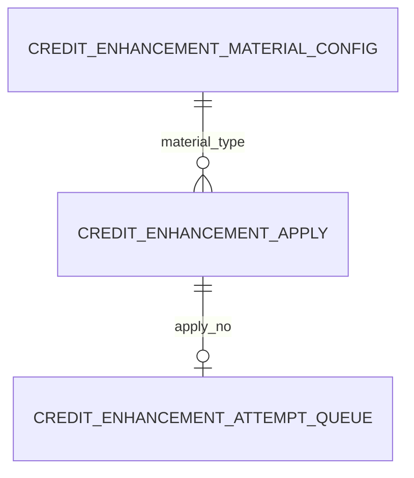
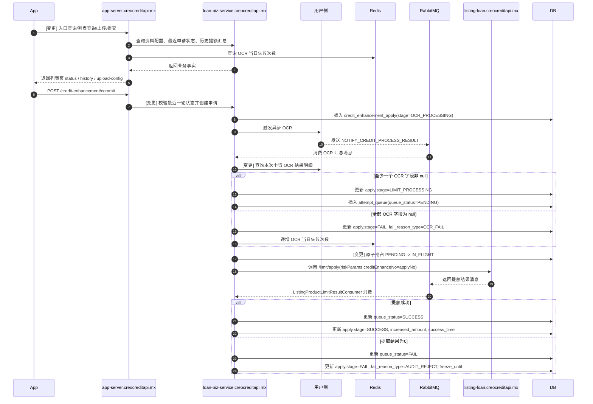
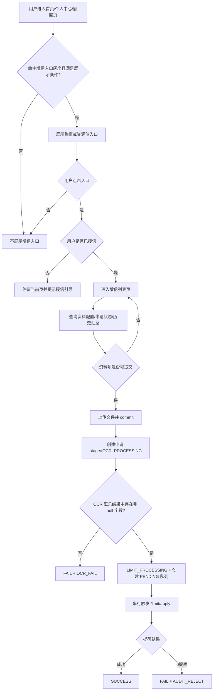
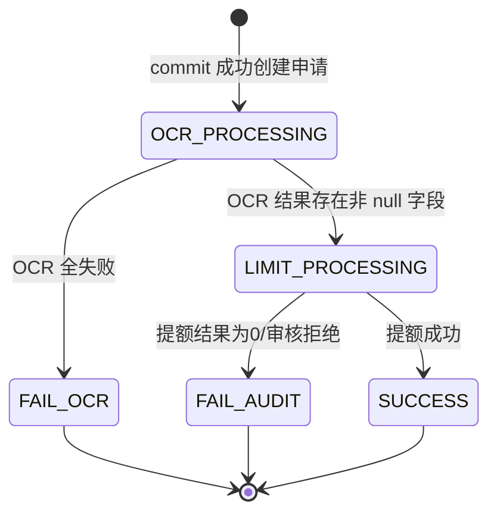

# 增信技术方案

## 背景及目标

墨西哥增信提额需求需要在已授信用户现有借款链路之外，新增一条“入口触达 -> 资料上传 -> OCR 汇总 -> 提额处理 -> 结果展示”的完整闭环。当前 PRD 已明确 6 类资料类型、入口形态、页面状态、每日 OCR 失败上限、成功窗口期和审核拒绝冷冻期等产品规则；`mine/` 目录下文档已进一步沉淀了前台接口、系统流转和数据库设计草案。

本次设计以 `openspec/changes/d07-13-zeng-xin/mine/增信前台技术评审文档.md` 为首要参考，并综合以下设计参考物：

- `openspec/changes/d07-13-zeng-xin/mine/系统流转设计.md`
- `openspec/changes/d07-13-zeng-xin/mine/领域模型与数据库设计.md`
- `openspec/changes/d07-13-zeng-xin/mine/APP交互APP-SERVER接口文档.md`

本方案要达成的目标：

1. 在 `app-server.creocreditapi.mx` 与 `loan-biz-service.creocreditapi.mx` 之间建立清晰的前后台职责边界。
2. 统一前端对客状态与后端申请状态、失败原因、队列状态的映射口径。
3. 用最小数据模型承接首版闭环，仅保留申请主表、提额队列表、资料配置表 3 张核心表。
4. 复用现有首页弹窗、资源位、首页 banner 聚合能力，不新增分散的入口查询接口。
5. 支持 OCR 汇总消息、提额串行队列、结果回写等异步链路，并明确幂等与回滚策略。

## 关键决策

- 入口能力复用现有 `nodeEvent`、`querySlotBatch`、`/homepage/info` -> 参考 MGM 现有交互模式，减少前台入口改造面并复用既有资源位体系。
- 前端列表页接口只返回 `status`、`increasedAmount`、`increasedDate` 等业务事实字段 -> 按 `mine/增信前台技术评审文档.md` 最新口径，避免后端返回按钮文案、跳转控制等纯展示派生字段。
- 申请主状态只保留 `OCR_PROCESSING/LIMIT_PROCESSING/FAIL/SUCCESS` -> 降低状态机复杂度，用 `fail_reason_type` 和时间窗口补足失败细分。
- OCR 当日失败次数放 Redis，不落数据库 -> 该数据只服务于自然日限频判断，不需要持久化历史明细。
- 成功历史直接查询 `credit_enhancement_apply(stage=SUCCESS)` -> 首版不新增独立成功记录表，避免重复存储同一业务事实。
- 0 提额按 `AUDIT_REJECT` 口径收口 -> 与产品侧“审核拒绝等价于额度提升为 0”的规则保持一致，并通过 `riskTransData.blockDays` 计算冷冻期。
- 提额处理必须按用户串行 -> 同一 `customer_id` 禁止并发跑额，使用 `credit_enhancement_attempt_queue` + 乐观锁/条件更新做原子抢占。
- OCR 汇总消息不直接使用 `suppleDetails` 作为最终判断依据 -> 仅把消息作为“全部 OCR 已完成”的触发信号，最终以调用用户侧接口查询到的 OCR 结果明细是否存在非 `null` 字段为准。

## 修改到的站点

| 站点/应用 | 改动说明 | 影响范围 |
| --- | --- | --- |
| `app-server.creocreditapi.mx` | 新增增信前台 BFF 接口、首页 banner 聚合、入口编排、文件上传接入、状态翻译 | App 前台请求入口、首页聚合接口、资源位编排 |
| `loan-biz-service.creocreditapi.mx` | 新增增信申请主链路、OCR 汇总处理、提额串行调度、结果回写、资料项配置查询 | 增信核心业务、数据库、MQ 消费、对下资产调用 |
| `app.creosolutions.mx` | 对接增信入口、列表页、上传页、历史页及状态渲染 | App 前端页面与交互 |
| `listing-loan.creocreditapi.mx` | 承接 `/limit/apply` 调用并回传提额结果消息 | 外部提额执行依赖 |

## 领域模型



### 实体：`credit_enhancement_apply` - 增信申请主表

| 字段名 (Field) | 类型 (Type) | 长度 (Length) | 允许为空 (Nullable) | 默认值 (Default) | 说明 (Description) |
| --- | --- | --- | --- | --- | --- |
| id | bigint | 20 | NO | 自增 | 主键 |
| apply_no | varchar | 64 | NO | - | 增信申请单号 |
| customer_id | bigint | 20 | NO | - | 用户 ID |
| material_type | varchar | 64 | NO | - | 资料类型 |
| stage | varchar | 32 | NO | - | 申请阶段：`OCR_PROCESSING/LIMIT_PROCESSING/FAIL/SUCCESS` |
| freeze_until | datetime | - | YES | NULL | 审核拒绝冷冻到期时间 |
| fail_reason_type | varchar | 32 | YES | NULL | 失败原因：`OCR_FAIL/AUDIT_REJECT` |
| increased_amount | decimal | 10,2 | YES | NULL | 本轮成功提额金额 |
| success_time | datetime | - | YES | NULL | 本轮成功时间 |
| inserttime | datetime | - | NO | CURRENT_TIMESTAMP | 创建时间 |
| updatetime | datetime | - | NO | CURRENT_TIMESTAMP | 更新时间 |
| isactive | tinyint | 1 | NO | 1 | 逻辑删除 |

### 实体：`credit_enhancement_attempt_queue` - 增信提额串行任务队列表

| 字段名 (Field) | 类型 (Type) | 长度 (Length) | 允许为空 (Nullable) | 默认值 (Default) | 说明 (Description) |
| --- | --- | --- | --- | --- | --- |
| id | bigint | 20 | NO | 自增 | 主键 |
| apply_no | varchar | 64 | NO | - | 关联申请单号 |
| customer_id | bigint | 20 | NO | - | 用户 ID |
| material_type | varchar | 64 | NO | - | 资料类型快照 |
| queue_status | varchar | 32 | NO | - | 队列状态：`PENDING/IN_FLIGHT/SUCCESS/FAIL` |
| credit_apply_no | varchar | 64 | YES | NULL | 资产侧业务单号 |
| version | int | 11 | NO | 0 | 乐观锁版本号 |
| inserttime | datetime | - | NO | CURRENT_TIMESTAMP | 创建时间 |
| updatetime | datetime | - | NO | CURRENT_TIMESTAMP | 更新时间 |
| isactive | tinyint | 1 | NO | 1 | 逻辑删除 |

### 实体：`credit_enhancement_material_config` - 增信资料项配置表

| 字段名 (Field) | 类型 (Type) | 长度 (Length) | 允许为空 (Nullable) | 默认值 (Default) | 说明 (Description) |
| --- | --- | --- | --- | --- | --- |
| id | bigint | 20 | NO | 自增 | 主键 |
| material_type | varchar | 32 | NO | - | 资料类型 |
| title | varchar | 64 | NO | - | 西语标题 |
| subtitle | varchar | 256 | YES | NULL | 西语副标题 |
| item_icon | varchar | 256 | YES | NULL | 图标 URL |
| sort_order | int | 11 | NO | 0 | 排序 |
| enabled | tinyint | 1 | NO | 1 | 是否启用 |
| file_types | varchar | 64 | NO | - | 支持文件类型，逗号分隔 |
| max_file_size_mb | int | 11 | NO | - | 单文件大小上限 |
| max_upload_count | int | 11 | NO | - | 最大上传份数 |
| ocr_max_fail_count | int | 11 | NO | - | OCR 当日最大失败次数 |
| window_days | int | 11 | NO | - | 成功后的材料更新窗口期 |
| inserttime | datetime | - | NO | CURRENT_TIMESTAMP | 创建时间 |
| updatetime | datetime | - | NO | CURRENT_TIMESTAMP | 更新时间 |
| isactive | tinyint | 1 | NO | 1 | 逻辑删除 |

## 时序图与流程图

### 时序图



- 旧链路把 OCR 成功直接理解为进入风控审核；新链路统一改为 `LIMIT_PROCESSING`，并通过提额队列承接后续执行。
- 旧口径把 `suppleDetails` 作为最终判断依据；新链路改为收到 OCR 汇总消息后再调用用户侧接口查询 OCR 结果明细。
- 旧设计没有明确首页 banner 聚合；新设计要求首页 banner 通过 `/homepage/info` 的 `activityBanner.items` 聚合下发。

### 流程图



- 新流程把入口、提交、OCR 汇总、提额执行和最终收口放在一条完整链路里，便于评审时对齐前后端边界。
- `FAIL` 不是单一对客状态，仍需由 `app-server` 结合失败原因、冷冻期、Redis 限频结果翻译成最终 `status`。

## 状态机

### 状态图



| 状态 | 说明 | 允许的下一状态 |
| --- | --- | --- |
| `OCR_PROCESSING` | 用户已提交，等待 OCR 汇总完成 | `LIMIT_PROCESSING`、`FAIL(OCR_FAIL)` |
| `LIMIT_PROCESSING` | OCR 已通过，等待或执行提额处理 | `SUCCESS`、`FAIL(AUDIT_REJECT)` |
| `FAIL(OCR_FAIL)` | OCR 全失败收口 | 终态 |
| `FAIL(AUDIT_REJECT)` | 0 提额/审核拒绝收口 | 终态 |
| `SUCCESS` | 提额成功收口 | 终态 |

- 旧口径中存在 `AUDIT_PROCESSING`；新状态机不再保留，统一收敛到 `LIMIT_PROCESSING`。
- 0 提额按失败态收口；队列表与主申请都不再保留单独的零提额状态，主申请统一使用 `AUDIT_REJECT`。
- 对客 `OCR_FAILED_RETRY/OCR_FAILED_DAILY_LIMIT/AUDIT_REJECT_FROZEN` 都不是数据库主状态，而是 `app-server` 基于失败原因与时间条件翻译得到。

## 数据库设计

### 数据库：`loan_biz`

#### 新增表

##### `credit_enhancement_apply` - 增信申请主表

| 字段名 (Field) | 类型 (Type) | 长度 (Length) | 允许为空 (Nullable) | 默认值 (Default) | 说明 (Description) |
| --- | --- | --- | --- | --- | --- |
| id | bigint | 20 | NO | - | 主键，自增 |
| apply_no | varchar | 64 | NO | - | 增信申请单号 |
| customer_id | bigint | 20 | NO | - | 用户 ID |
| material_type | varchar | 64 | NO | - | 资料类型 |
| stage | varchar | 32 | NO | - | 申请阶段 |
| freeze_until | datetime | - | YES | NULL | 冷冻到期时间 |
| fail_reason_type | varchar | 32 | YES | NULL | 失败原因 |
| increased_amount | decimal | 10,2 | YES | NULL | 成功提额金额 |
| success_time | datetime | - | YES | NULL | 成功时间 |
| inserttime | datetime | - | NO | CURRENT_TIMESTAMP | 创建时间 |
| updatetime | datetime | - | NO | CURRENT_TIMESTAMP | 更新时间 |
| isactive | tinyint | 1 | NO | 1 | 逻辑删除 |

**建表 SQL（Required）**：

```sql
CREATE TABLE `credit_enhancement_apply` (
  `id` bigint UNSIGNED NOT NULL AUTO_INCREMENT COMMENT '主键',
  `apply_no` varchar(64) NOT NULL COMMENT '增信申请单号',
  `customer_id` bigint(20) NOT NULL COMMENT '用户ID',
  `material_type` varchar(64) NOT NULL COMMENT '资料类型',
  `stage` varchar(32) NOT NULL COMMENT '申请阶段: OCR_PROCESSING/LIMIT_PROCESSING/FAIL/SUCCESS',
  `freeze_until` datetime DEFAULT NULL COMMENT '冷冻到期时间',
  `fail_reason_type` varchar(32) DEFAULT NULL COMMENT '失败原因: OCR_FAIL/AUDIT_REJECT',
  `increased_amount` decimal(10,2) DEFAULT NULL COMMENT '本轮成功提额金额',
  `success_time` datetime DEFAULT NULL COMMENT '本轮成功提额时间',
  `inserttime` datetime NOT NULL DEFAULT CURRENT_TIMESTAMP COMMENT '插入时间',
  `updatetime` datetime NOT NULL DEFAULT CURRENT_TIMESTAMP ON UPDATE CURRENT_TIMESTAMP COMMENT '更新时间',
  `isactive` tinyint(1) NOT NULL DEFAULT '1' COMMENT '逻辑删除(1:保留,0:删除)',
  PRIMARY KEY (`id`),
  KEY `idx_apply_no` (`apply_no`),
  KEY `idx_customer_id` (`customer_id`),
  KEY `idx_inserttime` (`inserttime`) USING BTREE,
  KEY `idx_updatetime` (`updatetime`) USING BTREE
) ENGINE=InnoDB DEFAULT CHARSET=utf8mb4 COMMENT='增信申请主表';
```

##### `credit_enhancement_attempt_queue` - 增信提额串行任务队列表

| 字段名 (Field) | 类型 (Type) | 长度 (Length) | 允许为空 (Nullable) | 默认值 (Default) | 说明 (Description) |
| --- | --- | --- | --- | --- | --- |
| id | bigint | 20 | NO | - | 主键，自增 |
| apply_no | varchar | 64 | NO | - | 关联申请单号 |
| customer_id | bigint | 20 | NO | - | 用户 ID |
| material_type | varchar | 64 | NO | - | 资料类型快照 |
| queue_status | varchar | 32 | NO | - | 队列状态 |
| credit_apply_no | varchar | 64 | YES | NULL | 资产侧业务单号 |
| version | int | 11 | NO | 0 | 乐观锁版本号 |
| inserttime | datetime | - | NO | CURRENT_TIMESTAMP | 创建时间 |
| updatetime | datetime | - | NO | CURRENT_TIMESTAMP | 更新时间 |
| isactive | tinyint | 1 | NO | 1 | 逻辑删除 |

**建表 SQL（Required）**：

```sql
CREATE TABLE `credit_enhancement_attempt_queue` (
  `id` bigint UNSIGNED NOT NULL AUTO_INCREMENT COMMENT '主键',
  `apply_no` varchar(64) NOT NULL COMMENT '关联增信申请单号',
  `customer_id` bigint(20) NOT NULL COMMENT '用户ID',
  `material_type` varchar(64) NOT NULL COMMENT '资料类型快照',
  `queue_status` varchar(32) NOT NULL COMMENT '队列状态: PENDING/IN_FLIGHT/SUCCESS/FAIL',
  `credit_apply_no` varchar(64) DEFAULT NULL COMMENT '资产侧业务单号',
  `version` int(11) NOT NULL DEFAULT '0' COMMENT '乐观锁版本号',
  `inserttime` datetime NOT NULL DEFAULT CURRENT_TIMESTAMP COMMENT '插入时间',
  `updatetime` datetime NOT NULL DEFAULT CURRENT_TIMESTAMP ON UPDATE CURRENT_TIMESTAMP COMMENT '更新时间',
  `isactive` tinyint(1) NOT NULL DEFAULT '1' COMMENT '逻辑删除(1:保留,0:删除)',
  PRIMARY KEY (`id`),
  KEY `idx_customer_id` (`customer_id`),
  KEY `idx_apply_no` (`apply_no`),
  KEY `idx_credit_apply_no` (`credit_apply_no`),
  KEY `idx_inserttime` (`inserttime`) USING BTREE,
  KEY `idx_updatetime` (`updatetime`) USING BTREE
) ENGINE=InnoDB DEFAULT CHARSET=utf8mb4 COMMENT='增信提额串行任务队列表';
```

##### `credit_enhancement_material_config` - 增信资料项配置表

| 字段名 (Field) | 类型 (Type) | 长度 (Length) | 允许为空 (Nullable) | 默认值 (Default) | 说明 (Description) |
| --- | --- | --- | --- | --- | --- |
| id | bigint | 20 | NO | - | 主键，自增 |
| material_type | varchar | 32 | NO | - | 资料类型 |
| title | varchar | 64 | NO | - | 西语标题 |
| subtitle | varchar | 256 | YES | NULL | 副标题 |
| item_icon | varchar | 256 | YES | NULL | 图标地址 |
| sort_order | int | 11 | NO | 0 | 排序 |
| enabled | tinyint | 1 | NO | 1 | 是否启用 |
| file_types | varchar | 64 | NO | - | 支持文件类型 |
| max_file_size_mb | int | 11 | NO | - | 单文件大小上限 |
| max_upload_count | int | 11 | NO | - | 最大上传份数 |
| ocr_max_fail_count | int | 11 | NO | - | OCR 当日最大失败次数 |
| window_days | int | 11 | NO | - | 材料更新窗口期 |
| inserttime | datetime | - | NO | CURRENT_TIMESTAMP | 创建时间 |
| updatetime | datetime | - | NO | CURRENT_TIMESTAMP | 更新时间 |
| isactive | tinyint | 1 | NO | 1 | 逻辑删除 |

**建表 SQL（Required）**：

```sql
CREATE TABLE `credit_enhancement_material_config` (
  `id` bigint(20) NOT NULL AUTO_INCREMENT COMMENT '主键',
  `material_type` varchar(32) NOT NULL COMMENT '资料类型',
  `title` varchar(64) NOT NULL COMMENT '主标题(西语)',
  `subtitle` varchar(256) DEFAULT NULL COMMENT '副标题(西语)',
  `item_icon` varchar(256) DEFAULT NULL COMMENT '资料项图标',
  `sort_order` int(11) NOT NULL DEFAULT '0' COMMENT '排序',
  `enabled` tinyint(1) NOT NULL DEFAULT '1' COMMENT '是否启用: 1启用 0停用',
  `file_types` varchar(64) NOT NULL COMMENT '允许文件类型, 逗号分隔',
  `max_file_size_mb` int(11) NOT NULL COMMENT '单文件最大大小(MB)',
  `max_upload_count` int(11) NOT NULL COMMENT '最大上传份数',
  `ocr_max_fail_count` int(11) NOT NULL COMMENT 'OCR当日最大失败次数',
  `window_days` int(11) NOT NULL COMMENT '成功后的材料更新窗口期',
  `inserttime` datetime NOT NULL DEFAULT CURRENT_TIMESTAMP COMMENT '插入时间',
  `updatetime` datetime NOT NULL DEFAULT CURRENT_TIMESTAMP ON UPDATE CURRENT_TIMESTAMP COMMENT '更新时间',
  `isactive` tinyint(1) NOT NULL DEFAULT '1' COMMENT '逻辑删除(1:保留,0:删除)',
  PRIMARY KEY (`id`),
  UNIQUE KEY `uk_material_type` (`material_type`,`isactive`),
  KEY `idx_enabled_sort` (`enabled`,`sort_order`,`isactive`)
) ENGINE=InnoDB DEFAULT CHARSET=utf8mb4 COMMENT='增信资料项配置表';
```

#### 数据变更

**触发条件**：首次上线增信资料项时，需要初始化 6 类资料配置。

**执行时机**：发布前执行，先于入口灰度开放。

**幂等策略**：以 `material_type + isactive=1` 唯一约束保证不可重复插入；重复执行前需先校验是否已存在。

**回滚策略**：关闭入口灰度后，按 `material_type` 逻辑删除本次插入配置，禁止直接删除已被业务依赖的数据。

**数据变更 SQL（Required）**：

```sql
INSERT INTO `credit_enhancement_material_config` (
  `material_type`, `title`, `subtitle`, `item_icon`, `sort_order`, `enabled`,
  `file_types`, `max_file_size_mb`, `max_upload_count`, `ocr_max_fail_count`, `window_days`, `isactive`
) VALUES
  ('PAYSLIP', 'Recibo de nomina', '工资单', '', 10, 1, 'pdf', 20, 3, 3, 90, 1),
  ('BANK_STATEMENT', 'Estado de cuenta', '银行对账单', '', 20, 1, 'pdf', 20, 3, 3, 90, 1),
  ('CREDIT_CARD', 'Tarjeta de credito', '信用卡', '', 30, 1, 'jpg,png,pdf', 20, 3, 3, 90, 1),
  ('DRIVER_LICENSE', 'Licencia de conducir', '驾驶证', '', 40, 1, 'jpg,png,pdf', 20, 1, 3, 90, 1),
  ('VEHICLE_REGISTRATION', 'Tarjeta de circulacion', '行车证', '', 50, 1, 'jpg,png,pdf', 20, 1, 3, 90, 1),
  ('OTHER_APP', 'Pantalla de prestamo de otras apps', '其它 app 发标页', '', 60, 1, 'jpg,png,pdf', 20, 3, 3, 90, 1);
```

## 接口设计

### 所属服务：`app-server.creocreditapi.mx`

#### POST `/credit-enhancement/home` - 增信列表页接口

**改动类型**：新增

**请求参数**：

| 参数名 | 类型 | 必填 | 说明 |
| --- | --- | --- | --- |
| - | - | - | 基于登录态获取用户信息，请求体无需额外业务参数 |

**返回参数**：

| 参数名 | 类型 | 说明 |
| --- | --- | --- |
| result | Integer | 状态码，0 表示成功 |
| resultMessage | String | 结果描述 |
| content.totalIncreasedAmount | BigDecimal | 历史总增信额度 |
| content.items[].itemIcon | String | 资料项图标 |
| content.items[].itemType | String | 资料类型 |
| content.items[].itemTitle | String | 西语标题 |
| content.items[].itemSubTitle | String | 西语副标题 |
| content.items[].status | String | 对客状态码 |
| content.items[].increasedAmount | BigDecimal | 该类型历史累计提额金额 |
| content.items[].increasedDate | Long | 最近一次成功提额时间 |

#### POST `/credit-enhancement/history` - 增信提额历史接口

**改动类型**：新增

**请求参数**：

| 参数名 | 类型 | 必填 | 说明 |
| --- | --- | --- | --- |
| type | String | 否 | 资料类型；为空时查询全部 |

**返回参数**：

| 参数名 | 类型 | 说明 |
| --- | --- | --- |
| result | Integer | 状态码 |
| resultMessage | String | 结果描述 |
| content.totalIncreasedAmount | BigDecimal | 总增信额度 |
| content.records[].itemType | String | 资料类型 |
| content.records[].itemTitle | String | 西语标题 |
| content.records[].itemSubTitle | String | 西语副标题 |
| content.records[].increasedAmount | BigDecimal | 提额金额 |
| content.records[].increasedDate | Long | 成功时间 |

#### POST `/credit-enhancement/upload-config` - 增信上传配置接口

**改动类型**：新增

**请求参数**：

| 参数名 | 类型 | 必填 | 说明 |
| --- | --- | --- | --- |
| itemType | String | 是 | 资料类型 |

**返回参数**：

| 参数名 | 类型 | 说明 |
| --- | --- | --- |
| itemType | String | 资料类型 |
| maxUploadCount | Integer | 最大上传份数 |
| maxFileSizeMb | Integer | 单文件大小限制 |
| allowedFileTypeList | List<String> | 允许文件类型 |

#### POST `/credit-enhancement/upload` - 增信文件上传接口

**改动类型**：新增

**请求参数**：

| 参数名 | 类型 | 必填 | 说明 |
| --- | --- | --- | --- |
| fileName | String | 是 | 原始文件名 |
| fileType | String | 是 | 文件类型，如 `pdf/jpg/png` |
| file | File | 是 | 上传的二进制文件 |
| filePassword | String | 否 | 加密 PDF 密码 |

**返回参数**：

| 参数名 | 类型 | 说明 |
| --- | --- | --- |
| url | String | 文件 URL 或文件标识 |

#### POST `/credit-enhancement/commit` - 增信申请提交接口

**改动类型**：新增

**请求参数**：

| 参数名 | 类型 | 必填 | 说明 |
| --- | --- | --- | --- |
| itemType | String | 是 | 资料类型 |
| fileList | List<Object> | 是 | 本次提交文件列表 |
| fileList[].fileName | String | 是 | 文件名 |
| fileList[].fileType | String | 是 | 文件类型 |
| fileList[].url | String | 是 | 上传接口返回的文件地址/标识 |

**返回参数**：

| 参数名 | 类型 | 说明 |
| --- | --- | --- |
| result | Integer | 状态码 |
| resultMessage | String | 结果描述 |
| content.applyNo | String | 增信申请单号 |

#### POST `/track/user/nodeEvent` - 首页弹窗数据采集查询接口

**改动类型**：复用扩展

**请求参数**：

| 参数名 | 类型 | 必填 | 说明 |
| --- | --- | --- | --- |
| node | String | 是 | 采集节点，首页传 `/` |

**返回参数**：

| 参数名 | 类型 | 说明 |
| --- | --- | --- |
| content.flowNo | String | 流水号 |
| content.node | String | 采集节点 |
| content.customerType | String | 用户类型 |
| content.trackStatus[].activityCode | String | 活动编码 |
| content.trackStatus[].event | String | 事件编码 |
| content.trackStatus[].config | Object | 弹窗配置 |
| content.trackStatus[].trackFlag | Boolean | 是否展示 |
| content.trackStatus[].data | Object | 业务数据 |

#### POST `/slot/querySlotBatch` - 批量查询资源位接口

**改动类型**：复用扩展

**请求参数**：

| 参数名 | 类型 | 必填 | 说明 |
| --- | --- | --- | --- |
| nodeList | List<String> | 是 | 页面节点列表 |
| appVersion | String | 否 | APP 版本号 |
| os | String | 否 | 操作系统 |

**返回参数**：

| 参数名 | 类型 | 说明 |
| --- | --- | --- |
| content.nodeSlotList[].node | String | 页面节点 |
| content.nodeSlotList[].slotResultList[].activityCode | String | 活动编码 |
| content.nodeSlotList[].slotResultList[].slotCode | String | 资源位编码 |
| content.nodeSlotList[].slotResultList[].slotData | Object | 资源位动态内容 |

#### POST `/homepage/info` - 首页聚合接口

**改动类型**：修改

**请求参数**：

| 参数名 | 类型 | 必填 | 说明 |
| --- | --- | --- | --- |
| HeaderRequest | Object | 是 | 现有首页请求体，沿用当前结构 |

**返回参数**：

| 参数名 | 类型 | 说明 |
| --- | --- | --- |
| data.activityBanner.items[].img | String | banner 图片 |
| data.activityBanner.items[].url | String | 跳转地址 |
| data.activityBanner.items[].activityCode | String | 活动编码 |

### 所属服务：`loan-biz-service.creocreditapi.mx`

#### 内部 home/history/upload-config/commit 查询接口 - 增信业务事实查询与提交接口

**改动类型**：新增

**请求参数**：按 `app-server` 所需业务事实拆分内部接口，至少覆盖用户资料配置、最近申请状态、成功汇总、提交创建。

**返回参数**：返回业务事实，不返回按钮文案等前端展示派生字段。

## 消息队列

### 所属服务：`loan-biz-service.creocreditapi.mx`

#### 消费 queue: `listing_limit_queue` - 提额结果消息

**绑定exchange**：沿用资产提额结果交换机（现网已有）

**route_key**：沿用资产提额结果 route key（现网已有）

**幂等设计**：

- 以 `creditEnhanceNo/applyNo` 反查主申请和队列任务。
- 仅当申请当前仍处于 `LIMIT_PROCESSING` 且队列状态处于 `IN_FLIGHT` 时允许收口。
- 重复消息或晚到消息直接忽略，不覆盖已收口结果。

**消息格式**：

| 字段名 | 类型 | 必填 | 说明 |
| --- | --- | --- | --- |
| creditEnhanceNo | String | 是 | 增信申请单号，对应 `applyNo` |
| creditApplyNo | String | 否 | 资产侧业务单号 |
| increaseAmount | BigDecimal | 否 | 提额金额 |
| riskTransData.blockDays | Integer | 否 | 冷冻天数 |

#### 消费 queue: `NOTIFY_CREDIT_PROCESS_RESULT` 对应消费队列 - OCR 汇总结果消息

**绑定exchange**：`test-user-notifycreditprocessresult-exchange`

**route_key**：用户侧配置为准

**幂等设计**：

- 以 `flowNo=applyNo` 反查申请。
- 仅当申请当前仍是 `OCR_PROCESSING` 时才处理。
- 消费后仍需调用用户侧接口查询本次申请 OCR 结果明细，避免直接依赖 `suppleDetails`。

**消息格式**：

| 字段名 | 类型 | 必填 | 说明 |
| --- | --- | --- | --- |
| userId | Long | 是 | 用户 ID |
| infoType | String | 是 | 资料类型 |
| flowNo | String | 是 | 申请单号 `applyNo` |
| suppleDetails | List | 否 | 文件级 OCR 处理结果透传 |
| suppleDetails[].fileType | String | 否 | 文件子类型 |
| suppleDetails[].successs | Boolean | 否 | 单文件 OCR 是否成功 |

**消息示例**：

```json
{
  "userId": 123456,
  "infoType": "PAYSLIP",
  "flowNo": "FLOW202607060001",
  "suppleDetails": [
    {"fileType": "PAYSLIP_1", "successs": true},
    {"fileType": "PAYSLIP_2", "successs": true}
  ]
}
```

## 配置

| 站点/应用 | 配置Key | 配置Value（示例） | 改动类型 | 发布时机 | 说明 |
| --- | --- | --- | --- | --- | --- |
| `capsule-box.creocreditapi.mx` / 灰度配置 | `creditEnhancementEntry` | `{"0":{"low":"0","high":"1"},"1":null}` | 新增 | 发布前 | 增信统一入口灰度 |
| `loan-biz-service.creocreditapi.mx` | `credit.enhancement.material.config.enabled` | `true` | 新增 | 发布前 | 增信资料配置主开关 |
| `app-server.creocreditapi.mx` | `credit.enhancement.entry.enabled` | `true` | 新增 | 发布前 | 前台入口编排开关 |

## 缓存设计

| Key | 类型 | 过期时间 | 改动类型 | 说明 |
| --- | --- | --- | --- | --- |
| `credit:enhancement:ocr:fail:{customerId}:{materialType}:{yyyyMMdd}` | Integer | 当日 23:59:59 过期 | 新增 | OCR 当日失败次数 |

缓存策略：

- 写入时机：OCR 汇总结果判定为全失败时递增。
- 读取时机：列表页查询时由 `app-server` 读取，用于区分 `OCR_FAILED_RETRY` 与 `OCR_FAILED_DAILY_LIMIT`。
- 一致性：该 key 只参与自然日限频判断，不需要与数据库做强一致事务。
- 防穿透：仅对真实存在的 `customerId + materialType` 组合写入，不做空值缓存。

## 外部依赖

### 依赖接口

| 系统 | 接口 | 用途 | 备注 |
| --- | --- | --- | --- |
| 用户侧 | OCR 触发接口（名称待最终落定） | `commit` 后触发异步 OCR | 由 `loan-biz-service` 调用 |
| 用户侧 | 查询本次申请 OCR 结果接口（名称待最终落定） | OCR 汇总消息到达后查询 OCR 明细 | 以是否存在非 `null` 字段作为最终判断依据 |
| `listing-loan.creocreditapi.mx` | `/limit/apply` | 发起提额处理 | `riskParams.creditEnhanceNo=applyNo` |
| 文件存储/用户侧 | 文件上传能力 | 保存上传文件并返回 URL/标识 | 由 `app-server` 接入 |

### 依赖消息队列

| 系统 | Exchange / Queue | 用途 | 备注 |
| --- | --- | --- | --- |
| 用户侧 | `test-user-notifycreditprocessresult-exchange` / OCR 汇总消费队列 | OCR 汇总完成通知 | 消费后仍需二次查询 OCR 明细 |
| 资产系统 | `listing_limit_queue` | 提额结果回传 | 由 `ListingProductLimitResultConsumer` 消费 |

## 测试策略

- `app-server.creocreditapi.mx`
  - Unit：覆盖 `/credit-enhancement/home`、`/history`、`/upload-config`、`/upload`、`/commit` 的参数与返回结构。
  - Unit：覆盖 `status` 翻译逻辑、首页 `activityBanner.items` 追加逻辑、入口资源聚合逻辑。
  - 不优先做更高层级测试的原因：BFF 逻辑以聚合、转换和参数校验为主，纯 Mock 单测即可覆盖主要分支。
- `loan-biz-service.creocreditapi.mx`
  - Unit：覆盖申请状态推进、OCR 汇总判断、提额结果收口、冷冻期计算。
  - Integration：覆盖 3 张核心表读写、`PENDING -> IN_FLIGHT` 串行抢占、成功/失败回写。
  - MQ 消费测试：覆盖 OCR 汇总消息与提额结果消息的重复消费、晚到消息、乱序消息处理。
- 建议命令
  - `mvn test -Dtest=*CreditEnhancement*`
  - `mvn test -Dtest=*HomePageServiceImplTest,*SlotServiceImplTest`
  - `mvn -pl code/backend/loan-biz-service.creocreditapi.mx test`
  - `mvn -pl code/backend/app-server.creocreditapi.mx test`

关键断言：

- 命中灰度且已授信用户能看到入口并进入列表页。
- `home` 返回的 `status` 与申请主状态、失败原因、Redis 失败次数、冷冻期、窗口期映射一致。
- OCR 全失败时申请收口为 `FAIL + OCR_FAIL` 并递增 Redis。
- OCR 汇总成功时创建 `PENDING` 队列并把申请推进到 `LIMIT_PROCESSING`。
- 0 提额时申请收口为 `FAIL + AUDIT_REJECT`，并正确写入 `freeze_until`。

## 发布素材

- 发布站点
  - `loan-biz-service.creocreditapi.mx`
  - `app-server.creocreditapi.mx`
- DB
  - 执行 3 张表建表 SQL
  - 执行 `credit_enhancement_material_config` 初始化 SQL
- 配置 / 灰度
  - 新增并确认灰度 `creditEnhancementEntry`
  - 打开 `credit.enhancement.material.config.enabled`
  - 打开 `credit.enhancement.entry.enabled`
- MQ
  - 确认 OCR 汇总消息消费配置
  - 确认资产结果消息消费链路
- 验证方式
  - 首页 `activityBanner.items` 能看到增信 banner
  - 首页 `nodeEvent` 可返回增信弹窗配置
  - 列表页可查询到 6 类资料项与 `status`
  - 一次完整链路可从 `OCR_PROCESSING` 推进到 `SUCCESS` 或 `FAIL`
- 回滚方式
  - 首先关闭灰度 `creditEnhancementEntry`
  - 其次关闭 `app-server` 和 `loan-biz-service` 开关配置
  - 代码回滚时保留已存在申请和队列数据，不做物理删除
