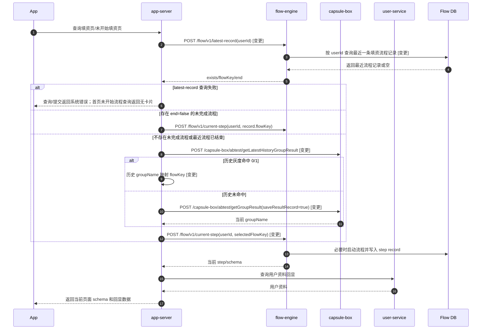
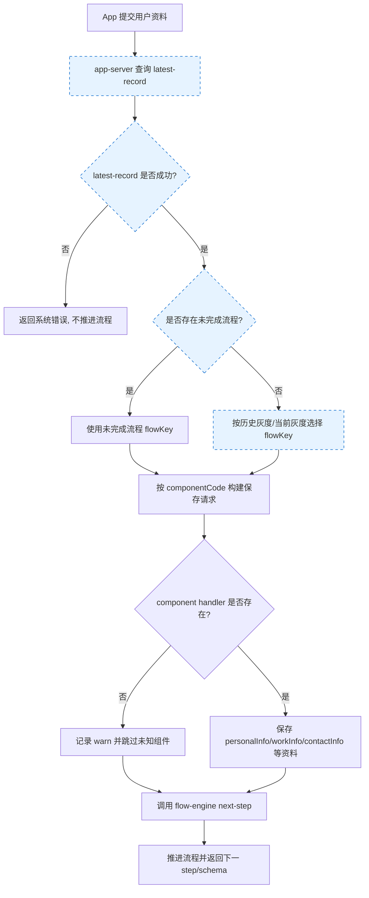
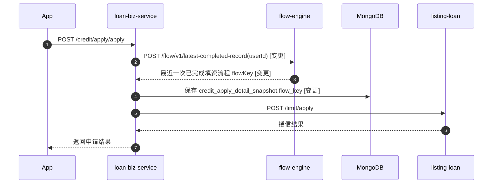

# 一.需求背景

本需求旨在优化 Booya 戳额/填资流程，通过 capsule-box 灰度方式对无进行中填资流程的用户进行新旧流程分流，验证字段删增对完件率的影响。

PRD：`doc/requirement/戳额流程优化/戳额流程优化.md`

用户侧技术说明：`doc/requirement/戳额流程优化/戳额流程优化用户侧技术文档.md`

技术方案：`.trellis/tasks/06-11-credit-flow-optimization/design/technical-design.md`

说明：

1. 本文档用于技术评审会议，聚焦阶段一“字段删增测试”，不包含 UI 交互优化、历史数据迁移和风控模型策略改造。
2. 老流程继续使用 `userInfo-default-flow`，新流程使用 `userInfo-optimized-flow`，通过 `creditFlowOptimization` 实验分流。
3. 新流程将职业信息和个人信息合并到 `basic-info-optimized` 页面，删除 `maritalStatus`、`incomeSource`、`creditCardNumber`，新增 `workYear`、`jobIndustryNew`、`profession`。
4. 命中新流程的授信申请会在 `loan-biz-service` 的授信快照中写入 `flow_key`（戳额流程 flow标识），供下游策略判断是否绕过 UBT 模型。
5. 字典数据发布、`id/parentIds` 返回能力和后台录入能力不在本次发布范围内；这些前置能力完成前，capsule-box 必须保持 `1=0%`，不得放量新流程。

# 二.时序图设计

时序图见本文档内嵌 Mermaid 代码块。

## 1、填资查询/启动时序图



## 2、填资提交流程图



## 3、授信快照打标时序图



# 三.数据库设计

## 1、mex_flow_engine 数据变更

新增 `userInfo-optimized-flow` 流程部署数据，不修改老流程历史部署。

流程节点：

```text
start -> basic-info-optimized -> contact-info -> bank-info -> id-info -> live -> end
```

数据变更 SQL 示意如下，实际 `model_json` 必须由 flow-engine 流程设计工具导出并在测试库验证节点顺序后执行：

```sql
INSERT INTO em_flow_deployment (flow_key, model_json, inserttime, updatetime, isactive)
SELECT 'userInfo-optimized-flow', '<exported-flow-model-json>', NOW(), NOW(), 1
WHERE NOT EXISTS (
  SELECT 1 FROM em_flow_deployment WHERE flow_key = 'userInfo-optimized-flow' AND isactive = 1
);
```

说明：`user_flow_step_record.flow_key` 和 `node_key` 已支持新 flowKey/stepCode，本需求不修改 MySQL 表结构。

## 2、capsule-box 查询能力变更

本需求不修改 capsule-box 表结构，只新增最近一次历史灰度查询能力。

新增 Mapper 方法：`selectLatestByGroupElementAndGroupCode(groupElement, groupCode)`

```sql
SELECT
  id,
  user_id,
  group_code,
  group_config,
  group_result,
  inserttime,
  updatetime,
  isactive,
  group_element
FROM abtest_group_result
WHERE group_element = #{groupElement}
  AND group_code = #{groupCode}
ORDER BY id DESC
LIMIT 1;
```

说明：实现前需确认生产表是否存在支撑 `group_element + group_code + id` 查询的索引；如缺少索引，应补充索引评估/DDL 方案后再提测。

## 3、loan-biz MongoDB 变更

集合：`credit_apply_detail_snapshot`

| 变更类型 | 字段名 | 类型 | 允许为空 | 默认值 | 说明 |
| --- | --- | --- | --- | --- | --- |
| 新增 | `flow_key` | String | YES | `` | 戳额流程 flow标识，如 `userInfo-default-flow` / `userInfo-optimized-flow` |

说明：MongoDB 文档新增字段无需 DDL；历史快照不回填，读取方按 `null` 处理，`null` 表示用户使用的是老流程。

## 4、字典前置数据

本次不修改字典提供方、`backend-user` 或管理后台代码，flow-engine 只消费并透传字典响应中的 `id`、`parentIds` 字段。新流程放量前必须由后续独立方案完成数据准备。

| type | code/字段 | 数据来源 | 说明 |
| --- | --- | --- | --- |
| `41` | `workYear` | `Booya戳额字段-20260415update - 工作时长.csv` | 工作时长枚举 |
| `48` | `jobIndustryNew` | `Booya戳额字段-20260415update - 行业-职业.csv` | 新流程行业字段 |
| `8` | `profession` | `Booya戳额字段-20260415update - 行业-职业.csv` | 职业字段，`parentIds` 关联 `jobIndustryNew.id` |

# 四.灰度设计

添加灰度：戳额流程优化灰度

灰度 code：`creditFlowOptimization`

分组说明：

| 分组 | 含义 | flowKey | 上线默认比例 |
| --- | --- | --- | --- |
| `0` | 老流程 | `userInfo-default-flow` | 100% |
| `1` | 新流程 | `userInfo-optimized-flow` | 0% |

分流规则：

1. 仅对没有未完成填资流程的用户执行灰度分流。
2. 分流维度为 `userId`，不按 appVersion、os、device 或 mobile 过滤。
3. app-server 先查询 flow-engine `latest-record`；存在 `end=false` 未完成流程时，继续该流程，不重新分流。
4. 无未完成流程时，先查 capsule-box 最近一次历史灰度；历史命中 `0/1` 时沿用历史分组，保证入组后不出组。
5. 历史未命中时再调用 capsule-box 当前灰度接口，并保存结果记录。
6. capsule-box 异常、返回空或非法分组时默认降级 `0`，即老流程。
7. flow-engine `latest-record` 查询失败时 fail-closed：不调用 capsule-box，不启动任何 flowKey，避免产生双流程并行。

# 五.接口设计

## 1、用户填资查询/提交接口内部逻辑调整

### 接口站点

app-server.creocreditapi.mx

### 影响接口

```text
queryUserInfo
queryUserInfoNotStartFlow
submitUserInfo
```

### 接口说明

外部请求/响应结构保持不变，内部新增流程选择逻辑。

处理规则：

| 步骤 | 规则 |
| --- | --- |
| 1 | 调用 flow-engine `POST /flow/v1/latest-record` 查询用户最近一条填资流程记录 |
| 2 | `exists=true` 且 `end=false` 时使用返回的 `flowKey`，不调用 capsule-box |
| 3 | 无未完成流程时调用 capsule-box `getLatestHistoryGroupResult` 查询最近一次历史灰度 |
| 4 | 历史命中 `groupName=0/1` 时沿用历史分组 |
| 5 | 历史未命中时调用 capsule-box `getGroupResult`，`saveResultRecord=true` |
| 6 | `groupName=1` 映射 `userInfo-optimized-flow`，其它值映射 `userInfo-default-flow` |
| 7 | capsule-box 异常、空返回、非法分组时降级 `userInfo-default-flow` |

异常约束：`latest-record` 调用失败时，不执行灰度查询，不调用 `current-step` / `next-step`。

## 2、查询最近一次历史灰度结果接口

### 接口站点

capsule-box.creocreditapi.mx

### 接口地址

```text
POST /capsule-box/abtest/getLatestHistoryGroupResult
```

### 接口说明

按 `groupElement + groupCode` 查询最近一条历史灰度记录，服务 app-server 的“入组后不出组”判断。

------

请求参数（Request Body）

Content-Type: application/json

| 参数名 | 类型 | 是否必填 | 描述 |
| --- | --- | --- | --- |
| groupElement | string | 是 | 分流元素，本需求传 `String.valueOf(userId)` |
| groupCode | string | 是 | 固定 `creditFlowOptimization` |
| userId | integer | 否 | 保留字段，历史查询不依赖 |

请求示例：

```json
{
  "groupElement": "123456",
  "groupCode": "creditFlowOptimization",
  "userId": 123456
}
```

------

响应参数（Response Body）

| 参数名 | 类型 | 描述 |
| --- | --- | --- |
| result | integer | 结果状态码，0 通常表示成功 |
| resultMessage | string | 结果描述信息 |
| data | object | 最近一次历史灰度结果，无历史记录时可为空 |
| ├── groupCode | string | 实验 code |
| ├── value | number | 灰度 hash 值 |
| ├── groupName | string | 分组名，`0` 老流程、`1` 新流程 |
| ├── activityPrefix | string | 实验前缀 |
| ├── time | string | 历史记录创建时间 |

响应示例：

```json
{
  "result": 0,
  "resultMessage": "success",
  "data": {
    "groupCode": "creditFlowOptimization",
    "value": 0.42,
    "groupName": "1",
    "activityPrefix": "creditFlowOptimization",
    "time": "2026-06-12 10:00:00"
  }
}
```

## 3、跨 flowKey 最新流程记录查询接口

### 接口站点

flow-engine.creocreditapi.mx

### 接口地址

```text
POST /flow/v1/latest-record
```

### 接口说明

按 `userId` 查询用户最近一条填资流程记录，不限制 flowKey，用于 app-server 判断是否存在未完成流程。

------

请求参数（Request Body）

Content-Type: application/json

| 参数名 | 类型 | 是否必填 | 描述 |
| --- | --- | --- | --- |
| userId | integer | 是 | 用户 id |

请求示例：

```json
{
  "userId": 123456
}
```

------

响应参数（Response Body）

| 参数名 | 类型 | 描述 |
| --- | --- | --- |
| result | integer | 结果状态码，0 通常表示成功 |
| resultMessage | string | 结果描述信息 |
| data | object | 响应主体 |
| ├── exists | boolean | 用户是否存在填资流程记录 |
| ├── flowKey | string | 最近一条记录的 flowKey，`exists=false` 时为空 |
| ├── end | boolean | 最近一条记录是否已完成，`exists=false` 时为空 |

响应示例：

```json
{
  "result": 0,
  "resultMessage": "success",
  "data": {
    "exists": true,
    "flowKey": "userInfo-optimized-flow",
    "end": false
  }
}
```

## 4、最近一次已完成流程查询接口

### 接口站点

flow-engine.creocreditapi.mx

### 接口地址

```text
POST /flow/v1/latest-completed-record
```

### 接口说明

内部接口，仅供 `loan-biz-service` 创建授信快照时查询用户最近一次已完成的填资流程。授信快照字段 `flow_key` 直接使用 flow-engine 返回的已完成流程 `flowKey`。

------

请求参数（Request Body）

Content-Type: application/json

| 参数名 | 类型 | 是否必填 | 描述 |
| --- | --- | --- | --- |
| userId | integer | 是 | 用户 id |

请求示例：

```json
{
  "userId": 123456
}
```

------

响应参数（Response Body）

| 参数名 | 类型 | 描述 |
| --- | --- | --- |
| result | integer | 结果状态码，0 通常表示成功 |
| resultMessage | string | 结果描述信息 |
| data | object | 响应主体 |
| ├── exists | boolean | 是否存在已完成填资流程记录 |
| ├── flowKey | string | 最近一次已完成流程的 flowKey，`exists=false` 时为空 |

响应示例：

```json
{
  "result": 0,
  "resultMessage": "success",
  "data": {
    "exists": true,
    "flowKey": "userInfo-optimized-flow"
  }
}
```

说明：该接口只查询已完成流程记录，不调用当前灰度、不启动流程、不读取未完成流程。无已完成流程或查询失败时，loan-biz-service 对 `flow_key` 写入空值并记录 error，保证授信申请不中断。

## 5、字典接口响应字段补充

### 接口地址

```text
GET /data/queryDataDictMapGroupByTypeV2?language={language}&typeList={typeList}
```

### 接口说明

本次 flow-engine 消费该接口响应并透传 `id`、`parentIds` 到 schema options，用于 `jobIndustryNew` 和 `profession` 联动。

新增/透传字段：

| 字段 | 类型 | 描述 |
| --- | --- | --- |
| id | integer | 字典项 id |
| parentIds | string | 英文逗号分隔父类 id，用于职业按行业过滤 |

schema options 输出示例：

```json
{
  "key": "profession",
  "type": "select",
  "options": [
    {
      "label": "Empleado",
      "value": "1001",
      "id": 1001,
      "parentIds": "48_01,48_02"
    }
  ]
}
```

# 六.消息队列

本期无新增消息队列。

# 七.JOB

本期无新增 JOB。

# 八.Apollo

| 站点 | key | value | 说明 |
| --- | --- | --- | --- |
| app-server.creocreditapi.mx | `userInfo.flow` | `userInfo-default-flow` | 老流程默认 flowKey，`getFlowCode()` 直接返回该值 |
| flow-engine.creocreditapi.mx | `step.basic-info-optimized.schema` | `<schema-json>` | 新流程基础信息/职业信息合并页 schema |
| loan-biz-service.creocreditapi.mx | `user.slot.config` | 增加 `node=/applying/?step=basic-info-optimized#back` 的 `creditRetentionTip` 配置 | 兼容新流程戳额挽留 |
| app-server.creocreditapi.mx|`userInfo.nonEditableFields` |增加"workYear","profession","jobIndustryNew"|添加不可修改配置|

loan-biz Apollo `user.slot.config` 需追加以下配置项：

```json
{
  "activityCode": "creditRetention",
  "slotCode": "creditRetentionTip",
  "node": "/applying/?step=basic-info-optimized#back",
  "abtestGroupCode": "creditRetention"
}
```

`step.basic-info-optimized.schema` 字段要求：

| 字段 | 展示 | 必填 | 说明 |
| --- | --- | --- | --- |
| `monthlyIncomeCode` | 是 | 是 | 文案 `Ingreso mensual` |
| `workYear` | 是 | 是 | 字典 type=41 |
| `jobIndustryNew` | 是 | 是 | 字典 type=48 |
| `profession` | 是 | 是 | 字典 type=8，按 `parentIds` 联动 |
| `state/city` | 是 | 是 | 文案 `Estado y Municipio / Ciudad`，邮编反显不可编辑 |
| `colonia` | 是 | 是 | 文案 `Colonia` |
| `address` | 是 | 是 | 文案 `Calle y número` |
| `maritalStatus` | 否 | 否 | 新流程删除 |
| `incomeSource` | 否 | 否 | 新流程删除 |
| `creditCardNumber` | 否 | 否 | 新流程删除 |
| `jobIndustry` | 否 | 否 | 老流程保留，新流程不使用 |

发布顺序：

1. 确认字典数据、`id/parentIds` 返回和后台录入能力由后续独立方案承接；未完成前 `1=0%`。
2. 发布 capsule-box 最近一次历史灰度接口。
3. 发布 flow-engine `latest-record` 接口、字典透传代码和 `step.basic-info-optimized.schema`。
4. 配置并验证 `userInfo-optimized-flow` 流程部署数据。
5. 配置 capsule-box `creditFlowOptimization`，默认 `1=0%`。
6. 发布 app-server 分流、保存/回显代码。
7. 发布 loan-biz-service 快照打标代码。

# 九.历史需求兼容

本次新增 `basic-info-optimized` 节点后，需同步兼容已上线的历史需求，避免新流程用户在首页进度和戳额挽留场景出现缺失。

| 历史需求 | 兼容点 | 处理规则 | 涉及站点 |
| --- | --- | --- | --- |
| 首页戳额进度卡片兼容 | `basic-info-optimized` 属于基础信息补全阶段 | app-server 首页进度卡片 stepCode 映射需将 `basic-info-optimized` 与 `basic-info` 使用同一基础信息卡片配置，不新增首页卡片类型；未知 stepCode 仍按现有异常策略处理 | app-server.creocreditapi.mx |
| 戳额挽留兼容 | 新流程返回页 node 可能为 `/applying/?step=basic-info-optimized#back` | loan-biz 的 `user.slot.config` 需为 `creditRetentionTip` 增加 `basic-info-optimized` 对应 node，活动和灰度配置沿用现有 `creditRetention`；保留老流程 `work-info/basic-info/contact-info/id-info/live` 等既有 node，不改变已有挽留逻辑 | loan-biz-service.creocreditapi.mx |

loan-biz 需要新增的资源位配置示例：

```json
{
  "activityCode": "creditRetention",
  "slotCode": "creditRetentionTip",
  "node": "/applying/?step=basic-info-optimized#back",
  "abtestGroupCode": "creditRetention"
}
```

# 十.影响范围

影响范围如下：

1. App 填资流程查询、提交和首页未开始流程卡片展示。
2. app-server 的流程选择逻辑、用户资料保存/回显链路和首页 stepCode 映射。
3. flow-engine 的跨 flowKey 最新记录查询、最近一次已完成流程查询、schema 字典注入和新流程部署配置。
4. capsule-box 的最近一次历史灰度查询能力以及 `creditFlowOptimization` 实验配置。
5. loan-biz-service 授信快照写入逻辑，新增 `flow_key`（戳额流程 flow标识）。
6. 字典接口对 `workYear`、`jobIndustryNew`、`profession` 的数据准备和 `id/parentIds` 返回能力属于前置依赖，未完成前新流程不得放量。
7. 老流程 `userInfo-default-flow`、旧 `jobIndustry` 保存/回显、联系人/绑卡/身份/活体等后续步骤需保持兼容。

# 十一.监控项

建议关注以下监控：

1. `creditFlowOptimization` 当前分组调用失败数和失败率。
2. 历史灰度命中数、当前灰度命中数和实际分组比例，偏差超过预期需告警。
3. `userInfo-optimized-flow` 启动数；默认 `1=0%` 期间出现非白名单启动需告警。
4. `POST /flow/v1/latest-record` 查询失败数；失败时 app-server 应 fail-closed，不启动流程。
5. 同一用户是否出现多条未完成填资流程；任意出现均需排查。
6. `basic-info-optimized` schema 解析失败和字典 options 为空情况。
7. 新字段 `workYear/jobIndustryNew/profession` 保存失败率和回显缺失率。
8. loan-biz-service 授信快照 `flow_key` 写入缺失率；B 组用户缺失率超过 1% 需告警。

# 十二.是否涉及P0场景

否。

本需求属于戳额/填资流程优化和授信策略辅助打标，不直接修改核心放款、还款主链路 P0 场景。

说明：虽然本需求会影响授信前用户填资链路，并在授信快照中新增标识字段，但上线默认新流程 `1=0%`，且打标异常降级为空值不阻断授信申请；整体通过灰度和 fail-closed 策略控制风险。
