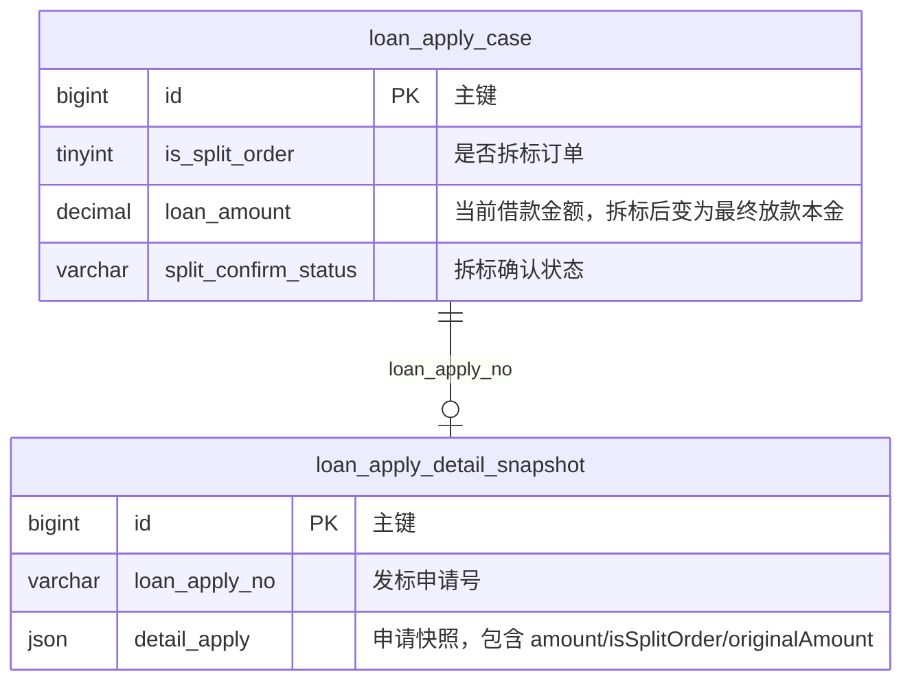
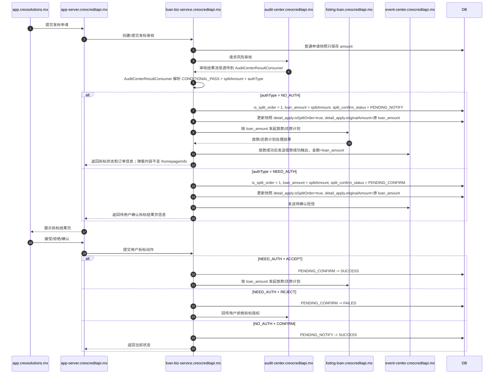
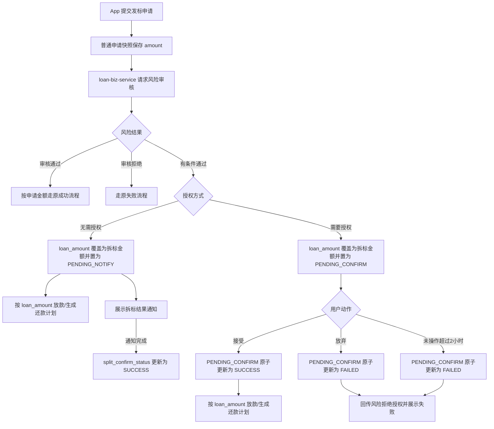
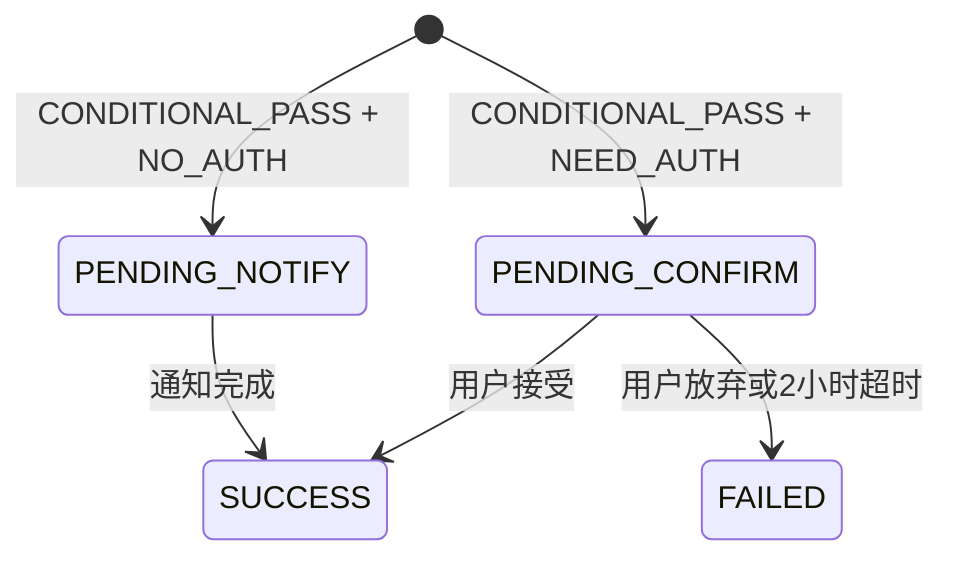

# 发标拆标完整流程 技术方案

## 背景及目标

当前发标审核结果只有通过和拒绝两类，风险无法在审核后通过降低最终借款金额来承接资质较差但仍可放款的用户。本次新增“有条件通过”审核结果，风险返回拆标金额和授权方式后，前台按授权方式进入信息告知或用户确认流程。

本次设计目标：

- 支持风险审核结果新增 `CONDITIONAL_PASS`，并携带拆标金额和授权方式。
- 区分无需授权和需要授权两套资金触发语义：无需授权立即放款，需要授权接受后才放款。
- 支持拆标结果页、首页待确认、首页拆标弹窗、2 小时超时失败和风险拒绝授权回传。
- 风险返回 `CONDITIONAL_PASS` 时即认为拆标生效，`loan_apply_case.loan_amount` 覆盖为拆标后的实际本金；需要授权场景只延后资金链路，不延后金额覆盖。
- 快照详情保存 `isSplitOrder`，拆标订单保存 `originalAmount`，非拆标订单只保存原有 `amount`。

## 关键决策

- 不新增独立拆标确认表，拆标确认状态直接放在已有 MySQL `loan_apply_case` 表。
- `loan_apply_case` 新增拆标订单标识 `is_split_order` 和拆标状态字段 `split_confirm_status`。
- `loan_apply_detail_snapshot` 的快照内容新增 `isSplitOrder` 和 `originalAmount`；拆标订单写 `isSplitOrder=true` 且保留原始金额 `originalAmount`，非拆标订单保持 `amount` 不变且不写 `originalAmount`。
- 拆标金额不新增单独字段保存；收到 `CONDITIONAL_PASS` 后直接覆盖 `loan_apply_case.loan_amount`，后续放款、合同、还款计划、首页和触达金额均读取当前 `loan_amount`。
- 授权方式、风险决策号、触达已读、风险回传状态、确认截止时间不单独加字段；本方案只持久化业务必须长期查询的拆标标识、确认状态和原始金额，其它过程信息按现有调用上下文、状态更新时间、日志或已有外部幂等能力处理。
- 拆标确认状态收敛为四态：`PENDING_NOTIFY`-待通知、`PENDING_CONFIRM`-待确认、`SUCCESS`-成功、`FAILED`-失败。

## 修改到的站点

| 站点/应用 | 改动说明 | 影响范围 |
| --- | --- | --- |
| `app-server.creocreditapi.mx` | 调整首页 `processingCard` 返回拆标待确认订单号；调整 `/loan/result` 返回 `SPLIT_PENDING_CONFIRM` 和拆分前后金额；转发接受/放弃/已读操作 | App 接口入口、借款等待页 |
| `loan-biz-service.creocreditapi.mx` | 在 `loan_apply_case` 写入拆标状态并覆盖 `loan_amount`，在申请快照内容保存 `isSplitOrder` 和拆标原始金额；通过 nodeEvent `handleBizEvent` 返回拆标通知数据 | 发标核心业务、nodeEvent 弹窗 |

> 说明：本次代码改造只涉及 `app-server.creocreditapi.mx` 和 `loan-biz-service.creocreditapi.mx`。审核消息由现有链路透传过来，`audit-center.creocreditapi.mx` 本次不需要改动；触达和外部放款服务按现有接口消费实际金额或现有事件，不作为本次改造站点。

## 领域模型



### 实体：`loan_apply_case` - 发标申请主表拆标字段

| 字段名 | 类型 | 长度 | 允许为空 | 默认值 | 说明 |
| --- | --- | --- | --- | --- | --- |
| is_split_order | tinyint unsigned | 1 | YES | NULL | 是否拆标订单：1-是，NULL/0 按非拆标订单兼容 |
| split_confirm_status | varchar | 32 | YES | NULL | 拆标确认状态：`PENDING_NOTIFY`、`PENDING_CONFIRM`、`SUCCESS`、`FAILED` |

### 实体：`loan_apply_detail_snapshot.detail_apply` - 借款申请快照内容

| 字段名 | 类型 | 长度 | 允许为空 | 默认值 | 说明 |
| --- | --- | --- | --- | --- | --- |
| isSplitOrder | boolean | - | YES | NULL | 是否拆标订单；拆标订单为 true，非拆标订单可为空或 false |
| originalAmount | decimal | 18,2 | YES | NULL | 拆标订单的原始借款金额；非拆标订单不写该字段，只保留快照内原有 `amount` |

## 时序图与流程图

### 时序图



### 流程图



## 状态机

### 状态图



| 状态 | 说明 | 允许的下一状态 |
| --- | --- | --- |
| `PENDING_NOTIFY` | 无需授权待通知；只等待用户完成拆标结果通知确认，不表达资金链路成败 | `SUCCESS` |
| `PENDING_CONFIRM` | 需要授权待用户确认；只等待用户是否接受拆标金额，不表达资金链路成败 | `SUCCESS`、`FAILED` |
| `SUCCESS` | 用户确认流程成功；NO_AUTH 表示通知已完成，NEED_AUTH 表示用户已接受 | 终态 |
| `FAILED` | 用户确认流程失败；仅表示 NEED_AUTH 用户放弃或超时未确认 | 终态 |

并发约束：

- 接受、放弃、超时均只能从 `PENDING_CONFIRM` 原子更新。
- 如果接受先成功，超时任务和放弃接口必须返回当前 `SUCCESS` 状态，不得回传拒绝风险。
- 如果超时或放弃先成功，后续接受接口必须返回该次拆标已失效，不得触发资金链路。
- `NO_AUTH` 场景只能从 `PENDING_NOTIFY` 更新为 `SUCCESS`；不会因为放款失败进入 `FAILED`。
- 需要授权待确认记录的 2 小时起算点以进入 `PENDING_CONFIRM` 时写入的 `loan_apply_case.updatetime` 为准；进入待确认后不得通过无关更新刷新该记录 `updatetime`，接受接口和超时 Job 都按该时间判断是否过期。

## 数据库设计

### 数据库：`loan_biz`

#### 表结构调整

##### `loan_apply_case` - 已有发标申请主表新增拆标状态字段

| 字段名 | 类型 | 长度 | 允许为空 | 默认值 | 说明 |
| --- | --- | --- | --- | --- | --- |
| is_split_order | tinyint unsigned | 1 | YES | NULL | 是否拆标订单：1-是，NULL/0 按非拆标订单兼容 |
| split_confirm_status | varchar | 32 | YES | NULL | `PENDING_NOTIFY`、`PENDING_CONFIRM`、`SUCCESS`、`FAILED` |

##### `loan_apply_detail_snapshot.detail_apply` - 已有借款申请快照内容新增拆标字段

| 字段名 | 类型 | 长度 | 允许为空 | 默认值 | 说明 |
| --- | --- | --- | --- | --- | --- |
| isSplitOrder | boolean | - | YES | NULL | 是否拆标订单；拆标订单为 true，非拆标订单可为空或 false |
| originalAmount | decimal | 18,2 | YES | NULL | 拆标订单的原始借款金额；非拆标订单不写该字段，只保留快照内原有 `amount` |

**是否需要拆表字段结论**：不需要新增 `loan_split_confirm` 表，也不需要在 `loan_apply_case` 上增加一组过程字段。本次持久化信息收敛为主表两个字段和快照内容两个字段：

- `is_split_order`：用于标识这笔借款是否为拆标订单，便于查询、展示和后续链路判断。
- `split_confirm_status`：用于首页待确认、超时扫描、接受/放弃并发控制和结果展示。
- `isSplitOrder`：写入 `loan_apply_detail_snapshot.detail_apply`，便于快照消费者不依赖主表也能识别拆标订单。
- `originalAmount`：写入 `loan_apply_detail_snapshot.detail_apply`，仅拆标订单写入，用于在 `loan_amount` 被拆标金额覆盖后仍可追溯用户原始申请金额；非拆标订单只保留原有 `amount`。

**变更 SQL（Required）**：

```sql
ALTER TABLE `loan_apply_case`
  ADD COLUMN `is_split_order` tinyint(1) unsigned DEFAULT NULL COMMENT '是否拆标订单: 1-是, NULL/0-否',
  ADD COLUMN `split_confirm_status` varchar(32) DEFAULT NULL COMMENT '拆标确认状态: PENDING_NOTIFY-待通知, PENDING_CONFIRM-待确认, SUCCESS-成功, FAILED-失败';
```

`loan_apply_detail_snapshot` 当前以 `detail_apply` 快照对象承载申请详情；`isSplitOrder`、`originalAmount` 写入该快照对象，不新增独立数据库列。对应 Java 快照 DTO/对象需补充同名 camelCase 字段，保证序列化后字段名为 `isSplitOrder`、`originalAmount`。

**核心状态更新 SQL 约束（示意，实际 Mapper 需放入 ExtXxxMapper.xml）：**

```sql
-- NEED_AUTH 接受：必须仍在待确认且未过期，成功更新 1 行后才允许触发资金链路
UPDATE `loan_apply_case`
SET `split_confirm_status` = 'SUCCESS',
    `updatetime` = NOW()
WHERE `id` = #{applyId}
  AND `customer_id` = #{userId}
  AND `split_confirm_status` = 'PENDING_CONFIRM'
  AND DATE_ADD(`updatetime`, INTERVAL #{confirmTimeoutMinutes} MINUTE) > NOW()
  AND `isactive` = 1;

-- NEED_AUTH 放弃/超时：只允许从待确认更新，避免覆盖已接受
UPDATE `loan_apply_case`
SET `split_confirm_status` = 'FAILED',
    `updatetime` = NOW()
WHERE `id` = #{applyId}
  AND `split_confirm_status` = 'PENDING_CONFIRM'
  AND `isactive` = 1;
```

## 接口设计

### 所属服务：`app-server.creocreditapi.mx`

#### POST /loan/result - 借款等待页结果查询

**改动类型**：修改

**现有代码依据**：`LoanController.queryLoanResult` 暴露 `POST /loan/result`，调用 `LoanServiceImpl.queryLoanResult`；当前返回 `LoanResultResp.lifeCycleCode`、`paramMap`、`intervalSeconds`，`lifeCycleCode` 直接来自 loan-biz `LoanApplyResultResp.auditStage` 或 listing 生命周期状态。

**新增枚举**：`LoanResultStatusEnum`

`LoanResultStatusEnum` 用于 App 借款等待页展示，不直接复用 `ApplyAuditStageEnum`。它与 `ApplyAuditStageEnum` 的差异是：把原先统一的审核中状态 `AUDIT` 拆成普通审核中 `AUDIT` 和用户拆标待确认 `SPLIT_PENDING_CONFIRM`。

| 枚举值 | 来源/条件 | 说明 |
| --- | --- | --- |
| `AUDIT` | `ApplyAuditStageEnum.INIT` 或 `ApplyAuditStageEnum.PENDING`，且非拆标待确认 | 普通审核中/处理中等待页 |
| `SPLIT_PENDING_CONFIRM` | `is_split_order = 1` 且 `split_confirm_status = PENDING_CONFIRM` | 用户拆标待确认等待页 |
| `SUCCESS` | 现有成功状态 | 借款成功/放款处理中按现有逻辑展示 |
| `REJECT` | 现有拒绝状态 | 借款失败按现有逻辑展示 |

**返回参数补充**：

| 参数名 | 类型 | 改动类型 | 说明 |
| --- | --- | --- | --- |
| lifeCycleCode | String | 修改 | 改为返回 `LoanResultStatusEnum`，拆标待确认时返回 `SPLIT_PENDING_CONFIRM` |
| paramMap.originalAmount | String/Number | 新增 | 拆标前金额，来自快照 `originalAmount`，仅 `SPLIT_PENDING_CONFIRM` 场景返回 |
| paramMap.splitAmount | String/Number | 新增 | 拆标后金额，来自当前 `loan_apply_case.loan_amount`，仅 `SPLIT_PENDING_CONFIRM` 场景返回 |

**接口约束**：

- `/loan/result` 是借款等待页结果展示入口；拆标确认页所需金额通过 `paramMap.originalAmount` 和 `paramMap.splitAmount` 返回，不新增拆标详情接口。
- App 判断 `lifeCycleCode = SPLIT_PENDING_CONFIRM` 时展示用户拆标确认页面，并读取 `paramMap` 中的拆分前后金额。
- `LoanResultStatusEnum` 只用于 app-server 返回给 App 的等待页状态映射；loan-biz 仍以申请状态和 `split_confirm_status` 作为事实来源。
- 普通 `AUDIT`、`SUCCESS`、`REJECT` 场景保持现有返回语义，不返回拆标金额参数。

#### POST /api/loan/split/action - 提交拆标用户动作

**改动类型**：新增

**请求参数**：

| 参数名 | 类型 | 必填 | 说明 |
| --- | --- | --- | --- |
| applyId | Long | 是 | 发标申请 ID |
| action | String | 是 | `ACCEPT`-接受拆标金额，`REJECT`-拒绝拆标金额，`CONFIRM`-无需授权通知确认 |

**返回参数**：

| 参数名 | 类型 | 说明 |
| --- | --- | --- |
| result | Integer | 0 表示动作提交成功；失败按现有统一错误码和错误文案返回 |

**接口约束**：

- 该接口只负责提交用户动作，不返回 `finalStatus`、`nextPage` 等页面编排字段。
- App 后续页面跳转和展示按动作类型、本地页面上下文以及现有统一错误处理决定；需要刷新状态时复用现有查询链路。

#### POST /homepage/info - 首页信息查询

**改动类型**：修改

**现有代码依据**：`HomePageController.homepageInfo` 暴露 `POST /homepage/info`，返回 `HomepageInfoResp.data`；`HomepageDataResp.processingCard` 类型为 `ProcessingDataResp`，当前仅包含 `content` 字段。

**返回参数补充**：

| 参数名 | 类型 | 改动类型 | 说明 |
| --- | --- | --- | --- |
| data.processingCard | Object | 修改 | 复用现有 `HomepageDataResp.processingCard` 承载拆标待确认信息，不新增独立节点 |
| data.processingCard.content | String | 修改 | 继续作为 processing 卡片展示文案 |
| data.processingCard.orderNo | String | 新增 | 拆标待确认订单号，用于前端跳转或展示待确认订单 |
| data.processingCard.status | String | 新增 | `SPLIT_PENDING_CONFIRM`-发标待确认 |

**接口约束**：

- 不新增 `POST /api/home/status`，也不新增 `POST /api/loan/split/detail` 之类的拆标结果详情查询接口；拆标待确认入口复用现有 `POST /homepage/info`。
- 拆标待确认信息放入现有 `processingCard`；实现时扩展 `ProcessingDataResp`，在现有 `content` 基础上新增 `orderNo` 和 `status`。
- App 进入拆标结果页所需的订单定位信息从 `data.processingCard.orderNo` 获取。
- `/homepage/info` 不返回拆标弹窗内容；弹窗内容走现有 `POST /track/user/nodeEvent` -> loan-biz `POST /loan-biz/track/user/nodeEvent` -> `BizEventHandlerServiceImpl.handleBizEvent` 链路。

### 所属服务：`loan-biz-service.creocreditapi.mx`

#### AuditCenterResultConsumer - 处理审核结果消息

**改动类型**：修改现有 Consumer

**消息字段**：

| 字段名 | 类型 | 必填 | 说明 |
| --- | --- | --- | --- |
| userId | Long | 是 | 用户 ID |
| applyId/orderNo | Long/String | 是 | 发标申请 ID 或订单号，按现有审核消息字段读取 |
| auditResult | String | 是 | `PASS`、`REJECT`、`CONDITIONAL_PASS` |
| splitAmount | BigDecimal | 条件必填 | 有条件通过时必填，最终放款本金 |
| authType | String | 条件必填 | `NO_AUTH`、`NEED_AUTH` |

**处理语义**：

- `PASS`、`REJECT` 保持原逻辑。
- `CONDITIONAL_PASS + NO_AUTH`：将快照 `isSplitOrder` 更新为 true，将原 `loan_amount` 写入快照 `originalAmount`，再把 `loan_apply_case.loan_amount` 覆盖为 `splitAmount`，设置 `is_split_order=1`，并将 `split_confirm_status` 更新为 `PENDING_NOTIFY`；用户完成通知确认后推进为 `SUCCESS`。
- `CONDITIONAL_PASS + NEED_AUTH`：将快照 `isSplitOrder` 更新为 true，将原 `loan_amount` 写入快照 `originalAmount`，再把 `loan_apply_case.loan_amount` 覆盖为 `splitAmount`，设置 `is_split_order=1`，将 `split_confirm_status` 更新为 `PENDING_CONFIRM`，不触发资金链路；用户接受时仅将确认状态推进为 `SUCCESS` 并触发资金链路。
- 不新增 loan-biz decision 接口；有条件通过决策通过现有审核结果消息链路进入 `AuditCenterResultConsumer` 处理。

#### BizEventHandlerServiceImpl.handleBizEvent - 拆标通知弹窗

**改动类型**：修改现有 nodeEvent 处理链路

**现有代码依据**：App `TrackController.queryUserNodeEvent` 暴露 `POST /track/user/nodeEvent`，通过 `LoanBizClient.queryUserNodeEvent` 调用 loan-biz `POST /loan-biz/track/user/nodeEvent`；loan-biz `MarketingEventServiceImpl` 读取 nodeEvent 配置后调用 `IBizEventHandlerService.handleBizEvent`；`BizEventHandlerServiceImpl.handleBizEvent` 按 `collectConfig.event` 返回 `TrackStatusDto(event, activityCode, data, config)`；`NodeEventConstant` 维护现有弹窗事件常量。

**处理语义**：

- 新增拆标通知弹窗 nodeEvent，例如 `HOMEPAGE_LOAN_SPLIT_NOTIFY_POP`，具体命名实现时按现有 `NodeEventConstant` 风格确认。
- 在 `BizEventHandlerServiceImpl.handleBizEvent` 中为该 `collectConfig.event` 增加分支。
- 查询当前用户最早一条待确认拆标借款记录：`is_split_order = 1` 且 `split_confirm_status = PENDING_NOTIFY` 或 `PENDING_CONFIRM`，按申请时间/主键升序取第一条。
- 根据该借款记录查询 `loan_apply_detail_snapshot`：拆标前金额取 `originalAmount`，拆标后金额取当前 `loan_apply_case.loan_amount`。
- 若不存在待确认拆标记录、快照缺少 `originalAmount`、或金额异常，则返回 `null`，不展示弹窗。

**TrackStatusDto.data 建议字段**：

| 字段名 | 类型 | 说明 |
| --- | --- | --- |
| orderNo | String | 拆标订单号 |
| originalAmount | String | 拆标前金额，来自快照 `originalAmount` |
| splitAmount | String | 拆标后金额，来自当前 `loan_apply_case.loan_amount` |

#### POST /internal/loan/split/action - 处理 App 用户动作

**改动类型**：新增内部契约

**处理语义**：

- `CONFIRM` 仅处理 `PENDING_NOTIFY`，成功后更新为 `SUCCESS`。
- `ACCEPT` 仅从 `PENDING_CONFIRM` 更新为 `SUCCESS`，成功后按当前 `loan_apply_case.loan_amount` 触发一次资金链路。
- `REJECT` 仅从 `PENDING_CONFIRM` 更新为 `FAILED`，成功后回传风险。
- 当前代码未检出，以上路径为新契约建议；实现前必须对照实际 app-server 与 loan-biz 内部 RPC/HTTP 风格调整命名，但不得改变 `NO_AUTH` 不等待确认、`NEED_AUTH` 接受前不放款的业务语义。

## 定时任务

| 站点/应用 | JOB名称 | CRON表达式 | 执行说明 | 参数 |
| --- | --- | --- | --- | --- |
| `loan-biz-service.creocreditapi.mx` | `LoanSplitConfirmTimeoutJob` | `0 */5 * * * ?` | 每 5 分钟扫描 `PENDING_CONFIRM` 且 `updatetime + confirmTimeoutMinutes <= now()` 的有效记录，原子更新为 `FAILED` 后回传风险 | `batchSize=500` |

任务要求：

- 单批最多处理 500 条，避免大事务。
- 超时更新按 `id + split_confirm_status = PENDING_CONFIRM + updatetime + confirmTimeoutMinutes <= now() + isactive = 1` 条件更新。
- 风险回传失败不得反转 `FAILED` 终态；若没有单独回传状态字段，失败重试依赖 Job 重扫 `FAILED` 记录时的外部接口幂等能力或现有补偿日志。

## 配置

| 站点/应用 | 配置Key | 配置Value（示例） | 改动类型 | 发布时机 | 说明 |
| --- | --- | --- | --- | --- | --- |
| `loan-biz-service.creocreditapi.mx` | `loan.split.enabled` | `false` | 新增 | 发布前 | 拆标总开关，发布后灰度开启 |
| `loan-biz-service.creocreditapi.mx` | `loan.split.confirmTimeoutMinutes` | `120` | 新增 | 发布前 | 需要授权确认超时时长 |
| `loan-biz-service.creocreditapi.mx` | `loan.split.timeoutJob.enabled` | `false` | 新增 | 发布前 | 超时任务开关，确认服务发布后开启 |
| `app-server.creocreditapi.mx` | `loan.split.app.enabled` | `false` | 新增 | 发布前 | App 拆标页面/首页状态聚合开关 |

### 提测编排素材

| 顺序 | 操作类型 | 目标 | 详细内容 | 前置条件 | 验证方式 | 回滚/撤销方式 |
| --- | --- | --- | --- | --- | --- | --- |
| 1 | DB | `loan_biz.loan_apply_case`、`loan_biz.loan_apply_detail_snapshot` | 在 `loan-biz-service.creocreditapi.mx` 发布前执行 ALTER SQL：主表新增 `is_split_order`、`split_confirm_status`，快照表新增 `isSplitOrder`、`originalAmount` | 确认目标表存在且字段名未占用 | `SHOW COLUMNS` 检查四个新增字段和字段注释 | 优先回滚代码并保留兼容字段；如必须回滚 DB，执行 DROP COLUMN 前需确认会丢失回滚期间新写入数据 |
| 2 | 配置预置 | `loan-biz-service.creocreditapi.mx` / `app-server.creocreditapi.mx` | 预置 `loan.split.enabled=false`、`loan.split.timeoutJob.enabled=false`、`loan.split.app.enabled=false` | DB 已完成 | 应用启动后读取默认关闭，不产生拆标状态 | 保持 false 或删除未使用配置 |
| 3 | 站点发布 | `loan-biz-service.creocreditapi.mx` | 发布拆标状态、金额覆盖、nodeEvent `handleBizEvent` 拆标通知弹窗、资金触发控制、超时 Job 和风险回传逻辑 | DB 和配置已预置 | 普通 PASS/REJECT 回归通过；开关关闭时不处理 `CONDITIONAL_PASS`；nodeEvent 无拆标记录时不返回弹窗 | 回滚站点版本或保持总开关 false |
| 4 | 站点发布 | `app-server.creocreditapi.mx` | 发布 App 聚合接口和首页 `processingCard` 待确认返回逻辑 | loan-biz 已发布且开关关闭 | 开关关闭时首页、审核中、原成功/失败流程保持原表现 | 回滚站点版本或保持 `loan.split.app.enabled=false` |
| 5 | 开关启用 | `loan.split.app.enabled`、`loan.split.enabled` | 先开启 App 聚合，再小流量开启 loan-biz 总开关 | 两个站点基础验证通过 | 构造 `NO_AUTH`、`NEED_AUTH` 用例，验证资金触发点 | 先关闭 `loan.split.enabled`，再关闭 `loan.split.app.enabled` |
| 6 | Job 启用 | `loan.split.timeoutJob.enabled=true` | 确认待确认记录可被超时处理后开启 | 风险回传接口联调通过 | 构造过期记录，验证只从 `PENDING_CONFIRM` 超时为 `FAILED` 且回传风险 | 关闭 Job 开关；失败记录由人工补偿或下一轮修复后重试 |

## 外部依赖

### 依赖接口

| 系统 | 接口 | 用途 | 备注 |
| --- | --- | --- | --- |
| `audit-center.creocreditapi.mx` | 风险审核结果接口/回调 | 返回 `CONDITIONAL_PASS`、`splitAmount`、`authType` | 需与风险确认字段枚举 |
| `audit-center.creocreditapi.mx` | 风险拒绝授权回传接口 | 用户放弃或超时时告知风险用户最终拒绝拆标授权 | 失败需重试；接口路径、签名和错误码当前无法从未检出代码确认，需实现前补齐 |
| `listing-loan.creocreditapi.mx` | 发标/放款/还款计划接口 | 按当前 `loan_apply_case.loan_amount` 创建放款和还款计划 | 需要保证金额字段使用实际借款金额 |
| `event-center.creocreditapi.mx` | 触达发送接口 | 发送需要授权短信和借款成功触达 | 借款成功金额变量使用实际放款金额 |

外部依赖失败处理：

- 风险审核结果字段缺失、`authType` 非 `NO_AUTH`/`NEED_AUTH`、`splitAmount` 为空或小于等于 0 时，不更新拆标状态，不覆盖 `loan_amount`，不触发资金链路，按风险结果异常记录可观测错误并走产品确认的降级策略。
- 风险拒绝授权回传失败不得反转用户最终态；若不新增风险回传状态字段，需依赖外部接口幂等能力、Job 重试策略或现有补偿机制避免丢失回传。
- `listing-loan.creocreditapi.mx` 放款/还款计划失败时，不得回退为待确认；拆标确认状态只表达用户确认/通知结果，资金失败按既有借款状态和补偿流程处理。
- 需要授权短信发送前必须确认记录仍为 `PENDING_CONFIRM`；用户已接受、放弃或超时后不得重复发送误导性待确认短信。

## 监控项

| 监控指标 | 监控方式 | 告警阈值 | 告警接收人 |
| --- | --- | --- | --- |
| `loan_split_conditional_pass_count` | 应用埋点/日志聚合 | 环比突增 100% | loan-biz 值班 |
| `loan_split_accept_count` / `loan_split_reject_count` / `loan_split_timeout_count` | 应用埋点 | 接受率低于配置阈值 | 产品 + loan-biz 值班 |
| `loan_split_duplicate_action_count` | 应用日志聚合 | 5 分钟内 > 20 | loan-biz 值班 |
| `loan_split_risk_notify_failed_count` | 应用日志聚合 | 5 分钟内 > 0 | loan-biz + audit-center 值班 |
| `loan_split_loan_failed_count` | 放款链路监控 | 5 分钟内 > 0 | loan-biz + listing-loan 值班 |
| `loan_split_timeout_job_lag_minutes` | Job 监控 | 最大延迟 > 10 分钟 | loan-biz 值班 |

日志要求：状态变更、风险回传、资金链路触发、短信发送和 Job 批处理必须记录稳定操作标识、`applyId`、原状态、新状态和处理结果；不得记录用户敏感身份信息、完整短信内容或外部鉴权信息。
